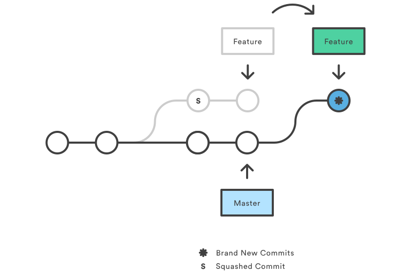

# Git

Git is a **distributed version-control system** for tracking changes in any set of files, originally designed for coordinating work among programmers cooperating on source code during software development. Its goals include **speed**, **data integrity**, and support for **distributed, non-linear workflows**. It was created by **Linus Torvalds in 2005** for development of the Linux kernel. ([wikipedia](https://en.wikipedia.org/wiki/Git))

## Basic Concepts

### Repositories

A Git repository is simply a database containing all the information needed to retain and manage the revisions and history of a project. A repository retains a complete copy of the entire project throughout its lifetime.

Git maintains a set of configuration values within each repository. Unlike file data and other repository metadata, configuration settings are not propagated from one repository to another during a clone operation. Instead, Git manages and inspects configuration on a per-site, per-user, and per-repository basis.

Within a repository, Git maintains two primary data structures, **the object store** and **the index**. All of this repository data is stored at the root of your working directory in a hidden subdirectory named `.git`. The object store is designed to be **efficiently copied during a clone operation**. The index is **transitory information**, is private to a repository, and can be created or modified on demand as needed.

### Object Types

The object store contains your **original data files** and all the **log messages**, **author information**, **dates**, and other information required to rebuild any version or branch of the project. Git places only four types of objects in the object store: the blobs, trees, commits, and tags. These four atomic objects form the foundation of Git’s higher level data structures.

- **Blobs**: Each version of a file is represented as a blob. Blob (**binary large object**), is a term that’s commonly used in computing to refer to some variable or file that can contain any data and whose internal structure is ignored by the program. A blob is treated as being opaque. A blob **holds a file’s data** but does not contain any metadata about the file or even its name.
- **Trees**: A tree object represents **one level of directory information**. It records blob identifiers, path names, and a bit of metadata for all the files in one directory. It can also recursively reference other (sub)tree objects and thus build a complete hierarchy of files and subdirectories.
- **Commits**: A commit object holds **metadata for each change introduced into the repository**, including the author, committer, commit date, and log message. Each commit points to a tree object that captures, in one complete snapshot, the state of the repository at the time the commit was performed. The initial commit, or root commit, has no parent. Most commits have one parent but they can reference multiple ones.
- **Tags**: A tag object assigns an arbitrary yet presumably **human readable name to a specific object**, usually a commit. Although `9da581d910c9c4ac93557ca4859e767f5caf5169` refers to an exact and well-defined commit, a more familiar tag name like `Ver-1.0-Alpha` might make more sense!

Over time, all the information in the object store changes and grows, tracking and modeling your project edits, additions, and deletions. To use disk space and network bandwidth efficiently, Git compresses and stores the objects in **pack files**, which are also placed in the object store.

### Index

The index is a **temporary and dynamic binary file that describes the directory structure of the entire repository**. More specifically, the index captures a version of the project’s overall structure at some moment in time. The project’s state could be represented by a commit and a tree from any point in the project’s history, or it could be a future state toward which you are actively developing.

It enables you to alter the contents of the index in methodical, well-defined steps. The index allows a separation between incremental development steps and the committal of those changes. As a developer, you execute Git commands to stage changes in the index. Changes usually add, delete, or edit some file or set of files. The index records and retains those changes, keeping them safe until you are ready to commit them. You can also remove or replace changes in the index. Thus, the index allows a gradual transition from one complex repository state to another, presumably better state.

The index also plays an important role in **merges**, allowing multiple versions of the same file to be managed, inspected, and manipulated simultaneously.

### Content-Addressable Names

The Git object store is organized and implemented as a **content-addressable storage system**. Specifically, each object in the object store has a unique name produced by applying `SHA1` to the contents of the object, yielding a SHA1 hash value. Because the complete contents of an object contribute to the hash value and the hash value is believed to be effectively unique to that particular content, the SHA1 hash is a sufficient index or name for that object in the object database.

SHA1 values are **160-bit** values that are usually represented as a **40-digit hexadecimal number**, such as `9da581d910c9c4ac93557ca4859e767f5caf5169`. Sometimes, during display, SHA1 values are abbreviated to a smaller, unique prefix.

### Content Tracking

It’s important to see Git as something more than a VCS: Git is a **content tracking system**. This distinction, however subtle, guides much of the design of Git and is perhaps the key reason it can perform internal data manipulations with relative ease. Git’s content tracking is manifested in two critical ways:

- Git’s object store is based on the **hashed computation of the contents of its objects**, not on the file or directory names from the user’s original file layout. Thus, when Git places a file into the object store, it does so based on the hash of the data and not on the name of the file. In fact, Git does not track file or directory names, which are associated with files in secondary ways. Again, Git tracks content instead of files. If two separate files have exactly the same content, whether in the same or different directories, Git stores a single copy of that content as a blob within the object store, indexed by that SHA1 value.

- Git’s internal database efficiently **stores every version of every file** (not their differences) as files go from one revision to the next. Because Git uses the hash of a file’s complete content as the name for that file, it must operate on each complete copy of the file. The typical user view of a file (with revisions and that appears to progress from one revision to another) is simply an artifact. Git computes this history as a set of changes between different blobs with varying hashes, rather than storing a file name and set of differences directly.

### Pack Files

To avoid storing the complete content of every version of every file, Git uses a more efficient storage mechanism called a **pack file**. To create a packed file, Git first locates files whose content is very similar and stores the complete content for one of them. It then **computes the differences between similar files and stores just the differences**.

Git does the file packing very cleverly. That is, Git can take any two files from anywhere within the repository and compute deltas between them if it thinks they might be similar enough to yield good data compression. Thus, Git has a fairly elaborate algorithm to locate and match up potential delta candidates globally within a repository. Furthermore, Git is able to construct a series of deltas from one version of a file to a second, to a third, etc.

Git also maintains the knowledge of the original blob SHA1 for each complete file (either the complete content or as a reconstruction after deltas are applied) within the packed representation. This provides the basis for an index mechanism to locate objects within a pack. Packed files are stored in the object store alongside the other objects, under `.git/objects/pack`.

## Working with objects

### Commits

Let's start with a single commit repository. It has five objects: one blob for the contents of each of the three files, one tree that lists the contents of the directory and specifies which file names are stored as which blobs, and one commit with the pointer to that root tree and all the commit metadata.


### Branches

If you make some changes and commit again, the next commit stores a pointer to the commit that came immediately before it. A branch in Git is simply a lightweight **movable pointer to one of these commits**.

From a commit, multiple branches can be created and there can exist multiple lines of histories. We can checkout to any of them and work on it. How does Git know what branch you’re currently on? It keeps a special pointer called **HEAD**.


### Merges

When we are ready, we can merge branches together. There are multiple **merge strategies**: recursive (default), resolve, octopus, ours... (more info [here](https://git-scm.com/docs/merge-strategies)). There are also multiple **merge type strategies**:

- **Explicit merges** (default): They create a new merge commit. This alters the commit history and explicitly shows where a merge was executed. The merge commit content is also explicit in the fact that it shows which commits were the parents of the merge commit. Some teams avoid explicit merges because arguably the merge commits add "noise" to the history of the project.
- **Implicit merges**: Takes a series of commits from a specified branch head and applies them to the top of a target branch. Implicit merges are triggered by **rebase events** (or fast forward merges). During an interactive rebae, a **squash merge** will take the commits from a target branch and combine or squash them in to one commit.



## The Three Trees

The "three trees" are Git's internal state management system. Trees may be a misnomer, as they are not strictly traditional tree data-structures. They are, however, node and pointer-based data structures that Git uses to track a timeline of edits.

### The working directory

This tree is **in sync with the local filesystem** and is representative of the immediate changes made to the content in files and directories. Invoking `git status` shows that Git is aware of the changes to the file.

### The Staging index

This tree is tracking **Working Directory changes**, that have been promoted with git add, to be stored in the next commit. This tree is a complex internal caching mechanism. To inspect the state of the Staging Index tree we must utilize a lesser known Git command `git ls-files` (a debug utility).

### The Commit history

The final tree is the Commit History. The git commit command adds changes to a **permanent snapshot** that lives in the Commit History. This snapshot also includes the state of the Staging Index at the time of commit.

### Commands

| Command      | Scope        | Common use cases                                                     |
| ------------ | ------------ | -------------------------------------------------------------------- |
| git reset    | Commit-level | Discard commits in a private branch or throw away uncommited changes |
| git reset    | File-level   | Unstage a file                                                       |
| git checkout | Commit-level | Switch between branches or inspect old snapshots                     |
| git checkout | File-level   | Discard changes in the working directory                             |
| git revert   | Commit-level | Undo commits in a public branch                                      |
| git revert   | File-level   | (N/A)                                                                |


## References

### Hashes

The most direct way to reference a commit is via its **SHA-1 hash**. This acts as the unique ID for each commit. To find the commit hash of an indirect reference: `git rev-parse [ref]`.

### Refs

A ref is an indirect way of referring to a commit. It can be seen as a user-friendly alias for a commit hash. Tha's how git represents branches and tags internally. Refs are stored as normal text files in the `.git/refs` directory.

```
.git/refs
├── heads/
│   └── master
├── remotes/
│   └── origin/
│       ├── HEAD
│       └── master
└── tags/
```

- The `.git/refs/heads` directory defines all the local branches. Files matche the name of a branch, and inside the file is a commit hash of the tip of the branch.
- The `.git/refs/tags` works the same way but contains tags instead of branches.
- The`.git/refs/remote` contains all the remotes as sub-directories (like **origin**) with all the remote branches.

### Special Refs

In addition to the `.git/refs` directory, there are a few special refs that reside in the top-level `.git` directory. These files contain different content depending on their type and the state of the repository. The **HEAD** ref can contain either a **symbolic ref** (a reference to another ref) or a commit hash.

- **HEAD**: The currently checked-out commit/branch.
- **FETCH_HEAD**: The most recently fetched branch from a remote repo.
- **ORIG_HEAD**: A backup reference to HEAD before drastic changes to it.
- **MERGE_HEAD**: The commit(s) that you’re merging into the current branch with git merge.
- **CHERRY_PICK_HEAD**: The commit that you’re cherry-picking.

### Relative Refs

- We can also refer to commits relative to another commit. The `~` character lets you reach **parent commits** (ex: `git show HEAD~2` displays the grandparent of HEAD). The `~` character will always follow the **first parent**.
- To follow a **different parent**, use the `^` character. For a merge commit, `git show HEAD^2` will show the parent commit from the branch that was merged.
- We can use more than one `^` character to move **more than one generation**. For a merge commit, `git show HEAD^2^1` will show the grandparent of HEAD that rests on the second parent.


### Refspecs

A refspec **maps a branch in the local repository to a branch in a remote repository**. It is specified as `[+]<src>:<dst>` (the optional `+` sign forces the remote repository to perform a non-fast-forward update). It allows us to manage remote branches using local git commands and to configure some advanced git push and git fetch behavior (ex: to delete a remote branch).

### Reflog

The reflog is git’s **safety net**. It records almost every change made in your repository, regardless of whether you committed a snapshot or not. You can think of it as a chronological history of everything you’ve done in your local repo. To view the reflog: `git reflog`.

## Stashes

`git stash` temporarily shelves changes you've made to your working copy so you can work on something else, and then come back and re-apply them later on. Stashing is handy if you need to quickly switch context and work on something else, but you're mid-way through a code change and aren't quite ready to commit.

### Common Operations

- Stash files: by default only staged and unstaged files, but untracked and ignored filed can be included.
- Re-apply stash: **Pop** a stash to apply and remove the files or simply **apply** to keep the files in the stash. By default, the most recent stash (`stash@{0}` is used)
- Manage multiple stashed: List and annotate stashed (with the `git stash save`)
- Other operations: view stash diff, create a branch from a stash, create partial stashes..

### Internals

Stashes are actually encoded in your repository as commit objects. The special ref at `.git/refs/stash` points to your most recently created stash, and previously created stashes are referenced by the stash ref's reflog. This is why you refer to stashes by **stash@{n}**: you're actually referring to the nth reflog entry for the stash ref. Since a stash is just a commit, you can inspect it with git log.

Depending on what you stashed, a single git stash operation creates either two or three new commits. The diagrams above show a stash with the `--all` flag:


## Collaboration

### Worflows

When working with a team on a Git managed project, it’s important to make sure the team is all in agreement on how the flow of changes will be applied.

- Centralized Worflow: A central repository serves as the single point-of-entry for all changes to the project.
- Feature branch Worflow: All feature development should take place in a dedicated branch instead of the master branch.
- Gitflow ([A successful Git branching model](https://nvie.com/posts/a-successful-git-branching-model/)): Defines a strict branching model designed around the project release (see diagram above).
- [GitHub flow](https://guides.github.com/introduction/flow/): Simpler than GitFlow for teams and projects where deployments are made regularly. Deploy from a branch for final testing before merging to main.
- Forking Workflow: Instead of using a single server-side repository to act as the "central" codebase, it gives every developer a server-side repository. This means that each contributor has not one, but two Git repositories: a private local one and a public server-side one.


## Miscellaneous

- **Bare repository**: A repository that doesn't have a working directory, making it impossible to edit files and commit changes. Hosted repositories should always be bare. They end in `.git`.
- **Hooks**: Scripts that run automatically every time a particular event occurs in a git repository. They let you customize Git’s internal behavior and trigger customizable actions at key points in the development life cycle. They are stored in `.git/hooks`. Hooks are local to a git repository, and are **not copied over** to the new repository when doing a `git clone`.
- **Submodules** (a pointer to a specific commit in another repository, easier to push into) vs **subtrees** (a copy of a repository that is pulled into a parent repository, easier to pull)
- **git cherry-pick**: Enables arbitrary Git commits to be picked by reference and appended to the current working HEAD. Cherry picking is the act of picking a commit from a branch and applying it to another.
- **Shallow clone**: Copy only recent revisions (pull down only the latest n commits of the repo’s history) with `git pull --depth [depth] [remote-url]`
- **git gc**: Clean up orphaned or inaccessible commits and compress group of similar objects into "packs" (`./git/objects/pack`). GC runs automatically on `pull`, `merge`, `rebase` and `commit` commands.
- **git prune**: Child command of `git gc` that cleans up unreachable or orphaned git objects.
- **LFS** (Large File Storage): A git extension that reduces the impact of large files in your repository. Large files are replaced with **tiny pointer files** and downloaded lazily, during the checkout process rather than during cloning or fetching.

## Resources

- [Documentation](https://git-scm.com/doc)
- [Learn Git](https://www.atlassian.com/git/tutorials/learn-git-with-bitbucket-cloud)
- [Basic Git Concepts](https://www.oreilly.com/library/view/version-control-with/9781449345037/ch04.html)
