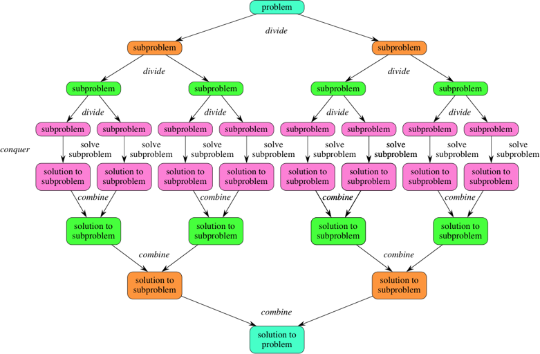

# Grokking Algorithms (Book)

## TLDR

- **Big O notation**: constant, linear, logarithmic, linearithmic, square root, quadratic, cubic, polynomial, exponential, factorial
- **Data structures**: arrays, linked lists, hash tables, stacks, queues, graphs, sets
- **Design**: Tail recursion and Divide and conquer
- **Search algorithms**: linear search and binary search
- **Sorting algorithms**: insertion sort and selection sort \(simple sorts\), merge sort and quicksort \(efficient sorts\)
- **Graph algorithms**: Breadth-first search, Dijkstra’s algorithm, Bellman-Ford algorithm
- **Greedy algorithms** and **NP-complete problems**
- **Dynamic Programming**
- **K-Nearest Neighbors** (KNN)

## 1. Introduction to Algorithms

### Binary Search

Binary search is an efficient algorithm for finding an item from a **sorted list of items**. It works by repeatedly **dividing in half** the portion of the list that could contain the item, until you've narrowed down the possible locations to just one. The time complexity is **O\(Log n\)**: for any list of n element, binary search will take log\(n\) steps.

Example with python 3:

```python
def binary_search(list, item):
    # keep track of which part of the list we search in
    start = 0
    end = len(list) - 1

    step = 0
    while (start <= end):
        # rounds the result down to the nearest whole number
        mid = (start + end) // 2
        guess = list[mid]
        print(f"Step {step}: guessing {guess} (index {mid}) in {list[start:end+1]}")

        # found the item
        if item == guess:
            print(f"Found {item} at index is {mid}")
            return mid

        # guess is too high
        if guess > item:
            end = mid - 1
        # guess is too low
        else:
            start = mid + 1

        step += 1
    return -1

sorted_list = [1,2,3,4,5,6,7,8,9,10]
binary_search(sorted_list, 9)
```

Output:

```text
Step 0: guessing 5 (index 4) in [1, 2, 3, 4, 5, 6, 7, 8, 9, 10]
Step 1: guessing 8 (index 7) in [6, 7, 8, 9, 10]
Step 2: guessing 9 (index 8) in [9, 10]
Found 9 at index is 8
```

### Big O notation

Big O notation tells how **fast** an algorithm **running time grows**. Big O notation is written `O(n)` where `O` means "Big O" and `n` is the number of operations.

Big O establishes **worst-case run time**: A simple / linear search algorithm \(a sequential search is made over all items one by on\) takes **O\(n\)** time to run. However, if the first entry match the search, it only took **O\(1\)**.

Some common Big O run times sorted from fastest to slowest:

- **O\(log n\)** also known as _log time_ \(ex: binary search\)
- **O\(n\)**: also known as _linear time_ \(ex: simple search\)
- **O\(n \* log n\)**: a fast sorting algorithm \(ex: quicksort, see chapter 4\)
- **O\(n^2\)**: a slow sorting algorithm \(ex: selection sort, see chapter 2\)
- **O\(n!\)**: a really slow algorithm \(ex: the traveling salesperson: he wants to hit a n number of cities while travelling the minimum distance\)


## 2. Selection Sort

### Arrays and Linked Lists

Both Arrays and Linked Lists are **linear data structures**, but they have some advantages and disadvantages over each other.

Arrays:

- **Index based** data structure where each elements are associated with an index.
- They are stored in **sequential** memory location.
- They have a **fixed size**, specified during declaration and allocated during compile time.
- Elements are accessed **directly** \(specifying the element index\), at **O\(1\)**.
- Insertion and deletion is relatively slow \(as shifting is required\), at **O\(n\)**.

Linked Lists:

- **Reference based** data structure where each node consists of the data and the reference to the next element.
- They are stored **randomly** in memory.
- They have a **variable** number of elements and grow and shrink during run time.
- Elements are accessed **sequentially** \(traversing the node, starting from the first one\) at **O\(n\)**.
- Insertion and deletion is fast, at **O\(1\)**.

### Selection Sort

Selection sort is a simple **in-place comparison-based** sorting algorithm. It has **O\(n^2\)** complexity. The list is divided into two parts, the sorted part at the left end and the unsorted part at the right end. Initially, the sorted part is empty and the unsorted part is the entire list.

The smallest element is selected from the unsorted array and **swapped** with the leftmost element, and that element becomes a part of the sorted array. This process continues moving unsorted array boundary by one element to the right.


**In-place** means that the algorithm does **not use extra space for manipulating the input** but may require a small though non constant extra space for its operation. Usually, this space is O\(log n\), though sometimes anything in o\(n\) \(Smaller than linear\) is allowed.


Example with python 3:

```python
def selection_sort(list):
    print(f"Selection sort on: {list}")

    # range over all the array indexes
    for i in range(len(list)):
        min_idx = i

        # find the index of the smallest element in the remaining array
        for j in range(i+1, len(list)):
            if list[j] < list[min_idx]:
                min_idx = j

        # swap the smallest element with the current one
        list[i], list[min_idx] = list[min_idx], list[i]
        print(f"Swapped {list[i]} with {list[min_idx]}: {list}")

unsorted_list = [9,6,5,8,4,2,1,3,7]
selection_sort(unsorted_list)
```

Output:

```text
Selection sort on: [9, 6, 5, 8, 4, 2, 1, 3, 7]
Swapped 1 with 9: [1, 6, 5, 8, 4, 2, 9, 3, 7]
Swapped 2 with 6: [1, 2, 5, 8, 4, 6, 9, 3, 7]
Swapped 3 with 5: [1, 2, 3, 8, 4, 6, 9, 5, 7]
Swapped 4 with 8: [1, 2, 3, 4, 8, 6, 9, 5, 7]
Swapped 5 with 8: [1, 2, 3, 4, 5, 6, 9, 8, 7]
Swapped 6 with 6: [1, 2, 3, 4, 5, 6, 9, 8, 7]
Swapped 7 with 9: [1, 2, 3, 4, 5, 6, 7, 8, 9]
Swapped 8 with 8: [1, 2, 3, 4, 5, 6, 7, 8, 9]
Swapped 9 with 9: [1, 2, 3, 4, 5, 6, 7, 8, 9]
```


Another simple sort algorithm is **insertion sort**. Insertion sort works by taking elements from the list one by one and inserting them in their correct position into **a new** sorted list. Insertion sort is generally faster than selection sort due to fewer comparisons and good performance on almost-sorted data, and thus is preferred in practice. But, selection sort uses fewer writes, and thus is used when write performance is a limiting factor.


## 3. Recursion

### Recursion

A program is called **recursive** when an entity calls itself \(vs an **iterative** program when there is a loop\).

To avoid infinite loop when writing a recursive function, we have to tell it when to stop recursing, it's the **base case**. The **recursive case** is when the function actually calls itself.

Example with python 3:

```python
def countdown(i):
    print(i)
    if i <= 1:      # Base case
        return
    countdown(i-1)  # Recursive case

countdown(10)
```

### Stacks

A **Stack** is an **abstract data type** that serves as a collection of elements, with two main principal operations:

- **Push**: Add an element to the collection
- **Pop**: Remove the most recently added element that was not yet removed.

The order in which elements come off a stack gives rise to its alternative name, **LIFO** \(last in, first out\). Additionally, a **peek** operation may give access to the top without modifying the stack.

Considered as a linear data structure, or more abstractly a sequential collection, the push and pop operations occur only at **one end of the structure**, referred to as the **top** of the stack. This data structure makes it possible to implement a stack as a singly linked list and a pointer to the top element. A stack may be implemented to have a **bounded capacity**. If the stack is full and does not contain enough space to accept an entity to be pushed, the stack is then considered to be in an **overflow** state.

### The call stack

A **call stack** is a stack data structure that stores information about the active subroutines of a computer program. A subroutine is a sequence of program instructions that perform a specific task, packaged as a unit and can be used in programs wherever the task should be performed. Think of a subroutine as a method or a function. The main purpose of the call stack is to keep track of the point to which each active subroutine should return control when it finishes executing.

The call stack is made up of **stack frames**, one for each method call. A stack frame usually stores:

- Local variables
- Arguments passed into the method
- Information about the caller's stack frame
- The return address: what the program should do after the function returns \(i.e.: where it should "return to"\).


Each method call creates its own stack frame, taking up space on the call stack. That's important because it can impact the **space complexity** of an algorithm. Especially when we use **recursion**.

### Tail recursion

A recursive function is **tail recursive** when recursive call is the last thing executed by the function. Modern compilers do **tail call elimination** to optimize the tail recursive code. The idea used by compilers to optimize tail-recursive functions is simple: since the recursive call is the last statement, there is nothing left to do in the current function, so saving the current function’s stack frame is of no use. Tail call elimination reduces **space complexity** of recursion **from O\(N\) to O\(1\)**. As function call is eliminated, no new stack frames are created and the function is executed in **constant memory space**.

Example of a non-tail recursive function with python 3:

```python
def fact(n):
    if (n == 0):
        return 1
    return n * fact(n-1)
```

The value returned by fact\(n-1\) is used in fact\(n\), so the call to fact\(n-1\) is not the last thing done by fact\(n\). A tail recursive function would use one more argument to accumulate the factorial value:

```python
def fact(n, acc = 1):
    if (n == 0):
        return acc
    return fact(n - 1, n * acc)
```


Python interpreters don't support tail call optimization, this is for demonstration purpose only.


## 4. Quicksort

### Divide and Conquer

**Divide and conquer** is an **algorithm design paradigm** based on multi-branched recursion. A divide-and-conquer algorithm works by **recursively breaking down** a problem into two or more sub-problems of the **same or related type**, until these become simple enough to be solved. The solutions to the sub-problems are then **combined** to give a solution to the original problem. Because divide-and-conquer **solves subproblems recursively**, each subproblem must be smaller than the original problem, and there must be a **base case for subproblems**.

Divide-and-conquer algorithms have three parts:

- **Divide the problem** into a number of subproblems that are smaller instances of the same problem.
- **Conquer the subproblems** by solving them recursively. If they are small enough, solve the subproblems as base cases.
- **Combine the solutions** to the subproblems into the solution for the original problem.




The **Euclidean algorithm**, to compute the greatest common divisor \(**GCD**\) of two numbers by reducing the numbers to smaller and smaller equivalent subproblems, is one of the ancient algorithm using this technique \(which dates to several centuries BC\). Some authors consider that the name "divide and conquer" should be used only when each problem may generate two or more subproblems. The name **decrease and conquer** has been proposed instead for the single-subproblem class.


Using Divide and Conquer to find Fibonacci numbers:


In mathematics, the **Fibonacci numbers**, commonly denoted Fn, form a sequence, called the **Fibonacci sequence**, such that **each number is the sum of the two preceding ones**, starting from 0 and 1.


Let's look at the Fibonacci numbers, starting with a list `[0, 1]`:

```text
# [0, 1]
0 + 1 = 1       # 3rd fib number
# [0, 1, 1]
1 + 1 = 2       # 4th fib number
# [0, 1, 1, 2]
2 + 1 = 3       # 5th fib number
# [0, 1, 1, 2, 3]
```

The first thing when designing a divide and conquer algorithm is to design the recurrence. The recurrence always starts with a base case:

```python
def f(n):
    if n == 0 or n == 1:
        return n
```


The best case is often 0 or 1 when working with numbers and an empty array or an array with one element when working with arrays.


This base case will give us the 1st \(n = 0\) and the 2nd \(n = 1\) fibonacci number. Next, to calculate the 3rd number, we will do 2nd + 1st number, in other word \(2 - 1\) + \(1 - 1\). From now on, we want to add the last 2 Fibonacci numbers together:

```python
def f(n):
    if n == 0 or n == 1:
        return n
    else:
        return f(n - 1) + f(n - 2)
```

### Merge Sort

**Merge Sort**, invented by John von Neumann in 1945, is a Divide and Conquer algorithm. It divides the input array into two halves, calls itself for the two halves, and then merges the two sorted halves. It can be expressed as **T\(n\) = 2T\(n/2\) + θ\(n\)** and is **θ\(n Log n\)** in all 3 cases \(**worst, average and best case**\) as merge sort always divides the array into two halves and takes linear time to merge two halves.

Example with python 3:

```python
def merge_sort(arr):
    # base caae
    if len(arr) <= 1:
        return arr

    # divide the array into two halves
    mid = len(arr) // 2
    left = arr[:mid]
    right = arr[mid:]
    print(f"Divided {arr} into {left} and {right}")

    # sort both halves
    merge_sort(left)
    merge_sort(right)

    # merge data from sorted arrays left and rights
    i = j = k = 0
    while i < len(left) and j < len(right):
        if left[i] < right[j]:
            arr[k] = left[i]
            i += 1
        else:
            arr[k] = right[j]
            j += 1
        k += 1

    # Checking if any element was left
    while i < len(left):
        arr[k] = left[i]
        i += 1
        k += 1
    while j < len(right):
        arr[k] = right[j]
        j += 1
        k += 1

    print(f"Merged {left} and {right} into {arr}")


unsorted_arr = [9, 6, 5, 8, 4, 2]
merge_sort(unsorted_arr)
```

Output:

```text
Divided [9, 6, 5, 8, 4, 2] into [9, 6, 5] and [8, 4, 2]
Divided [9, 6, 5] into [9] and [6, 5]
Divided [6, 5] into [6] and [5]
Merged [6] and [5] into [5, 6]
Merged [9] and [5, 6] into [5, 6, 9]
Divided [8, 4, 2] into [8] and [4, 2]
Divided [4, 2] into [4] and [2]
Merged [4] and [2] into [2, 4]
Merged [8] and [2, 4] into [2, 4, 8]
Merged [5, 6, 9] and [2, 4, 8] into [2, 4, 5, 6, 8, 9]
```


Most implementations of merge sort produce a **stable sort**: objects with equal keys appear in the same order in sorted output as they appear in the input array to be sorted.


### Quicksort

Quicksort is another divide-and-conquer algorithm. It works by selecting a **pivot** element from the array and partitioning the other elements into two sub-arrays, according to whether they are **less than or greater than the pivot**. The sub-arrays are then sorted recursively. This can be done in-place, requiring small additional amounts of memory to perform the sorting. However, efficient implementations of Quicksort are not a stable sort.

The way that Quicksort uses divide-and-conquer is a little different from how merge sort does. In merge sort, the divide step does hardly anything, and all the real work happens in the combine step. Quicksort is the opposite: **all the real work happens in the divide step**.

Its **worst-case** running time is as bad as selection sort and insertion sort: **O\(n^2\)**. But its **average-case** running time is as good as merge sort: **O\(n log n\)**.

```python
def partition(arr, start, end):
    # pick the pivot as the last element of arr
    pivot = arr[end]
    # track the future index of pivot
    i = start

    for j in range(start, end):
        # if current element is smaller than the pivot
        if arr[j] < pivot:
            arr[i], arr[j] = arr[j], arr[i]
            i += 1

    # put the pivot at its right place in arr
    arr[i], arr[end] = arr[end], arr[i]
    return i

def quick_sort(arr, start, end):
    # base case handles arr of 1 element
    if start >= end:
        return

    # put pivot at the right place in arr
    input = arr[start:end+1]
    pivot = partition(arr, start, end)
    print(f"Partition of {input} done with pivot {arr[pivot]}: array is now {arr}")

    # sort elements before and after the pivot
    quick_sort(arr, start, pivot - 1)
    quick_sort(arr, pivot + 1, end)


unsorted_arr = [7, 2, 4, 1, 8, 5]
quick_sort(unsorted_arr, 0, len(unsorted_arr) - 1)
```

Output:

```text
Partition of [7, 2, 4, 1, 8, 5] done with pivot 5: array is now [2, 4, 1, 5, 8, 7]
Partition of [2, 4, 1] done with pivot 1: array is now [1, 4, 2, 5, 8, 7]
Partition of [4, 2] done with pivot 2: array is now [1, 2, 4, 5, 8, 7]
Partition of [8, 7] done with pivot 7: array is now [1, 2, 4, 5, 7, 8]
```


**Pivot selection** is an important part of quick sort. Selecting the first or last element in a nearly sorted or reversed sorted array degrades the performance to **O\(n^2\)** because all the elements will go to only one partition. Pivot should be chosen **randomly** or by using the **median value of the first, the last, and the middle element** of the array.

The **constant factor** in the big O notation is used to compare algorithms with the same run time. On the average case, let's say Quicksort run at **k1 \* n log n** and merge sort at **k2 \* n log n**. k1 is actually smaller than k2, so Quicksort would be faster than merge sort on average case, even though it is slower on worst case.


## 5. Hash Tables \(WIP\)

- collisions are bad
- hash tables are good at search, insert and delete
- hash tables are good at modeling relationships from item to another
- load factor &gt; 0.7 -&gt; resize the hash table
- hash tables are good for caching data
- hash tables are good for catching duplicates

A hash table \(**hash map**\) is a data structure that implements an **associative array abstract data type**, a structure that can map keys to values. A hash table uses a **hash function** to compute an index, also called a hash code, into an array of buckets or slots, from which the desired value can be found. During lookup, the key is hashed and the resulting hash indicates where the corresponding value is stored.

### Hash functions

Properties of a hashing function:

- **Uniformity**: The hash function should map the expected inputs as evenly as possible over its output range.
- **Efficiency**: The use of a hash function is a trade off between search time and data storage space. A hash table can be very large, very sparse, but very fast.
- **Deterministic**: For a given input value it must always generate the same hash value.

### Collisions

Ideally, the hash function will assign each key to a unique bucket, but most hash table designs employ an imperfect hash function, which might cause hash **collisions** where the hash function generates the same index for more than one key. Such collisions are typically accommodated in some way. \# TODO: more info

### Performance

In a well dimensioned hash table, the average cost \(number of instructions\) for each lookup is independent of the number of elements stored in the table. Many hash table designs also allow arbitrary insertions and deletions of key-value pairs, at constant average cost per operation.

### Use cases

In many situations, hash tables turn out to be on average more efficient than search trees or any other table lookup structure. For this reason, they are widely used in many kinds of computer software, particularly for associative arrays, database indexing, caches, and sets.

## 6. Breadth-first Search \(WIP\)

### Queues

- Data structure similar to stacks, you can't access random elements
- There are only two operations: **enqueue** and **dequeue**
- A queue is **FIFO**: First In First Out \(in contract to a FIFO stack\)

### Graphs

- A graph models a set of connections. It models how different things are connected to one another
- A graph is made up of **nodes** and **edges**
- A node can be directly connected to other nodes, its **neighbors**, with edges.
- A **directed graph** is a graph where edges points to a single direction \(uni-directional relationship\)
- An **undirected graph** is a graph where edges doesn't have a direction \(bi-directional relationship\)
- A **topological sort** makes an ordered list out of a graph by sorting relationships
- A **tree** is a special graph where no nodes ever points back \(a directed graph with only one edge between nodes\)

### Breadth-first search \(BFS\)

- Run on graphs
- Find if there is a path between two nodes
- Find the shortest path between two nodes

How it works:

1. Build hash tables that keep tracks of node's connections
2. Build a queue that contain nodes to check, start with the first-degree nodes \(that's how we get the shortest path\)
3. Create an array to keep track of nodes that have been already checked
4. Pop a node from the queue, until it's a node that hasn't been checked before
5. If the node match: we are done
6. If it doesn't match: add the node to the array of checked node, add all the node connection to the queue, loop back to `4`

> Keeping a list of nodes that have been checked solved two potential issues:
>
> - We don't want to check nodes twice to increase performance
> - We don't want to get stuck in an infinite loop

Running time:

- Search an entire graph means following each edges **O\(edges\)**
- Adding each node to the queue \(in constant O\(1\) for each node\) means **O\(vertices\)**
- BFT running time is **O\(V + E\)**

## 7. Dijkstra’s algorithm

- **Weighted graph**
- Breadth-first search is use to calculate the shortest path for an unweighted graph.
- **Dijkstra's algorithm** is use to calculate the sortest path for a weighted graph.
- Dijkstra's algorithm works when **all the weights are positive**.
- In the case of negative weights, use the **Bellman-Ford algorithm**.

## 8. Greedy algorithms

- **Sets**
- Operation on sets: **union**, **intersection**, **difference**
- **Greedy algorithms** optimize locally, hoping to end up with a global optimum.
- **NP-complete problems** have no know fast solution.
- When dealing with NP-complete problems, your best bet is to use an **approximation algorithm**
- Greedy algorithms are easy to write and fast to run, so they make good algorithms

How do you tell if a problem is NP-complete ?

- The algorithm runs quickly with a handful of items but really slows down with more items.
- "All combinations of X" usually points to an NP-complete problem.
- Do you have to calculate "every possible version" of X because you can't break it down into smaller sub-problems ? Might be NP-complete.
- If your problem involves a sequence \(such as a sequence of cities, like in the travelling salesperson\), and it's hard to solve, it might be NP-complete.
- Can you restate your problem as the set-covering problem or the travelling salesperson problem? Then your problem is definitely NP-complete.

## 9. Dynamic programming

- Dynamic programming is useful when you are trying to optimize something given a **constraint**.
- You can use dynamic programming when the problem can be broken down into **discrete subproblems**.
- Every dynamic programming solution involves a **grid**.
- The values in the cells are usually what you are trying to **optimize**.
- Each cell is a subproblem, so think about **how you can divide your problem** into subproblems.
- There is no formula for calculating a dynamic programming solution

Exemple of dynamic programming problems:

- The Knapsack problem:
- Longest common substring and longest common subsequence

Exemple of dynamic programming usages:

- Biologists use the longest common subsequence to find similarities in DNA strands.
- Diff tools \(like git diff\) use dynamic programming to find the difference between two files.
- **Levenshtein distance** measures how similar two strings arewith dynamic programming \(use for spell checking, copyright check etc.\).

## 10. K-nearest neighbors

### KNN

- **KNN** is used for classification and regression and involves looking at k-nearest neighbors.
- **Classification**: categorizarion into groups.
- **Regression**: predicting a response \(like a number\).
- **Feature extraction** means converting an item \(like a fruit, a user, a picture\) into a list of numbers that can be compared.
- Picking good features is an important part of a successful KNN algorithm, we should try to avoid **bias**.

### Finding similarities

- **Pythagorian formula** can be used to find distance between multiple points: `distance^2 = (x1-x2)^2 + (y1+y2)^2 + (z1-z2)^2`
- **Cosine similarity** compares the angles between vectors to find similarities.

### Introduction to Machine Learning

- **OCR** \(Optical Character Recognition\): Measures lines, points and curves on test characters.
- **Training**: extracting features from a large set of data
- **Naive Bayes classifiers** to figure out the probability of something being classified into "something"

## 11. Where to go next

- Trees
- Inverted Indexes
- The Fourier Transform
- Parallel algorithms
- MapReduce
- Bloom filters and HyperLogLog
- The SHA algorithms
- Locality-sensitive hashing
- Diffie-Hellman key exchange
- Linear programming
