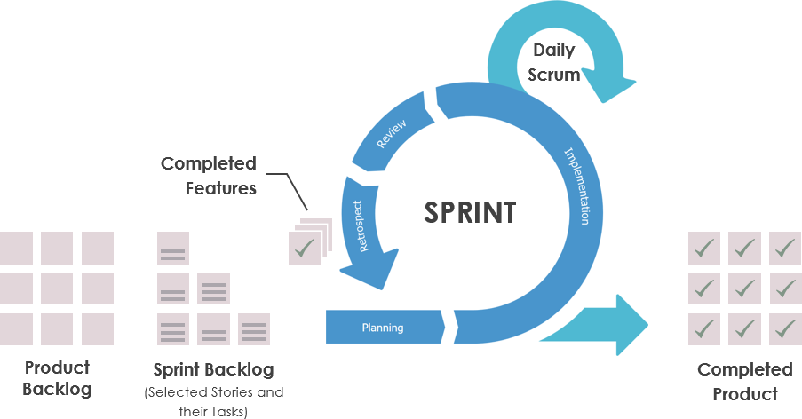
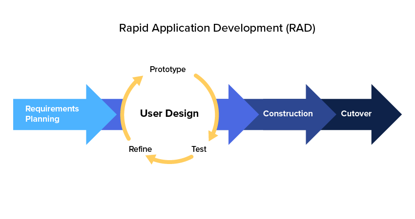
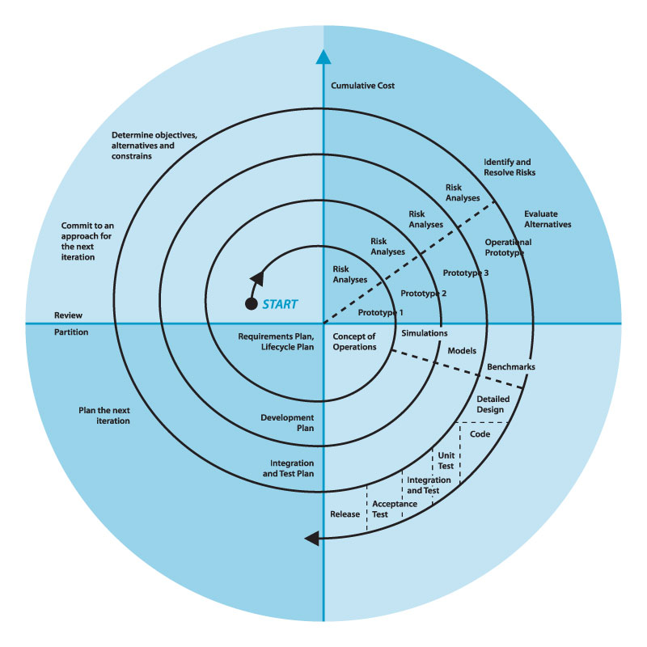
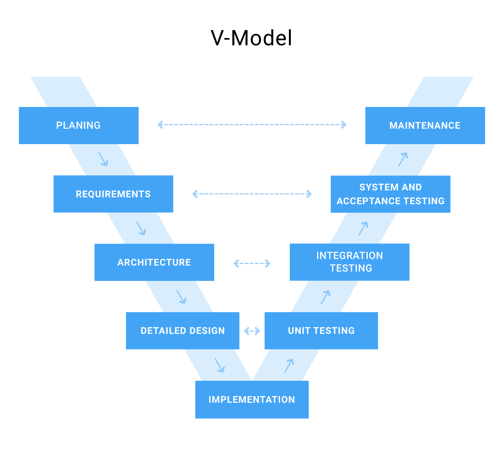

# Software Engineering

**Software Engineering** is a systematic approach to the design, development, operation, and maintenance of a software system.

## Objectives

- **Maintainability:** The software should be able to evolve to meet changing requirements.
- **Correctness:** Requirements specified in the **SRS** (Software Requirements Specification) should be correctly implemented.
- **Reusability:** The different modules of the product can easily be reused to develop new products.
- **Testability:** The software facilitates both the establishment of test criteria and the evaluation of the software with respect to those criteria.
- **Reliability:** The program can be expected to perform its desired function over an arbitrary time period.
- **Portability:** The software can be transferred from one computer system or environment to another.
- **Adaptability:** The software allows differing system constraints and user needs to be satisfied by making changes to the software.

## Systems Development Life Cycle

### Initiation Phase

- A business need or opportunity is identified.
- A Project Manager is appointed.
- The business need is documented in a **Concept Proposal**.

### System Concept Development Phase

- Review of the **feasibility and appropriateness** of the concept.
- A **Systems Boundary Document** identifies the scope of the system.
- Senior Official approval is required.

### Planning Phase

- Describe **how the business will operate** once the system is implemented.
- To ensure the products provide the required capability on-time and within budget, **project resources, activities, schedules, tools, and reviews are defined**.
- Security certification and accreditation activities begin with the identification of system security requirements and the completion of a high level vulnerability assessment.

### Requirements Analysis Phase

- **Functional user requirements** are formally defined and delineate the requirements in terms of **data, system performance, security, and maintainability requirements** for the system.
- All requirements are defined to a level of detail sufficient for systems design to proceed.
- All requirements need to be **measurable and testable** and relate to the business need or opportunity identified in the Initiation phase.

### Design Phase

- The operating environment is established, major subsystems and their inputs and outputs are defined.
- **Everything requiring user input or approval must be documented and reviewed by the user**.
- The physical characteristics of the system are specified and a detailed design is prepared.
- Subsystems identified during design are used to create a detailed structure of the system.
- Each subsystem is partitioned into one or more design units or modules.
- **Detailed logic specifications are prepared for each software module**.

### Development Phase

- The detailed specifications produced during the design phase are **translated into hardware, communications, and executable software**.
- Software shall be unit tested, integrated, and retested in a systematic manner.
- Hardware is assembled and tested.

### Integration and Test Phase

- The various components of the system are integrated and systematically tested.
- The user tests the system to ensure that the **functional requirements are satisfied** by the developed or modified system.
- The system must undergo certification and accreditation activities.

### Operations and Maintenance Phase

- The system or system modifications are installed and made operational in a production environment.
- The system is **monitored for continued performance** in accordance with user requirements, and needed system modifications are incorporated.
- The operational system is periodically assessed through In-Process Reviews to determine how the system can be made more efficient and effective.

### Disposition Phase

- Ensure the **orderly termination** of the system and **preserve the vital information about the system** so that some or all of the information may be reactivated in the future if necessary.
- Particular emphasis is given to proper **preservation of the data processed by the system**.

## Software Development Processes

### Agile Development

A group of software development methodologies based on **iterative development**, where requirements and solutions evolve via collaboration between self-organizing cross-functional teams. It uses iterative development as a basis but advocates a lighter and more people-centric viewpoint than traditional approaches. Agile processes fundamentally incorporate iteration and the continuous feedback that it provides to successively refine and deliver a software system.



### Incremental Development

Various methods are acceptable for **combining linear and iterative systems development** methodologies, with the primary objective of each being to reduce inherent project risk by breaking a project into smaller segments and providing more ease-of-change during the development process. (ex: series of mini-Waterfalls for each parts of the system VS initial software concept, requirements analysis, and design of architecture and system core are defined via Waterfall, followed by incremental implementation etc.)

### Rapid Application Development \(RAD\)

Favors iterative development and the rapid construction of **prototypes** instead of large amounts of up-front planning. The "planning" of software developed using RAD is interleaved with writing the software itself. The lack of extensive pre-planning generally allows software to be written much faster, and makes it easier to change requirements.



### Spiral Development

Combines some key aspect of the waterfall model and rapid prototyping methodologies, in an effort to combine advantages of top-down and bottom-up concepts. It provided emphasis in a key area many felt had been neglected by other methodologies: deliberate **iterative risk analysis**, particularly suited to large-scale complex systems.



### Waterfall Model

A sequential development approach, in which development is seen as flowing steadily **downwards** (like a waterfall) through several phases.

### V-Shaped Model

May be considered an extension of the waterfall model. Instead of moving down in a linear way, the process steps are bent upwards after the coding phase, to form the typical V shape. The V-Model demonstrates the relationships between each phase of the development life cycle and its **associated phase of testing**.



## Agile Manifesto

- **Individuals and interactions** over processes and tools.
- **Working software** over comprehensive documentation.
- **Customer collaboration** over contract negotiation.
- **Responding to change** over following a plan.

## Software Requirements Specification (IEEE 29148)

### Presentation

A software requirements specification (**SRS**) is a description of a software system to be developed. It is modeled after **business requirements specification**. The software requirements specification lays out **functional** and **non-functional** requirements, and it may include a set of **use cases** that describe user interactions that the software must provide to the user for perfect interaction.

Software requirements specification establishes the **basis for an agreement** between customers and contractors or suppliers on how the software product should function. Software requirements specification is a rigorous assessment of requirements before the more specific system design stages, and its goal is to reduce later redesign. It should also provide a realistic basis for estimating product costs, risks, and schedules.

**Requirements smells**: subjective language, ambiguous adverbs and adjectives, superlatives and negative statements.

### Structure

```
Revision History
1. Introduction
    1.1 Document Purpose
    1.2 Product Scope
    1.3 Definitions, Acronyms and Abbreviations
    1.4 References
    1.5 Document Overview
2. Product Overview
    2.1 Product Perspective
    2.2 Product Functions
    2.3 Product Constraints
    2.4 User Characteristics
    2.5 Assumptions and Dependencies
    2.6 Apportioning of Requirements
3. Requirements
    3.1 External Interfaces
        3.1.1 User Interfaces
        3.1.2 Hardware Interfaces
        3.1.3 Software Interfaces
    3.2 Functional
    3.3 Quality of Service
        3.3.1 Performance
        3.3.2 Security
        3.3.3 Reliability
        3.3.4 Availability
    3.4 Compliance
    3.5 Design and Implementation
        3.5.1 Installation
        3.5.2 Distribution
        3.5.3 Maintainability
        3.5.4 Reusability
        3.5.5 Portability
        3.5.6 Cost
        3.5.7 Deadline
        3.5.8 Proof of Concept
4. Verification
5. Appendixes
```

## Software Design Description (IEEE 1016)

### Presentation

A software design description (**SDD**) is a representation of a software design that is used to record design information, address design concerns and communicate to the design’s stakeholders. An SDD usually accompanies an architecture diagram with pointers to detailed feature specifications of smaller pieces of the design. Practically, the description is required to coordinate a large team under a single vision, needs to be a stable reference, and outline all parts of the software and how they will work.

The SDD usually contains the following information:

- The **data design** describes structures that reside within the software. Attributes and relationships between data objects dictate the choice of data structures.
- The **architecture design** uses information flowing characteristics, and maps them into the program structure. The transformation mapping method is applied to exhibit distinct boundaries between incoming and outgoing data. The data flow diagrams allocate control input, processing and output along three separate modules.
- The **interface design** describes internal and external program interfaces, as well as the design of the human interface.
- The **procedural design** describes structured programming concepts using graphical, tabular and textual notations.

### Structure

```
Revision History
1. Introduction
    1.1 Document Purpose
    1.2 Product Scope
    1.3 Definitions, Acronyms and Abbreviations
    1.4 References
    1.5 Document Overview
2. Design
    2.1 Stakeholder concerns
    2.2 Selected Viewpoints
        2.2.1 Context
        2.2.2 Composition
        2.2.3 Logical
        2.2.4 Dependency
        2.2.5 Information
        2.2.6 Patterns
        2.2.7 Interface
        2.2.8 Structure
        2.2.9 Interaction
        2.2.10 State dynamics
        2.2.11 Algorithm
        2.2.12 Resources
        2.2.13 Physical
        2.2.14 Deployment
        2.2.15 Concurrency
        2.2.16 Behavioral
    2.3 Design Views
3. Appendixes
```

## Software Testing

### The Seven Principles Of Software Testing

- **Testing shows presence of defects:** The goal of software testing is to make the software fail. It can ensure that defects are present but it can not prove that software is defects free. Testing can reduce the number of defects but not removes all defects.
- **Exhaustive testing is not possible:** The software can never test at every test cases \(in all possible inputs, valid or invalid, and pre-conditions\). It can test only some test cases and assume that software is correct and will produce the correct output in every test cases.
- **Early Testing:** To find the defect in the software, early test activity shall be started. The defect detected in early phases of **SDLC** are less expensive.
- **Defect clustering:** In a project, a small number of the module can contain most of the defects. The **Pareto Principle** applied to testing states that 80% of software defect comes from 20% of modules.
- **Pesticide paradox:** Repeating the same test cases again and again will not find new bugs.
- **Testing is context dependent:** Testing approach depends on context of software developed. Different types of software need to perform different types of testing.
- **Absence of errors fallacy:** If a built software is 99% bug-free but it does not follow the user requirement then it is unusable.

### Testing Approach

- **White box testing**: Verifies the internal structures or workings of a program, as opposed to the functionality exposed to the end-user. Choose inputs to exercise paths through the code and determine the appropriate outputs. It can be applied at the unit, integration, and system levels of the software testing process, it is usually done at the unit level. It can test paths within a unit, paths between units during integration, and between subsystems during a system–level test. Techniques used in white-box testing: API testing, Code coverage, Fault injection, Mutation testing, Static testing.
- **Black box testing**: Treats the software as a "black box", examining functionality without any knowledge of internal implementation, without seeing the source code. The testers are only aware of what the software is supposed to do, not how it does it. Black-box testing methods include: equivalence partitioning, boundary value analysis, all-pairs testing, state transition tables, decision table testing, fuzz testing, model-based testing, use case testing, exploratory testing, and specification-based testing.
- **Grey box testing**: Involves having knowledge of internal data structures and algorithms for purposes of designing tests while executing those tests at the black-box level. The tester will often have access to both the source code and the executable binary. Grey-box testing may also include reverse engineering to determine, for instance, boundary values or error messages.

### Testing Levels

- **Unit testing**: Refers to tests that verify the functionality of a specific section of code, usually at the function level. In an object-oriented environment, this is usually at the class level, and the minimal unit tests include the constructors and destructors.
- **Integration testing**: Any type of software testing that seeks to verify the interfaces between components against a software design.
- **System testing**: A completely integrated system to verify that the system meets its requirements.
- **Acceptance testing**: user acceptance, operational acceptance, contractual and regulatory acceptance, alpha and beta testing.

### Testing Types

- **Smoke testing**: Consists of minimal attempts to operate the software, designed to determine whether there are any basic problems that will prevent it from working at all.
- **Regression testing**: Seeks to uncover software regressions, as degraded or lost features, including old bugs that have come back. Such regressions occur whenever software functionality that was previously working correctly, stops working as intended. Typically, regressions occur as an unintended consequence of program changes.
- **Destructive testing**: Attempts to cause the software or a sub-system to fail.
- **Performance testing**: Executed to determine how a system or sub-system performs in terms of responsiveness and stability under a particular workload. It can also serve to investigate, measure, validate or verify other quality attributes of the system, such as scalability, reliability and resource usage.
- **Usability testing**: Check if the user interface is easy to use and understand.
- **Security testing**: Prevents security vulnerabilities and system intrusion and validate specific requirements such as confidentiality, integrity, authentication, availability, authorization and non-repudiation.
- **A/B testing**: A method of running a controlled experiment to determine if a proposed change is more effective than the current approach. Customers are routed to either a current version (control) of a feature, or to a modified version (treatment) and data is collected to determine which version is better at achieving the desired outcome.

## Resources

- [US Department of Justice SDLC](https://www.justice.gov/archive/jmd/irm/lifecycle/ch1.htm#para1.2)
- [Agile Manifesto](https://agilemanifesto.org/)
- [Geeks for Geeks Software Engineering](https://www.geeksforgeeks.org/software-engineering/)
- [SRS Template](https://github.com/jam01/SRS-Template/blob/master/template.md)
- [SDD Template](https://github.com/jam01/SDD-Template/blob/master/template.md)
- [Wikipedia Sotfware Testing](https://en.wikipedia.org/wiki/Software_testing)
