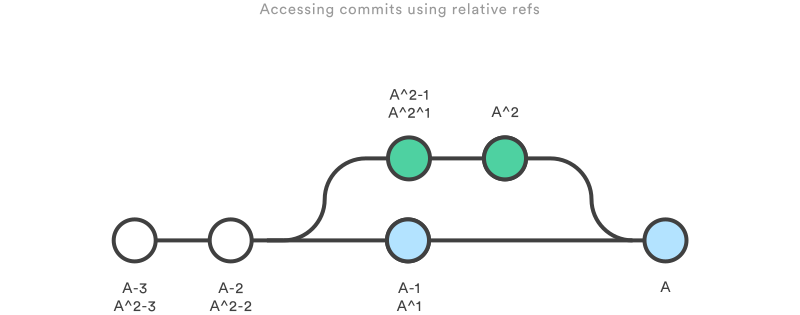

# Software Programming

## Git

Git is a **distributed version-control system** for tracking changes in any set of files, originally designed for coordinating work among programmers cooperating on source code during software development. Its goals include **speed**, **data integrity**, and support for **distributed, non-linear workflows**. It was created by **Linus Torvalds in 2005** for development of the Linux kernel. ([wikipedia](https://en.wikipedia.org/wiki/Git))

### Basic Concepts

#### Repositories

A Git repository is simply a database containing all the information needed to retain and manage the revisions and history of a project. A repository retains a complete copy of the entire project throughout its lifetime.

Git maintains a set of configuration values within each repository. Unlike file data and other repository metadata, configuration settings are not propagated from one repository to another during a clone operation. Instead, Git manages and inspects configuration on a per-site, per-user, and per-repository basis.

Within a repository, Git maintains two primary data structures, **the object store** and **the index**. All of this repository data is stored at the root of your working directory in a hidden subdirectory named `.git`. The object store is designed to be **efficiently copied during a clone operation**. The index is **transitory information**, is private to a repository, and can be created or modified on demand as needed.

#### Object Types

The object store contains your **original data files** and all the **log messages**, **author information**, **dates**, and other information required to rebuild any version or branch of the project. Git places only four types of objects in the object store: the blobs, trees, commits, and tags. These four atomic objects form the foundation of Git’s higher level data structures.

- **Blobs**: Each version of a file is represented as a blob. Blob (**binary large object**), is a term that’s commonly used in computing to refer to some variable or file that can contain any data and whose internal structure is ignored by the program. A blob is treated as being opaque. A blob **holds a file’s data** but does not contain any metadata about the file or even its name.
- **Trees**: A tree object represents **one level of directory information**. It records blob identifiers, path names, and a bit of metadata for all the files in one directory. It can also recursively reference other (sub)tree objects and thus build a complete hierarchy of files and subdirectories.
- **Commits**: A commit object holds **metadata for each change introduced into the repository**, including the author, committer, commit date, and log message. Each commit points to a tree object that captures, in one complete snapshot, the state of the repository at the time the commit was performed. The initial commit, or root commit, has no parent. Most commits have one parent but they can reference multiple ones.
- **Tags**: A tag object assigns an arbitrary yet presumably **human readable name to a specific object**, usually a commit. Although `9da581d910c9c4ac93557ca4859e767f5caf5169` refers to an exact and well-defined commit, a more familiar tag name like `Ver-1.0-Alpha` might make more sense!

Over time, all the information in the object store changes and grows, tracking and modeling your project edits, additions, and deletions. To use disk space and network bandwidth efficiently, Git compresses and stores the objects in **pack files**, which are also placed in the object store.

#### Index

The index is a **temporary and dynamic binary file that describes the directory structure of the entire repository**. More specifically, the index captures a version of the project’s overall structure at some moment in time. The project’s state could be represented by a commit and a tree from any point in the project’s history, or it could be a future state toward which you are actively developing.

It enables you to alter the contents of the index in methodical, well-defined steps. The index allows a separation between incremental development steps and the committal of those changes. As a developer, you execute Git commands to stage changes in the index. Changes usually add, delete, or edit some file or set of files. The index records and retains those changes, keeping them safe until you are ready to commit them. You can also remove or replace changes in the index. Thus, the index allows a gradual transition from one complex repository state to another, presumably better state.

The index also plays an important role in **merges**, allowing multiple versions of the same file to be managed, inspected, and manipulated simultaneously.

#### Content-Addressable Names

The Git object store is organized and implemented as a **content-addressable storage system**. Specifically, each object in the object store has a unique name produced by applying `SHA1` to the contents of the object, yielding a SHA1 hash value. Because the complete contents of an object contribute to the hash value and the hash value is believed to be effectively unique to that particular content, the SHA1 hash is a sufficient index or name for that object in the object database.

SHA1 values are **160-bit** values that are usually represented as a **40-digit hexadecimal number**, such as `9da581d910c9c4ac93557ca4859e767f5caf5169`. Sometimes, during display, SHA1 values are abbreviated to a smaller, unique prefix.

#### Content Tracking

It’s important to see Git as something more than a VCS: Git is a **content tracking system**. This distinction, however subtle, guides much of the design of Git and is perhaps the key reason it can perform internal data manipulations with relative ease. Git’s content tracking is manifested in two critical ways:

- Git’s object store is based on the **hashed computation of the contents of its objects**, not on the file or directory names from the user’s original file layout. Thus, when Git places a file into the object store, it does so based on the hash of the data and not on the name of the file. In fact, Git does not track file or directory names, which are associated with files in secondary ways. Again, Git tracks content instead of files. If two separate files have exactly the same content, whether in the same or different directories, Git stores a single copy of that content as a blob within the object store, indexed by that SHA1 value.

- Git’s internal database efficiently **stores every version of every file** (not their differences) as files go from one revision to the next. Because Git uses the hash of a file’s complete content as the name for that file, it must operate on each complete copy of the file. The typical user view of a file (with revisions and that appears to progress from one revision to another) is simply an artifact. Git computes this history as a set of changes between different blobs with varying hashes, rather than storing a file name and set of differences directly.

#### Pack Files

To avoid storing the complete content of every version of every file, Git uses a more efficient storage mechanism called a **pack file**. To create a packed file, Git first locates files whose content is very similar and stores the complete content for one of them. It then **computes the differences between similar files and stores just the differences**.

Git does the file packing very cleverly. That is, Git can take any two files from anywhere within the repository and compute deltas between them if it thinks they might be similar enough to yield good data compression. Thus, Git has a fairly elaborate algorithm to locate and match up potential delta candidates globally within a repository. Furthermore, Git is able to construct a series of deltas from one version of a file to a second, to a third, etc.

Git also maintains the knowledge of the original blob SHA1 for each complete file (either the complete content or as a reconstruction after deltas are applied) within the packed representation. This provides the basis for an index mechanism to locate objects within a pack. Packed files are stored in the object store alongside the other objects, under `.git/objects/pack`.

### Basic

#### Objects

- All commits are stored as a **tree** like data structure internally by git. That means there can be two or more children commits of a given commit.
- Everything in git is an **object**. Newly created files are stored as an object. Changes to file are stored as an objects and even commits are objects.
- All the objects are stored in the `.git/objects/` directory.

#### Branches

- From a commit, multiple branches can be created and branches can also be merged. Using branches, there can exist multiple lines of histories and we can checkout to any of them and work on it.
- Internally, git is just **a tree of commits**. Branch names are pointers to those commits in the tree. We use various git commands to work with the tree structure and references.
- **Merges** options: directly merge the branch (creates a merge commit -> ugly history) or **rebase** (take the branch and "put its commits on top of another one" -> clean history)

### The Three Trees

| Command      | Scope        | Common use cases                                                     |
| ------------ | ------------ | -------------------------------------------------------------------- |
| git reset    | Commit-level | Discard commits in a private branch or throw away uncommited changes |
| git reset    | File-level   | Unstage a file                                                       |
| git checkout | Commit-level | Switch between branches or inspect old snapshots                     |
| git checkout | File-level   | Discard changes in the working directory                             |
| git revert   | Commit-level | Undo commits in a public branch                                      |
| git revert   | File-level   | (N/A)                                                                |

### References

#### Hashes

The most direct way to reference a commit is via its **SHA-1 hash**. This acts as the unique ID for each commit. To find the commit hash of an indirect reference: `git rev-parse [ref]`.

#### Refs

A ref is an indirect way of referring to a commit. It can be seen as a user-friendly alias for a commit hash. Tha's how git represents branches and tags internally. Refs are stored as normal text files in the `.git/refs` directory.

```
.git/refs
├── heads/
│   └── master
├── remotes/
│   └── origin/
│       ├── HEAD
│       └── master
└── tags/
```

- The `.git/refs/heads` directory defines all the local branches. Files matche the name of a branch, and inside the file is a commit hash of the tip of the branch.
- The `.git/refs/tags` works the same way but contains tags instead of branches.
- The`.git/refs/remote` contains all the remotes as sub-directories (like **origin**) with all the remote branches.

#### Special Refs

In addition to the `.git/refs` directory, there are a few special refs that reside in the top-level `.git` directory. These files contain different content depending on their type and the state of the repository. The **HEAD** ref can contain either a **symbolic ref** (a reference to another ref) or a commit hash.

- **HEAD**: The currently checked-out commit/branch.
- **FETCH_HEAD**: The most recently fetched branch from a remote repo.
- **ORIG_HEAD**: A backup reference to HEAD before drastic changes to it.
- **MERGE_HEAD**: The commit(s) that you’re merging into the current branch with git merge.
- **CHERRY_PICK_HEAD**: The commit that you’re cherry-picking.

#### Relative Refs

- We can also refer to commits relative to another commit. The `~` character lets you reach **parent commits** (ex: `git show HEAD~2` displays the grandparent of HEAD). The `~` character will always follow the **first parent**.
- To follow a **different parent**, use the `^` character. For a merge commit, `git show HEAD^2` will show the parent commit from the branch that was merged.
- We can use more than one `^` character to move **more than one generation**. For a merge commit, `git show HEAD^2^1` will show the grandparent of HEAD that rests on the second parent.



#### Refspecs

A refspec **maps a branch in the local repository to a branch in a remote repository**. It is specified as `[+]<src>:<dst>` (the optional `+` sign forces the remote repository to perform a non-fast-forward update). It allows us to manage remote branches using local git commands and to configure some advanced git push and git fetch behavior (ex: to delete a remote branch).

#### Reflog

The reflog is git’s **safety net**. It records almost every change made in your repository, regardless of whether you committed a snapshot or not. You can think of it as a chronological history of everything you’ve done in your local repo. To view the reflog: `git reflog`.

### Stashes

### Collaboration

#### Worflows

When working with a team on a Git managed project, it’s important to make sure the team is all in agreement on how the flow of changes will be applied.A

- Centralized Worflow
- Feature branch Worflow
- Gitflow
- GitHub flow
- Forking Workflow


### Miscellaneous

- **Stash**:
- **Bare repository**: A repository that doesn't have a working directory, making it impossible to edit files and commit changes. Hosted repositories should always be bare. They end in `.git`.
- **Hooks**: Scripts that run automatically every time a particular event occurs in a git repository. They let you customize Git’s internal behavior and trigger customizable actions at key points in the development life cycle. They are stored in `.git/hooks`. Hooks are local to a git repository, and are **not copied over** to the new repository when doing a `git clone`.
- **Submodules** (a pointer to a specific commit in another repository, easier to push into) vs **subtrees** (a copy of a repository that is pulled into a parent repository, easier to pull)
- **git cherry-pick**: Enables arbitrary Git commits to be picked by reference and appended to the current working HEAD. Cherry picking is the act of picking a commit from a branch and applying it to another.
- **Shallow clone**: Copy only recent revisions (pull down only the latest n commits of the repo’s history) with `git pull --depth [depth] [remote-url]`
- **git gc**: Clean up orphaned or inaccessible commits and compress group of similar objects into "packs" (`./git/objects/pack`). GC runs automatically on `pull`, `merge`, `rebase` and `commit` commands.
- **git prune**: Child command of `git gc` that cleans up unreachable or orphaned git objects.
- **LFS** (Large File Storage): A git extension that reduces the impact of large files in your repository. Large files are replaced with **tiny pointer files** and downloaded lazily, during the checkout process rather than during cloning or fetching.

### Resources

- [Documentation](https://git-scm.com/doc)
- [School of SRE](https://linkedin.github.io/school-of-sre/git/git-basics/)
- [Learn Git](https://www.atlassian.com/git/tutorials/learn-git-with-bitbucket-cloud)
- [A successful Git branching model](https://nvie.com/posts/a-successful-git-branching-model/)
- [GitHub flow](https://guides.github.com/introduction/flow/)

## Programming concepts

- [Programming Concepts](https://thecodeboss.dev/2014/10/programming-concepts-the-stack-and-the-heap/) \(faire toute la serie\)

### The Stack and the Heap

### Compiled and Interpreted languages

### Concurrency

### Static vs Dynamic type checking

### Type Introspection and Reflection

### Core functionnal Programming Concepts

### Garbage Collection

## Languages

### Erlang / Elixir

Resources:

- High level concepts of Erlang: [The Zen of Erlang](https://ferd.ca/the-zen-of-erlang.html)
- Learning tutorial: [Learn You Some Erlang for Great Good!](https://learnyousomeerlang.com/introduction#about-this-tutorial)
- How to write systems using Erlang: [Programming Rules and Conventions](http://www.erlang.se/doc/programming_rules.shtml)
- [Erlang Coding Standards & Guidelines](https://github.com/inaka/erlang_guidelines)
- Quick syntax introduction: [Erlang/Elixir Syntax: A Crash Course](https://elixir-lang.org/crash-course.html)
- Community:[ ](https://github.com/christopheradams/elixir_style_guide)[Elixir Style Guide](https://github.com/christopheradams/elixir_style_guide)

### Golang

[Go Proverbs](https://go-proverbs.github.io/):

- Don't communicate by sharing memory, share memory by communicating.
- Concurrency is not parallelism.
- Channels orchestrate; mutexes serialize.
- The bigger the interface, the weaker the abstraction.
- Make the zero value useful.
- interface{} says nothing.
- Gofmt's style is no one's favorite, yet gofmt is everyone's favorite.
- A little copying is better than a little dependency.
- Syscall must always be guarded with build tags.
- Cgo must always be guarded with build tags.
- Cgo is not Go.
- With the unsafe package there are no guarantees.
- Clear is better than clever.
- Reflection is never clear.
- Errors are values.
- Don't just check errors, handle them gracefully.
- Design the architecture, name the components, document the details.
- Documentation is for users.
- Don't panic.

Resources:

- Tips for writing clear, idiomatic Go code: [Effective Go](https://golang.org/doc/effective_go.html)
- Common comments made during reviews of Go code: [CodeReviewComments](https://github.com/golang/go/wiki/CodeReviewComments)
- Small supplement to CodeReviewComments: [Idiomatic Go](https://dmitri.shuralyov.com/idiomatic-go#use-consistent-spelling-of-certain-words)
- Real world advice for writing maintainable Go programs: [Practical Go](https://dave.cheney.net/practical-go/presentations/qcon-china.html)
- Language Design in the Service of Software Engineering: [Go at Google](https://talks.golang.org/2012/splash.article)
- [Idiomatic Go](https://dmitri.shuralyov.com/idiomatic-go#use-consistent-spelling-of-certain-words)
- The Dos and Don'ts of writing Go code at Uber: [Uber Go Style Guide](https://github.com/uber-go/guide/blob/master/style.md)
- Programming in an industrial context: [Go for Industrial Programming](https://peter.bourgon.org/go-for-industrial-programming/)
- Best practices from 2016: [Go best practices, six years in](https://peter.bourgon.org/go-best-practices-2016/)
- Common good practices for go packages: [Style guideline for Go packages](https://rakyll.org/style-packages/)
- [Network Programming with Go](https://tumregels.github.io/Network-Programming-with-Go/)
- Collection of Technical Interview Questions solved with Go: [go-interview](https://github.com/shomali11/go-interview/blob/master/README.md)

### Python

[The Zen of Python](https://www.python.org/dev/peps/pep-0020/)

- Beautiful is better than ugly.
- Explicit is better than implicit.
- Simple is better than complex.
- Complex is better than complicated.
- Flat is better than nested.
- Sparse is better than dense.
- Readability counts.
- Special cases aren't special enough to break the rules.
- Although practicality beats purity.
- Errors should never pass silently.
- Unless explicitly silenced.
- In the face of ambiguity, refuse the temptation to guess.
- There should be one-- and preferably only one --obvious way to do it.
- Although that way may not be obvious at first unless you're Dutch.
- Now is better than never.
- Although never is often better than _right_ now.
- If the implementation is hard to explain, it's a bad idea.
- If the implementation is easy to explain, it may be a good idea.
- Namespaces are one honking great idea -- let's do more of those!

Resources:

- [PEP8](https://www.python.org/dev/peps/pep-0008/)
- [Google Style Guide](http://google.github.io/styleguide/pyguide.html)
- [What the f\*ck Python!](https://github.com/satwikkansal/wtfpython)
- [Python behind the scenes](https://tenthousandmeters.com/tag/python-behind-the-scenes/)

### Javascript

Resources:

- [ECMAScript 6 features](https://github.com/lukehoban/es6features)
- [AirBnb style guide](https://github.com/airbnb/javascript).
- [The modern JavaScript tutorial](https://javascript.info/)

## Best practices

### Design Pattern

### SOLID Principles

- [Single-responsibility principle](https://en.wikipedia.org/wiki/Single-responsibility_principle): Every module, class or function in a computer program should have responsibility over a single part of that program's functionality, which it should encapsulate.
- [Open–closed principle](https://en.wikipedia.org/wiki/Open%E2%80%93closed_principle): Software entities \(classes, modules, functions, etc.\) should be open for extension, but closed for modification.
- [Liskov substitution principle](https://en.wikipedia.org/wiki/Liskov_substitution_principle): If S is a subtype of T, then objects of type T may be replaced with objects of type S without altering any of the desirable properties of the program.
- [Interface segregation principle](https://en.wikipedia.org/wiki/Interface_segregation_principle): No client should be forced to depend on methods it does not use \(split interfaces that are very large into smaller and more specific ones\).
- [Dependency inversion principle](https://en.wikipedia.org/wiki/Dependency_inversion_principle): High-level modules should not depend on low-level modules. Both should depend on abstractions. Abstractions should not depend on details. Details \(concrete implementations\) should depend on abstractions.

### [The Twelve-Factor App](https://12factor.net/)

- **Codebase**: One codebase tracked in revision control, many deploys
- **Dependencies**: Explicitly declare and isolate dependencies
- **Config**: Store config in the environment
- **Backing services**: Treat backing services as attached resources
- **Build, release, run**: Strictly separate build and run stages
- **Processes**: Execute the app as one or more stateless processes
- **Port binding**: Export services via port binding
- **Concurrency**: Scale out via the process model
- **Disposability**: Maximize robustness with fast startup and graceful shutdown
- **Dev/prod parity**: Keep development, staging, and production as similar as possible
- **Logs**: Treat logs as event streams
- **Admin processes**: Run admin/management tasks as one-off processes

## Templates

### Self documenting Makefile

Avoid documentation of Make targets in a Readme.md or something similar: the Makefiles get updated, not the documentation. Add documentation for each target of the Makefile and view it as a make target \(eg. make help\).

Requirements: `make` and `awk`

```text
.DEFAULT_GOAL:=help
SHELL:=/bin/bash

.PHONY: help deps clean build watch

help:  ## Display this help
    @awk 'BEGIN {FS = ":.*##"; printf "\nUsage:\n  make \033[36mtarget\033[0m \033[36m\033[0m\n\nTargets:\n"} /^[a-zA-Z_-]+:.*?##/ { printf "  \033[36m%-10s\033[0m %s\n", $$1, $$2 }' $(MAKEFILE_LIST)

deps:  ## Check dependencies
    $(info Checking and getting dependencies)

clean: ## Cleanup the project folders
    $(info Cleaning up things)

build: clean deps ## Build the project
    $(info Building the project)

watch: clean deps ## Watch file changes and build
    $(info Watching and building the project)
```

Output:

```text
$ make

Usage:
  make target

Targets:
  help        Display this help
  deps        Check dependencies
  clean       Cleanup the project folders
  build       Build the project
  watch       Watch file changes and build
```
