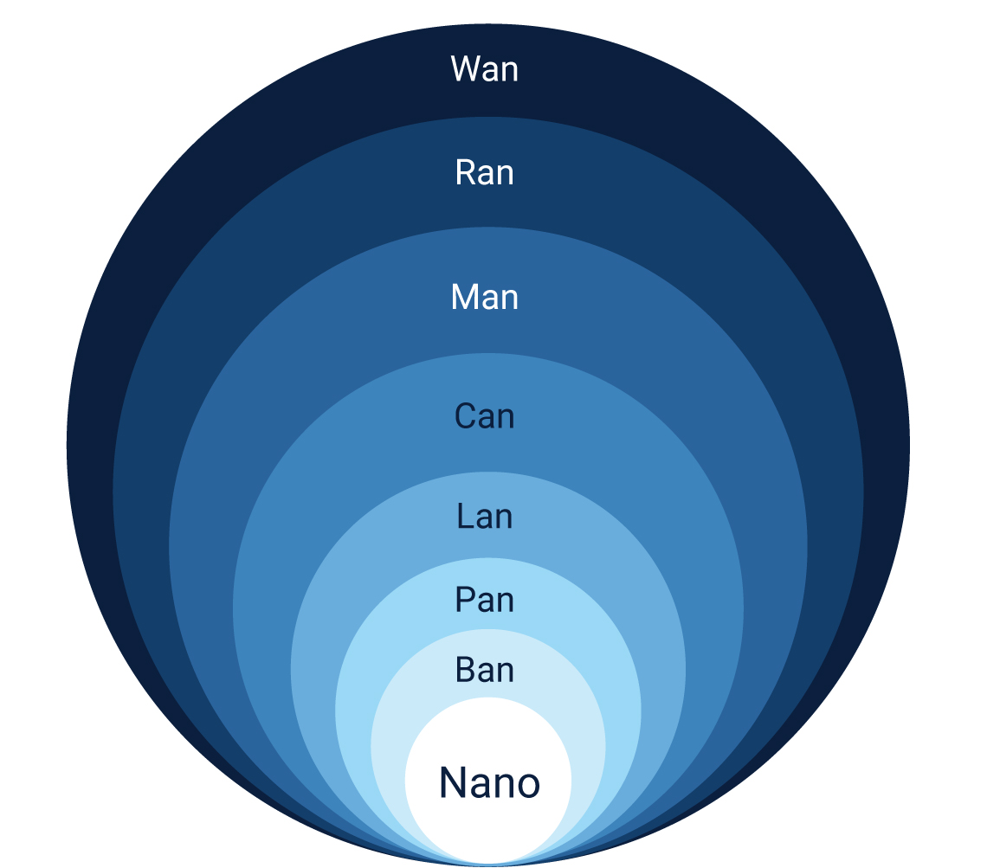
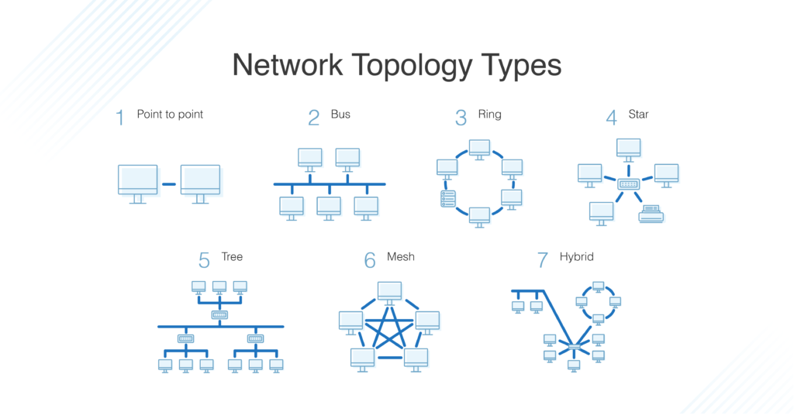

# Computer Networking

## Network Types

Common types of networks include the following:

- **Local Area Network** (LAN): The computers are geographically close together (that is, in the same building).
- **Wide Area Network** (WAN): The computers are farther apart and are connected by telephone lines or radio waves.
- **Metropolitan Area Network** (MAN): A data network designed for a town or city.
- **Home Area Network** (HAN): A network contained within a user’s home that connects a person’s digital devices.
- **Virtual Private Network** (VPN): A network that is constructed by using public wires usually the Internet to connect to a private network, such as a company’s internal network.
- **Storage Area Network** (SAN): A high-speed network of storage devices that also connects those storage devices with servers.

### Local Area Network (LAN)

A LAN connects network devices in such a way that personal computer and workstations can share data, tools and programs. The group of computers and devices are connected together by a switch, or stack of switches, using a **private addressing scheme** as defined by the TCP/IP protocol. Private addresses are unique in relation to other computers on the local network. Routers are found at the boundary of a LAN, connecting them to the larger WAN.

Data transmits at a very fast rate as the number of computers linked are limited. LANs cover smaller geographical area (Size is limited to a few kilometers) and are privately owned. One can use it for an office building, home, hospital, schools, etc. LAN is easy to design and maintain. A Communication medium used for LAN has twisted pair cables and coaxial cables. It covers a short distance, and so the error and noise are minimized.

Early LAN’s had data rates in the 4 to 16 Mbps range. Today, speeds are normally 100 or 1000 Mbps. Propagation delay is very short in a LAN. The smallest LAN may only use two computers, while larger LANs can accommodate thousands of computers. A LAN typically relies mostly on wired connections for increased speed and security, but wireless connections can also be part of a LAN. The fault tolerance of a LAN is more and there is less congestion in this network.

### Metropolitan Area Network (MAN)

A MAN covers a larger area than that of a LAN and smaller area as compared to WAN. It connects two or more computers that are apart but resides in the same or different cities. It covers a large geographical area and may serve as an ISP (**Internet Service Provider**). MAN is designed for customers who need a high-speed connectivity. Speeds of MAN ranges in terms of Mbps. It’s hard to design and maintain a Metropolitan Area Network.

The fault tolerance of a MAN is less and also there is more congestion in the network. It is costly and may or may not be owned by a single organization. The data transfer rate and the propagation delay of a MAN is moderate. Devices used for transmission of data through MAN are: Modem and Wire/Cable. Examples of a MAN are the part of the telephone company network that can provide a high-speed DSL line to the customer or the cable TV network in a city.

### Wide Area Network (WAN)

A WAN is a computer network that extends over a large geographical area, although it might be confined within the bounds of a state or country. A WAN could be a connection of LAN connecting to other LAN’s via telephone lines and radio waves and may be limited to an enterprise (a corporation or an organization) or accessible to the public. The technology is high speed and relatively expensive.

There are two types of WAN: **Switched WAN** and **Point-to-Point WAN**. WAN is difficult to design and maintain. Similar to a MAN, the fault tolerance of a WAN is less and there is more congestion in the network. A Communication medium used for WAN is PSTN or Satellite Link. Due to long distance transmission, the noise and error tend to be more in WAN.

WAN’s data rate is slow about a 10th LAN’s speed, since it involves increased distance and increased number of servers and terminals etc. Speeds of WAN ranges from few kilobits per second (Kbps) to megabits per second (Mbps). Propagation delay is one of the biggest problems faced here. Devices used for transmission of data through WAN are: Optic wires, Microwaves and Satellites. Example of a Switched WAN is the asynchronous transfer mode (ATM) network and Point-to-Point WAN is dial-up line that connects a home computer to the Internet.

## Network Topology

A network topology describes the physical composition of a network. Topologies are either physical or logical. There are four principal topologies used in LANs.

### Bus Topology

All devices are connected to a central cable, called the **bus** or **backbone**. Bus networks are relatively inexpensive and easy to install for small networks. The data is transmitted one end to another in single direction. No bi-directional feature is in bus topology. Even though it's the simplest type of network to implement, there are limitations to it. The first limitation is the length of the main cable or bus. The longer it gets, the higher the chance of signal dropout. This limitation constrains the physical layout of the network. All devices have to be physically located near each other, for example, in the same room. Finally, if there's a break in the bus cable, the whole network fails.

### Ring topology

All devices are connected to one another in the shape of a **closed loop**, so that each device is connected directly to two other devices, one on either side of it. This form of network is more resilient than the bus topology. A break in the cable ring also affects the performance of the network. The transmission is unidirectional, but it can be made bidirectional by having 2 connections between each Network Node, it is called **Dual Ring Topology**.

### Mesh topology

The mesh topology is described as either a **physical mesh** or a **logical mesh**. In a physical mesh, each network device connects to every other network device in the network. It dramatically increases the resilience of a network but has the physical overhead of connecting all devices. Few networks today are built as a full mesh. Most networks use a partial mesh, where some machines interconnect, but others connect through one device. There's a subtle difference between a physical mesh network and a logical one. The perception is that most modern networks are mesh based, since each device can see and communicate with any other device on the network. This description is of a logical mesh network and is primarily made possible through the use of network protocols.

### Star topology

The star topology is the most commonly used network topology. Each network device connects to a centralized hub or switch. Switches and hubs can be linked together to extend and build more extensive networks. This type of typology is, by far, the most robust and scalable.

## Network Standards

### Organizations

While network protocols provide a unified method for communication, network standards govern the hardware and software that uses them. Today, there are hundreds of thousands of hardware suppliers, yet all of their technology seamlessly integrates with your computer or network with minimal effort. Network standards provide a framework that enables the interoperability between devices.

There are a several leading organizations for standardization including:

- The **International Organization for Standardization** ([ISO](https://en.wikipedia.org/wiki/International_Organization_for_Standardization))
- The **American National Standards Institute** ([ANSI](https://en.wikipedia.org/wiki/American_National_Standards_Institute))
- The **Internet Engineering Task Force** ([IETF](https://en.wikipedia.org/wiki/Internet_Engineering_Task_Force))

### IEEE 802

The 802 specification covers all the physical networking standards for both Ethernet and wireless. The following table shows some of the more widely used standards.

| 802    | Overview        | Basics of physical and logical networking concepts                              | Status      |
| ------ | --------------- | ------------------------------------------------------------------------------- | ----------- |
| 802.1  | Bridging        | Higher Layer LAN Protocols (Bridging LAN/MAN, OSI Layer 2)                      | Active      |
| 802.2  | Logical Link    | The logical link control (LLC) specification                                    | Disbanded   |
| 802.3  | Ethernet        | Provides asynchronous networking                                                | Active      |
| 802.5  | Token ring      | The token-passing standard for shielded copper cables and twisted-pair cable    | Disbanded   |
| 802.11 | Wi-Fi           | WLAN media access control (MAC) and physical layer (PHY) specification          | Active      |
| 802.12 | Demand Priority | Ethernet data rate increased to 100 Mbps                                        | Disbanded   |
| 802.15 | WPAN            | Support for wireless personal area networks (bluetooth, uwb, zigbee..)          | Active      |
| 802.16 | WMAN            | Wireless metropolitan area networks Covers mobile and wireless broadband access | Hibernating |

## Network Devices

### Network Interface Card

An expansion board you insert into a computer so the computer can be connected to a network. Most NICs are designed for a particular type of network, protocol, and media, although some can serve multiple networks. The NIC allows computers to communicate over a computer network, either by using cables or wirelessly. The NIC is both a physical layer and data link layer device, as it provides physical access to a networking medium and, for IEEE 802 and similar networks, provides a low-level addressing system through the use of MAC addresses that are uniquely assigned to network interfaces.

### MAC Address

A MAC (**Media Access Control**) address, sometimes referred to as a hardware address or physical address, is an ID code that’s assigned to a network adapter or any device with built-in networking capability. The MAC address has a standard composition of six groups of 2 hexadecimal numbers separated by a colon or dash (48 bits). The first three numbers of the MAC address define the manufacturer's **Organizationally Unique Identifier** (OUI) and the remaining three numbers uniquely identify the device . For example, if the MAC address is AA-6A-BA-2B-68-C1 then the OUI is AA-6A-BA and 2B-68-C1 is the device ID.

### Repeaters

A repeater operates at the physical layer. Its job is to **regenerate the signal** over the same network before the signal becomes too weak or corrupted so as to extend the length to which the signal can be transmitted over the same network. An important point to be noted about repeaters is that they **do not amplify the signal**. When the signal becomes weak, they copy the signal bit by bit and regenerate it at the original strength. It is a 2 port device.

### Bridges

A bridge **divides a network into network segments** and can filter and forward data packets between these segments. Bridges use the network device's MAC address to decide the data package's destination. Typically, a bridge is used to improve network performance by reducing unnecessary network traffic on network segments.

### Hubs

A hub acts as a **multiport repeater** on a network. Hubs are used to connect more than one device and structure the layout of a network. For example, you can cascade hubs to create network branches or as an endpoint to create a star layout with multiple user type devices. Hubs contain multiple ports that act as an input/output Ethernet connection between the hub and a network device. A hub can operate at only one speed, which is the speed of the slowest network device on the network. It doesn't interpret or filter data packets and sends copies of each data packet to all attached devices.

### Switches

A switch **combines the functionality of a bridge and a hub**. It segments networks and can interpret and filter packet data to send it directly to an attached network device. Switches use the network device's MAC address to decide the data package's destination. A switch operates in **full-duplex mode**, which means it can send and receive data to and from network devices at the same time. The switch can perform error checking before forwarding data, that makes it very efficient as it does not forward packets that have errors and forward good packets selectively to correct port only. In other words, switch divides collision domain of hosts, but broadcast domain remains same.

**Managed switches** offers the means to adjust the configuration, behavior, and operation of the switch. The commonly available options are **traffic priority**, **virtuals LANs** (create logical groups of devices, improve security and performance), **Spanning Tree Protocol** (define alternative network routes in case a cable or device fails, improve resilience), **port mirroring** (exports a copy of the network traffic to a single port for a network analyzer), **bandwidth rate-limiting** (fine control of the bandwidth used by specific ports), **MAC address filtering**...

### Routers

Routers in an interconnected network maintain a **routing table** that lists the preferred route between each of the networks. The router acts as the start of **authority** for all the network devices on its network. Routing information is shared between routers by using a routing protocol like the **Border Gateway Protocol** (BGP).

There are several distinct classifications or types of routers:

- **Access routers**: Typically used in a home or small satellite offices, these routers tend to be low-cost devices with a simple routing need.
- **Distribution routers**: These routers compile traffic routing data from multiple routers. Distribution routers come with more significant memory and processing power. This type of router is designed to hold vast quantities of routing information. It's often used to manage and control the quality of service across a WAN.
- **Edge routers**: An edge router operates at the boundary between your network and other networks, for example, your local network and the internet. They act as gateways to filter traffic and route it internally or forward it based on the packet header. An edge router often comes with access control or firewalls to improve the security. It might also handle DHCP and DNS services.
- **Core routers**: Sometimes called enterprise routers, these routers are designed for higher bandwidths. They're used to connect different buildings or geographic locations together. Core routers tend to have fewer features than edge routers because their primary focus is on minimizing packet loss and preventing congestion. They tend to do packet forwarding to edge routers.

### Gateway

A gateway, as the name suggests, is a passage to connect two networks together that may work upon different networking models. They basically work as the messenger agents that take data from one system, interpret it, and transfer it to another system. Gateways are also called protocol converters and can operate at any network layer. Gateways are generally more complex than switch or router.

## Network Protocols

- [Network protocols to use when you implement a network](https://docs.microsoft.com/en-us/learn/modules/network-fundamentals/4-network-protocols)

### Network Protocols

- Network address
- Data Packet
- Datagram
- Routing

### Protocols Categories

### Communication protocols

### Security protocols

### Management protocols

- [School of SRE](https://linkedin.github.io/school-of-sre/linux_networking/intro/)
- [Network Protocols](https://docs.microsoft.com/en-us/learn/modules/network-fundamentals/4-network-protocols)

## IP address standards and services

- [TCP/IP Basics](https://docs.microsoft.com/en-us/learn/modules/network-fundamentals/5-ip-tcp-basics)

### ARP

### TCP/IP

- TCP/IP model layers

### Internet Protocol standards

- IPv4
- Structure of an IPv4 address
- Parts of an IPv4 address
- IPv4 address classes
- What is a subnet?
- Special-use addresses
- IPv4 address space exhaustion

### Private IP addressing

- IPv6
- Structure of an IPv6 address

### DNS

- [DNS Architecture](https://docs.microsoft.com/en-us/previous-versions/windows/it-pro/windows-server-2008-R2-and-2008/dd197427%28v=ws.10%29)

## Toolbox

From this [article](https://towardsdatascience.com/networking-tools-every-developer-needs-to-know-e17c9159b180)

- **ping**
- **dig**
- **netcat**
- **ip**
- **tracepath**
- **nmap**
- **ss**
- **tcpdump**
- **curl**: `curl | jq`
- **wget**

## Resources

- [Networking in a Day](https://cseweb.ucsd.edu/classes/sp16/cse291-e/applications/ln/lecture2.html)
- [Network Fundamentals Study Guide](https://www.webopedia.com/reference/network-fundamentals-study-guide/)
- [Fundamentals of computer networking](https://docs.microsoft.com/en-us/learn/modules/network-fundamentals/)
- [Computer Network Tutorials](https://www.geeksforgeeks.org/computer-network-tutorials)
- [The Internet](https://www.khanacademy.org/computing/computers-and-internet/xcae6f4a7ff015e7d:the-internet)
