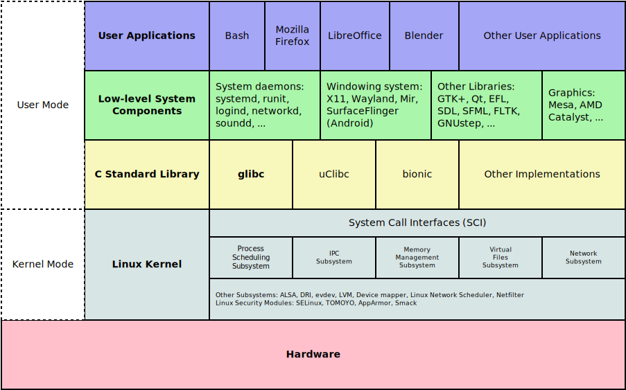

# Infrastructure & Operations

## Linux Basics

### Linux Architecture

* The Linux kernel is **monolithic** in nature.
* **System calls** are used to interact with the Linux kernel space.
* Kernel code can only be executed in **kernel mode**. Non-kernel code is executed in **user mode**.
* Device drivers are used to communicate with the hardware devices.

### File System Organization

* **bin**: User binaries \(ps, grep, ping..\).
* **sbin**: System binaries \(programs used for system administration: iptables, fdisk, ifconfig..\).
* **etc**: Configuration files \(/etc/resolv.conf, /etc/logrotate.conf\) and startup/shutdown shell scripts for programs.
* **dev**: Device files \(/dev/tty, /dev/stdin..\).
* **proc**: Process information \(pseudo filesystem: /proc/{pid}\) and system resources \(/proc/uptime\).
* **var**: Variable files \(files expected to grow: /var/log, /var/lib, /var/lock\).
* **tmp**: Temporary files \(created by system and users, deleted on system reboot\).
* **usr**: User Programs \(binaries, libs, documentation, source code for second level programs: less, cron, useradd..\).
* **home**: Home Directories \(user related files and directories\).
* **boot**: Boot loader files \(kernel initrd, vmlinux, grub files..\).
* **lib**: System libraries \(ld\* and lib\*.so.\* for binaries under /bin and /sbin\).
* **opt**: Optional add-on Apps \(for individual vendors\).
* **mnt**: Mount directory \(for mounted devices and filesystems\).
* **media**: Removable devices.
* **srv**: Service data \(for server specific services data\).

### Command Line Basics

* Navigating the filesystem: pwd, cd, ls
* Manipulating files: touch, mkdir, rm, cp, mv
* Viewing files: cat, head, tail, more, less
* Text processing: grep, sed, sort
* I/O redirection: &gt;, &gt;&gt;, i&gt;, i&gt;&j \(i and j are file descriptors\), &lt;, &lt;&gt;, \|

### Server administration

* User/Group management: id, whoami, /etc/passwd, /etc/shadow, /etc/group
* Commands for user management: useradd, passwd, usermod, userdel
* Commands for group management: groupadd, groupmod, groupdel, gpasswd
* File permission: chmod, chown, chgrp
* SSH: ssh-keygen, ssh-copy-id, ssh {user}@{hostname/ip} command, scp {source} {dest}
* procs and i/o management: ps, top, free, vmstat, df \(disk free\), du \(disk usage\)
* systemd: systemctl \[start\|stop\|restart\|status\|reload\] name.service

| Permission | rwx | Binary | Decimal |
| :--- | :--- | :--- | :--- |
| Read, write and execute | rwx | 111 | 7 |
| Read and write | rw- | 110 | 6 |
| Read and execute | r-x | 101 | 5 |
| Read only | r-- | 100 | 4 |
| Write and execute | -wx | 011 | 3 |
| Write only | -w- | 010 | 2 |
| Execute only | --x | 001 | 1 |
| None | --- | 000 | 0 |

## DevOps and SRE

* link to google review book

## Instrastructure as Code

* ansible
* terraform

## Observability

* architecture Prom + alermanager + DB
* architecture ELK
* OpenTracing / Jaeger etc

## Container Scheduling

* hashistack
* kubernetes
* service mesh
* ...

## Release engineering

* CI/CD - gitlab
* Artifactory

## Docker Best Practices

* **Run as non-root user**: Decrease the risk that container -&gt; host priviledge escalation could occur \(**PoLP**: Principle of Least Priviledge\).
* **Do not use a UID below 10000** In case of priviledge escalation, docker container UID may overlap with a more priviledged system user's UID.
* **Use a static UID and GID**: To manipulate file permissions for files owned by your container. Use `10000:10001` such that `chown 10000:10001 files/` always works.
* **Do not use latest, pin your image tags**: Pin image tags using a specific image version using `major.minor`, not major.minor.patch to get the latest security updates. Consider using [docker-lock](https://github.com/safe-waters/docker-lock).
* **Use** [**tiny**](https://github.com/krallin/tini) **as your ENTRYPOINT**: To ensure that the default signal handlers work for the software you run in your Docker image and protect from software that accidentally creates zombie processes.
* **Only store arguments in CMD**: The `ENTRYPOINT` should be the command name \(`ENTRYPOINT ["/sbin/tini", "--", "myapp"]`\) and `CMD` should only be arguments for the command \(`CMD ["--foo", "1", "--bar=2"]`\) so `docker run yourimage --help` works.

Resources:

* [Docker security](https://docs.docker.com/engine/security/)
* [Dockerfile best practices ](https://github.com/hexops/dockerfile)

## Chaos Engineering

* [https://principlesofchaos.org/](https://principlesofchaos.org/)

## Post Mortem Report

### Title

* Date
* Project
* Environnement
* Infrastructure

### Incident overview

Brief description of the incident. Include general informations, like for instance:

* Context, reasons, time and duration of the incident
* Type of incident: complete downtime, loss of data, partial interruption of normal operation etc.
* People impacted by the incident: end users, business owners, developpers etc.

### Timeline

Precise timeline of the different issues that happened during the incident, including:

* Starting date of the incident
* Date when actions were taken to mitigate the incident
* Resolution date of the incident

### Root cause analysis

Detailed desciption of what caused the incident.

### Resolution

Description of all the actions taken to resolve the incident. Include every actions taken, even the incorrect of ineffective ones.

### Preventive measures

List all the measures that should be taken to prevent/avoid this type of incident to happen again in the future. Ex: logging, monitoring, code improvements, development workflow etc.

## Resources

* [Counting & Timing](https://code.flickr.net/2008/10/27/counting-timing/)
* [Brendan Gregg Overview](http://www.brendangregg.com/overview.html)
* [eBPF - Rethinking the Linux Kernel](https://www.infoq.com/presentations/facebook-google-bpf-linux-kernel/)

