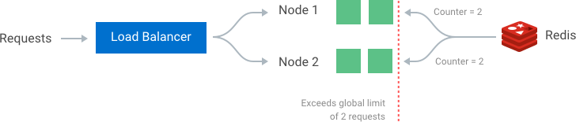

# Systems Design

## Introduction Systems Design

- https://lethain.com/introduction-to-architecting-systems-for-scale/
- https://www.aosabook.org/en/distsys.html

### Load Balancing

### Caching

### Content distribution networks

### Off-line processing

### Database Scaling

## Back of the envelope Estimation

### Latency Numbers

| Operation                                 |         Time ns |    Time μs | Time ms | Comments                    |
| ----------------------------------------- | --------------: | ---------: | ------: | --------------------------- |
| L1 cache reference                        |          0.5 ns |            |         |                             |
| Branch mispredict                         |            5 ns |            |         |                             |
| L2 cache reference                        |            7 ns |            |         | 14x L1 cache                |
| Mutex lock/unlock                         |           25 ns |            |         |                             |
| Main memory reference                     |          100 ns |            |         | 20x L2 cache, 200x L1 cache |
| System call overhead                      |          400 ns |            |         |                             |
| Compress 1KB bytes with Zippy             |        3,000 ns |       3 μs |         |                             |
| Context switch between processes          |        3,000 ns |       3 μs |         |                             |
| Send 1K bytes over 1 Gbps network         |       10,000 ns |      10 μs |         |                             |
| fork\(\) \(statically-linked binary\)     |       70,000 ns |      70 μs |         |                             |
| Read 4K randomly from SSD                 |      150,000 ns |     150 μs |         | ~1GB/sec SSD                |
| fork\(\) \(dynamically-linked binary\)    |      160,000 ns |     160 μs |         |                             |
| Read 1MB sequentially from memory         |      250,000 ns |     250 μs |         |                             |
| Roundtrip within same datacenter          |      500,000 ns |     500 μs |         |                             |
| Read 1 MB sequentially from SSD           |    1,000,000 ns |   1,000 us |    1 ms | ~1GB/sec SSD, 4X memory     |
| Disk seek                                 |   10,000,000 ns |  10,000 μs |   10 ms | 20x datacenter roundtrip    |
| Read 1MB sequentially from disk           |   20,000,000 ns |  20,000 μs |   20 ms | 80x memory, 20X SSD         |
| Send packet CA -&gt; Netherlands -&gt; CA | 150,000,0000 ns | 150,000 μs |  150 ms |                             |

### Availability Numbers

| Availability %          | Downtime per year | Downtime per month  | Downtime per week   | Downtime per day    |
| ----------------------- | ----------------- | ------------------- | ------------------- | ------------------- |
| 90% (one nine)          | 36.53 days        | 73.05 hours         | 16.80 hours         | 2.40 hours          |
| 99% (two nines)         | 3.65 days         | 7.31 hours          | 1.68 hours          | 14.40 minutes       |
| 99.9% (three nines)     | 8.77 hours        | 43.83 minutes       | 10.08 minutes       | 1.44 minutes        |
| 99.99% (four nines)     | 52.60 minutes     | 4.38 minutes        | 1.01 minutes        | 8.64 seconds        |
| 99.999% (five nines)    | 5.26 minutes      | 26.30 seconds       | 6.05 seconds        | 864.00 milliseconds |
| 99.9999% (six nines)    | 31.56 seconds     | 2.63 seconds        | 604.80 milliseconds | 86.40 milliseconds  |
| 99.99999% (seven nines) | 3.16 seconds      | 262.98 milliseconds | 60.48 milliseconds  | 8.64 milliseconds   |

## Rate Limiter

### Introduction to rate limiting

In a network system, a rate limiter is used to control the rate of traffic sent by a client or a service. In the HTTP world, a rate limiter limits the number of client requests allowed to be sent over a specified period. If the API request count exceed the threshold defined by the rate limiter, all the excess calls are rejected.

Rate limiting is generally put in place as a defensive measure for services. The benefits of using an API rate limiter:

- **Prevent resource starvation**: Caused by Denial of Service (DoS) attack, either intentional or unintentional.
- **Manage policies and quotas**: When the capacity of a service is shared among many users or consumers, it can apply rate limiting per user to provide fair and reasonable use, without affecting other users.
- **Control flow**: Distribute work more evenly between workers by limiting the flow into each worker, preventing a single worker from accumulating a queue of unprocessed items while other workers are idle.
- **Avoid excess costs**: If an underlying resource is capable of auto-scaling to meet demand, but the budget for that resource usage is limited; to prevent experiments from running out of control and accumulating large bills. Good practice to set initial quotas that can be increased on demand.

### Algorithms for Rate Limiting

There are various algorithms for rate limiting, each with its benefits and drawbacks. Let’s review each of them so we can pick the best one for our needs.

#### Token Bucket

The token bucket algorithm is based on an analogy of a **fixed capacity bucket into which tokens are added at a fixed rate**. When a request is made, the bucket is inspected to see if it contains sufficient tokens at that time. If so, the appropriate number of tokens are removed ("cashed in"), and the request is passed. The request is rejected if there are insufficient tokens in the bucket, and the contents of the bucket are not changed.

#### Leaky Bucket

When registering a request, the system **appends it to the end of a FIFO queue**. Requests are pulled from the queue and **processed at a regular interval**. If the queue is full, then additional requests are discarded (or leaked).

The advantage of the leaky bucket:

- Easy to implement.
- It smoothens burst of requests by processing them at a constant rate.
- The size of the queue used will be constant, hence it is memory efficient.

The disadvantage of the leaky bucket:

- A burst of traffic can fill-up the queue with old requests in a time slot and the new request might starve.
- It provides no guarantee that requests will be processed in a fixed amount of time.

#### Fixed Window

The algorithm **divides the timeline into fix-sized time windows and assign a counter for each window**. Each incoming request increments the counter for the window. Once the counter reaches the threshold, new requests are dropped until a new time window starts. The current timestamp floor typically defines the windows, so 12:00:03, with a 60 second window length, would be in the 12:00:00 window.

The advantage of the fixed window:

- Easy to implement.
- Less memory requirement since we are storing the only count in a given time window.
- Ensures more recent requests get processed without being starved by old requests (as the counter resets after every window).

The disadvantage of the fixed window:

- A single burst of traffic that occurs near the boundary of a window can result in twice the rate of requests being processed.
- Many consumers waiting for a reset window can stampede the server at the same time.

#### Sliding Log

The algorithm involves **tracking a time-stamped log for each consumer's request**. The system stores these logs in a time-sorted hash set or table. It also discards logs with timestamps beyond a threshold. When a new request comes in, we calculate the sum of logs to determine the request rate. If the request would exceed the threshold rate, then it is held.

The advantage of the sliding log:

- Does not suffer from the boundary conditions of fixed windows: enforcement of the rate limit will remain precise

The disadvantage of the sliding log:

- Can be costly to store a log for every request. It’s also expensive to compute because each request requires calculating a summation over the consumer’s prior requests, potentially across a cluster of servers. As a result, it does not scale well to handle large bursts of traffic or denial of service attacks.

#### Sliding Window

Sliding Window is a **hybrid approach that combines the fixed window algorithm's low processing cost and the sliding log's improved boundary conditions**. Like the fixed window algorithm, we track a counter for each fixed window. Next, we account for a weighted value of the previous window’s request rate based on the current timestamp to smooth out bursts of traffic. For example, if the current window is 25% through, we weigh the previous window’s count by 75%. The relatively small number of data points needed to track per key allows us to scale and distribute across large clusters.

The advantage of the sliding window:

- Easy to implement.
- Soothens the traffic spikes problem we had in the fixed window method
- It has very little memory usage: we need to store only 2 numbers per counter.

The disadvantage of the sliding window:

- It results in an approximate value, but the value is very close to an accurate value.

### Rate Limiting in Distributed Systems

#### Synchronization Policies

If we want to enforce a **global rate limit** when using a **cluster of multiple nodes**, you must **set up a policy to enforce it**. If each node were to track its rate limit, a consumer could exceed a global rate limit when sending requests to different nodes. The greater the number of nodes, the more likely the user will exceed the global limit.

The simplest way to enforce the limit is to set up **sticky sessions** in our load balancer so that each consumer gets sent to exactly one node. The disadvantages include a lack of fault tolerance and scaling problems when nodes get overloaded.

A better solution that allows more flexible load-balancing rules is to use a **centralized data store** such as Redis or Cassandra. A centralized data store will collect the counts for each window and consumer. The two main problems with this approach are increased latency making requests to the data store and race conditions, which we will discuss next.

#### Race Conditions

One of the most extensive problems with a centralized data store is the potential for **race conditions** in **high concurrency** request patterns. This issue happens when you use a **naïve "get-then-set" approach**, where you retrieve the current rate limit counter, increment it, and then push it back to the datastore. This model’s problem is that additional requests can come through in the time it takes to perform a full cycle of read-increment-store, each attempting to store the increment counter with an invalid (lower) counter value. This allows a consumer to send a very high rate of requests to bypass rate limiting controls.

One way to avoid this problem is to put a **lock** around the key in question, preventing any other processes from accessing or writing to the counter. A lock would quickly become a **significant performance bottleneck** and does not scale well, mainly when using remote servers like Redis as the backing datastore.

A better approach is to use a **"set-then-get"** mindset, relying on **atomic operators** that implement locks in a very performant fashion, allowing you to quickly increment and check counter values without letting the atomic operations get in the way.

#### Optimizing for Performance

The increased **latency** is another disadvantage of using a centralized data store when checking the rate limit counters. Unfortunately, even checking a fast data store like Redis would result in milliseconds of additional latency for every request.

Make checks locally **in memory** to make these rate limit determinations with minimal latency. To make local checks, relax the rate check conditions and use an eventually consistent model. For example, each node can create a data sync cycle that will synchronize with the centralized data store. Each node periodically pushes a counter increment for each consumer and window to the datastore. These pushes atomically update the values. The node can then retrieve the updated values to update its in-memory version. This cycle of **converge → diverge → reconverge** among nodes in the cluster is eventually consistent.

**The periodic rate at which nodes converge should be configurable**. Shorter sync intervals will result in less divergence of data points when spreading traffic across multiple nodes
in the cluster (e.g., when sitting behind a round robin balancer). Whereas longer sync intervals put less read/write pressure on the datastore and less overhead on each node to fetch new synced values.

### Detailed design

## Consistent Hashing

## Key-Value Store

## UUID Generator

## URL Shortener

## Web Crawler

## Notification

## News Feed

## Chat

## Search Autocomplete

## Youtube

## Google

## Resources

- [Numbers Everyone Should Know](https://everythingisdata.wordpress.com/2009/10/17/numbers-everyone-should-know/)
- [School of SRE](https://linkedin.github.io/school-of-sre/systems_design/intro/)
- [The System Design Primer](https://github.com/donnemartin/system-design-primer)
- [The Architecture of Open Source Applications](https://aosabook.org/en/index.html)
- [System Design Interview](https://www.goodreads.com/book/show/54109255-system-design-interview-an-insider-s-guide)
