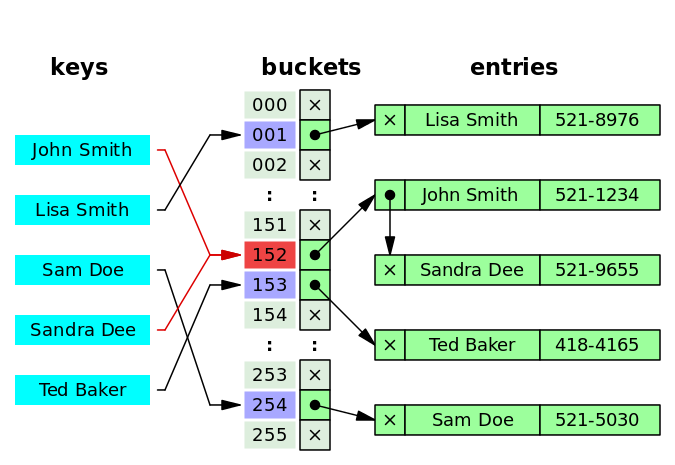
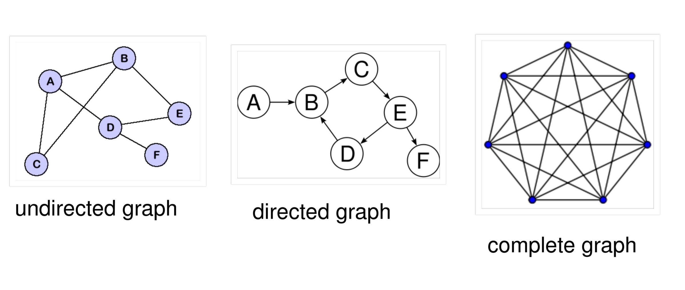
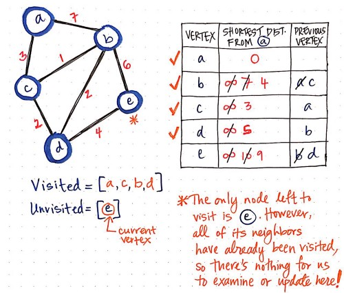
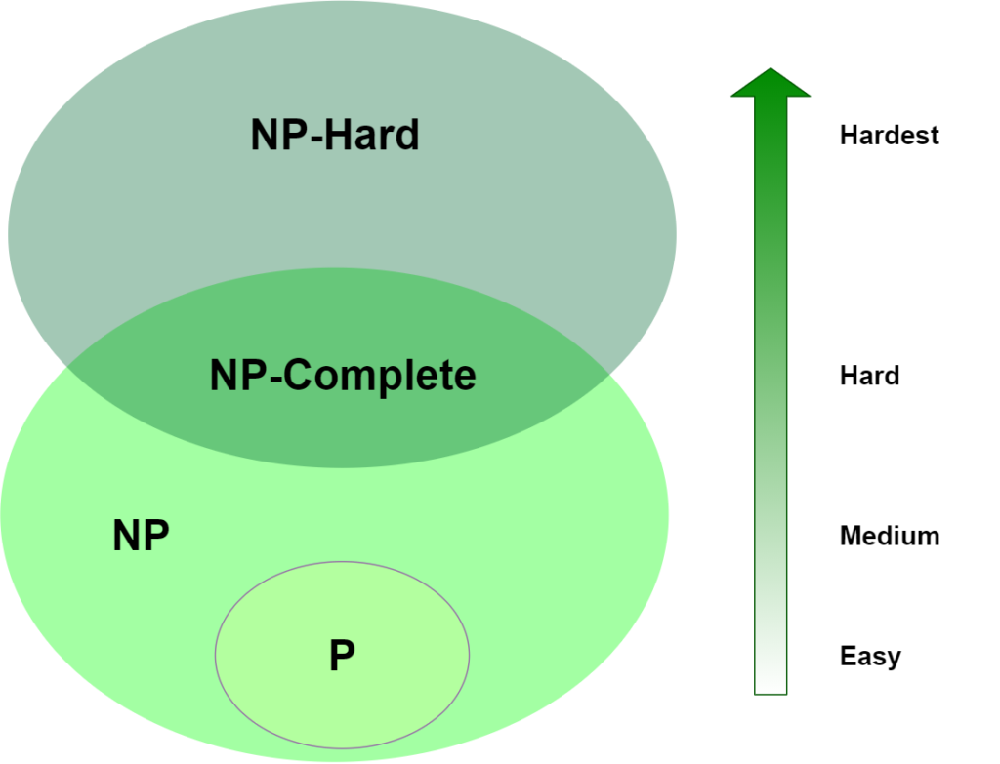
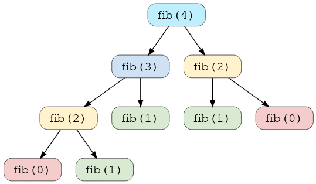
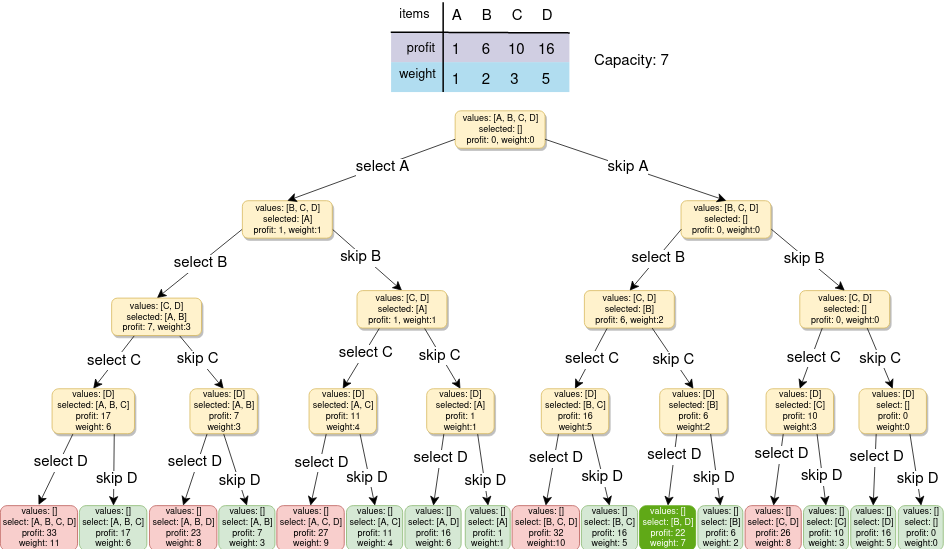
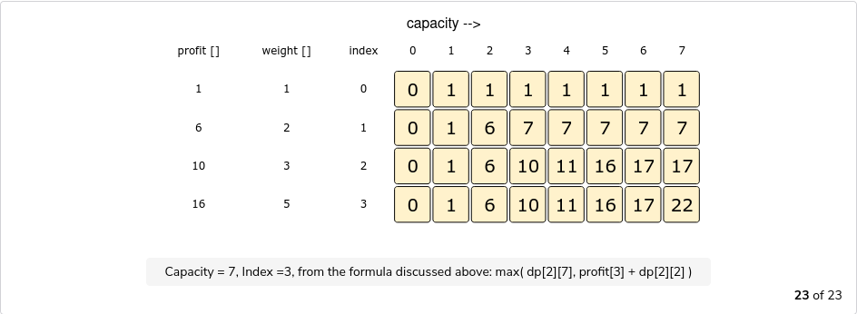
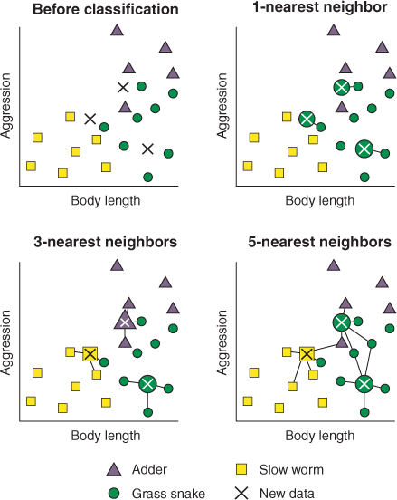

# Algorithms & Data Structures I

TLDR:

- **Big O notation**: constant, linear, logarithmic, linearithmic, square root, quadratic, cubic, polynomial, exponential, factorial
- **Data structures**: arrays, linked lists, hash tables, stacks, queues, graphs, sets
- **Tail recursion** and **Divide and conquer**
- **Search algorithms**: linear search and binary search
- **Sorting algorithms**: insertion sort and selection sort \(simple sorts\), merge sort and quicksort \(efficient sorts\)
- **Graph algorithms**: Breadth-first search, Dijkstra’s algorithm, Bellman-Ford algorithm
- **Greedy algorithms** and **NP-complete problems**
- **Dynamic Programming**
- **K-Nearest Neighbors** (KNN)

## 1. Introduction to Algorithms

### Binary Search

Binary search is an efficient algorithm for finding an item from a **sorted list of items**. It works by repeatedly **dividing in half** the portion of the list that could contain the item, until you've narrowed down the possible locations to just one. The time complexity is **O\(Log n\)**: for any list of n element, binary search will take log\(n\) steps.

Example with python 3:

```python
def binary_search(list, item):
    # keep track of which part of the list we search in
    start = 0
    end = len(list) - 1

    step = 1
    while (start <= end):
        # rounds the result down to the nearest whole number
        mid = (start + end) // 2
        guess = list[mid]
        print(f"Step {step}: guessing {guess} (index {mid}) in {list[start:end+1]}")

        # found the item
        if item == guess:
            print(f"Found {item} at index {mid}")
            return mid

        # guess is too high
        if guess > item:
            end = mid - 1
        # guess is too low
        else:
            start = mid + 1

        step += 1
    return -1

sorted_list = [1,2,3,4,5,6,7,8,9,10]
binary_search(sorted_list, 9)
```

Output:

```text
Step 1: guessing 5 (index 4) in [1, 2, 3, 4, 5, 6, 7, 8, 9, 10]
Step 2: guessing 8 (index 7) in [6, 7, 8, 9, 10]
Step 3: guessing 9 (index 8) in [9, 10]
Found 9 at index 8
```

### Big O Notation

Big O notation tells how **fast** an algorithm **running time grows**. Big O notation is written `O(n)` where `O` means "Big O" and `n` is the number of operations.

Big O establishes **worst-case run time**: A simple / linear search algorithm \(a sequential search is made over all items one by one\) takes **O\(n\)** time to run. However, if the first entry match the search, it only took **O\(1\)**.

Some common Big O run times sorted from fastest to slowest:

- **O\(log n\)** also known as _log time_ \(ex: binary search\)
- **O\(n\)**: also known as _linear time_ \(ex: simple search\)
- **O\(n \* log n\)**: a fast sorting algorithm \(ex: quicksort, see chapter 4\)
- **O\(n^2\)**: a slow sorting algorithm \(ex: selection sort, see chapter 2\)
- **O\(n!\)**: a really slow algorithm \(ex: the traveling salesperson: he wants to hit a n number of cities while travelling the minimum distance\)


## 2. Selection Sort

### Arrays and Linked Lists

Both Arrays and Linked Lists are **linear data structures**, but they have some advantages and disadvantages over each other.

Arrays:

- **Index based** data structure where each elements are associated with an index.
- They are stored in **sequential** memory location.
- They have a **fixed size**, specified during declaration and allocated during compile time.
- Elements are accessed **directly** \(specifying the element index\), at **O\(1\)**.
- Insertion and deletion is relatively slow \(as shifting is required\), at **O\(n\)**.

Linked Lists:

- **Reference based** data structure where each node consists of the data and the reference to the next element.
- They are stored **randomly** in memory.
- They have a **variable** number of elements and grow and shrink during run time.
- Elements are accessed **sequentially** \(traversing the node, starting from the first one\) at **O\(n\)**.
- Insertion and deletion is fast, at **O\(1\)**.

### Selection Sort

Selection sort is a simple **in-place comparison-based** sorting algorithm. It has **O\(n^2\)** complexity. The list is divided into two parts, the sorted part at the left end and the unsorted part at the right end. Initially, the sorted part is empty and the unsorted part is the entire list.

The smallest element is selected from the unsorted array and **swapped** with the leftmost element, and that element becomes a part of the sorted array. This process continues, moving unsorted array boundary by one element to the right.


**In-place** means that the algorithm does **not use extra space for manipulating the input** but may require a small though non constant extra space for its operation. Usually, this space is O\(log n\), though sometimes anything in O\(n\) \(Smaller than linear\) is allowed.


Example with python 3:

```python
def selection_sort(list):
    print(f"Selection sort on: {list}")

    # range over all the array indexes
    for i in range(len(list)):
        min_idx = i

        # find the index of the smallest element in the remaining array
        for j in range(i+1, len(list)):
            if list[j] < list[min_idx]:
                min_idx = j

        # swap the smallest element with the current one
        list[i], list[min_idx] = list[min_idx], list[i]
        print(f"Swapped {list[i]} with {list[min_idx]}: {list}")

unsorted_list = [9,6,5,8,4,2,1,3,7]
selection_sort(unsorted_list)
```

Output:

```text
Selection sort on: [9, 6, 5, 8, 4, 2, 1, 3, 7]
Swapped 1 with 9: [1, 6, 5, 8, 4, 2, 9, 3, 7]
Swapped 2 with 6: [1, 2, 5, 8, 4, 6, 9, 3, 7]
Swapped 3 with 5: [1, 2, 3, 8, 4, 6, 9, 5, 7]
Swapped 4 with 8: [1, 2, 3, 4, 8, 6, 9, 5, 7]
Swapped 5 with 8: [1, 2, 3, 4, 5, 6, 9, 8, 7]
Swapped 6 with 6: [1, 2, 3, 4, 5, 6, 9, 8, 7]
Swapped 7 with 9: [1, 2, 3, 4, 5, 6, 7, 8, 9]
Swapped 8 with 8: [1, 2, 3, 4, 5, 6, 7, 8, 9]
Swapped 9 with 9: [1, 2, 3, 4, 5, 6, 7, 8, 9]
```


Another simple sort algorithm is **insertion sort**. Insertion sort works by taking elements from the list one by one and inserting them in their correct position into **a new** sorted list. Insertion sort is generally faster than selection sort due to fewer comparisons and good performance on almost-sorted data, and thus is preferred in practice. But, selection sort uses fewer writes, and thus is used when write performance is a limiting factor.


## 3. Recursion

### Definition

A program is called **recursive** when an entity calls itself \(vs an **iterative** program when there is a loop\).

To avoid infinite loop when writing a recursive function, we have to tell it when to stop recursing, it's the **base case**. The **recursive case** is when the function actually calls itself.

Example with python 3:

```python
def countdown(i):
    print(i)
    if i <= 1:      # base case
        return
    countdown(i-1)  # recursive case

countdown(10)
```

### Stacks

A **Stack** is an **abstract data type** that serves as a collection of elements, with two main principal operations:

- **Push**: Add an element to the collection.
- **Pop**: Remove the most recently added element that was not yet removed.

The order in which elements come off a stack gives rise to its alternative name, **LIFO** \(last in, first out\). Additionally, a **peek** operation may give access to the top without modifying the stack.

Considered as a linear data structure, or more abstractly a sequential collection, the push and pop operations occur only at **one end of the structure**, referred to as the **top** of the stack. This data structure makes it possible to implement a stack as a single linked list and a pointer to the top element. A stack may be implemented to have a **bounded capacity**. If the stack is full and does not contain enough space to accept an entity to be pushed, the stack is then considered to be in an **overflow** state.

### The Call Stack

A **call stack** is a stack data structure that stores information about the active subroutines of a computer program. A subroutine is a sequence of program instructions that perform a specific task, packaged as a unit and can be used in programs wherever the task should be performed. Think of a subroutine as a method or a function. The main purpose of the call stack is to keep track of the point to which each active subroutine should return control when it finishes executing.

The call stack is made up of **stack frames**, one for each method call. A stack frame usually stores:

- Local variables
- Arguments passed into the method
- Information about the caller's stack frame
- The return address: what the program should do after the function returns \(i.e.: where it should "return to"\).


Each method call creates its own stack frame, taking up space on the call stack. That's important because it can impact the **space complexity** of an algorithm. Especially when we use **recursion**.

### Tail Recursion

A recursive function is **tail recursive** when recursive call is the last thing executed by the function. Modern compilers do **tail call elimination** to optimize the tail recursive code. The idea used by compilers to optimize tail-recursive functions is simple: since the recursive call is the last statement, there is nothing left to do in the current function, so saving the current function’s stack frame is of no use. Tail call elimination reduces **space complexity** of recursion **from O\(N\) to O\(1\)**. As function call is eliminated, no new stack frames are created and the function is executed in **constant memory space**.

Example of a non-tail recursive function with python 3:

```python
def fact(n):
    if (n == 0):
        return 1
    return n * fact(n-1)
```

The value returned by `fact(n-1)` is used in `fact(n)`, so the call to `fact(n-1)` is not the last thing done by `fact(n)`. A tail recursive function would use one more argument to accumulate the factorial value:

```python
def fact(n, acc = 1):
    if (n == 0):
        return acc
    return fact(n - 1, n * acc)
```


Python interpreters don't support tail call optimization, this is for demonstration purpose only.


## 4. Quicksort

### Divide and Conquer

**Divide and conquer** is an **algorithm design paradigm** based on multi-branched recursion. A divide-and-conquer algorithm works by **recursively breaking down** a problem into two or more sub-problems of the **same or related type**, until these become simple enough to be solved. The solutions to the sub-problems are then **combined** to give a solution to the original problem. Because divide-and-conquer **solves subproblems recursively**, each subproblem must be smaller than the original problem, and there must be a **base case for subproblems**.

Divide-and-conquer algorithms have three parts:

- **Divide the problem** into a number of subproblems that are smaller instances of the same problem.
- **Conquer the subproblems** by solving them recursively. If they are small enough, solve the subproblems as base cases.
- **Combine the solutions** to the subproblems into the solution for the original problem.



The **Euclidean algorithm**, to compute the greatest common divisor \(**GCD**\) of two numbers by reducing the numbers to smaller and smaller equivalent subproblems, is one of the ancient algorithm using this technique \(which dates to several centuries BC\).


Some authors consider that the name "divide and conquer" should be used only when each problem may generate two or more subproblems. The name **decrease and conquer** has been proposed instead for the single-subproblem class

Using Divide and Conquer to find Fibonacci numbers:


In mathematics, the **Fibonacci numbers**, commonly denoted Fn, form a sequence, called the **Fibonacci sequence**, such that **each number is the sum of the two preceding ones**, starting from 0 and 1.


Let's look at the Fibonacci numbers, starting with a list `[0, 1]`:

```text
# [0, 1]
0 + 1 = 1       # 2nd fib number
# [0, 1, 1]
1 + 1 = 2       # 3rd fib number
# [0, 1, 1, 2]
2 + 1 = 3       # 4th fib number
# [0, 1, 1, 2, 3]
```

The first thing when designing a divide and conquer algorithm is to design the recurrence. The recurrence always starts with a base case:

```python
def f(n):
    if n == 0 or n == 1:
        return n
```


The best case is often 0 or 1 when working with numbers and an empty array or an array with one element when working with arrays.


This base case will give us the 1st \(n = 0\) and the 2nd \(n = 1\) fibonacci number. Next, to calculate the 3rd number, we will do 2nd + 1st number, in other word \(2 - 1\) + \(1 - 1\). From now on, we want to add the last 2 Fibonacci numbers together:

```python
def f(n):
    if n == 0 or n == 1:
        return n
    else:
        return f(n - 1) + f(n - 2)
```

### Merge Sort

**Merge Sort**, invented by John von Neumann in 1945, is a Divide and Conquer algorithm. It divides the input array into two halves, calls itself for the two halves, and then merges the two sorted halves. It can be expressed as **T\(n\) = 2T\(n/2\) + θ\(n\)** and is **θ\(n Log n\)** in all 3 cases \(**worst, average and best case**\) as merge sort always divides the array into two halves and takes linear time to merge two halves.

Example with python 3:

```python
def merge_sort(arr):
    # base case
    if len(arr) <= 1:
        return arr

    # divide the array into two halves
    mid = len(arr) // 2
    left = arr[:mid]
    right = arr[mid:]
    print(f"Divided {arr} into {left} and {right}")

    # sort both halves
    merge_sort(left)
    merge_sort(right)

    # merge data from sorted arrays left and rights
    i = j = k = 0
    while i < len(left) and j < len(right):
        if left[i] < right[j]:
            arr[k] = left[i]
            i += 1
        else:
            arr[k] = right[j]
            j += 1
        k += 1

    # check if any element was left
    while i < len(left):
        arr[k] = left[i]
        i += 1
        k += 1
    while j < len(right):
        arr[k] = right[j]
        j += 1
        k += 1

    print(f"Merged {left} and {right} into {arr}")


unsorted_arr = [9, 6, 5, 8, 4, 2]
merge_sort(unsorted_arr)
```

Output:

```text
Divided [9, 6, 5, 8, 4, 2] into [9, 6, 5] and [8, 4, 2]
Divided [9, 6, 5] into [9] and [6, 5]
Divided [6, 5] into [6] and [5]
Merged [6] and [5] into [5, 6]
Merged [9] and [5, 6] into [5, 6, 9]
Divided [8, 4, 2] into [8] and [4, 2]
Divided [4, 2] into [4] and [2]
Merged [4] and [2] into [2, 4]
Merged [8] and [2, 4] into [2, 4, 8]
Merged [5, 6, 9] and [2, 4, 8] into [2, 4, 5, 6, 8, 9]
```


Most implementations of merge sort produce a **stable sort**: objects with equal keys appear in the same order in sorted output as they appear in the input array to be sorted.


### Quicksort

Quicksort is another divide-and-conquer algorithm. It works by selecting a **pivot** element from the array and partitioning the other elements into two sub-arrays, according to whether they are **less than or greater than the pivot**. The sub-arrays are then sorted recursively. This can be done in-place, requiring small additional amounts of memory to perform the sorting. However, efficient implementations of Quicksort are not a stable sort.

The way that Quicksort uses divide-and-conquer is a little different from how merge sort does. In merge sort, the divide step does hardly anything, and all the real work happens in the combine step. Quicksort is the opposite: **all the real work happens in the divide step**.

Its **worst-case** running time is as bad as selection sort and insertion sort: **O\(n^2\)**. But its **average-case** running time is as good as merge sort: **O\(n log n\)**.

```python
def partition(arr, start, end):
    # pick the pivot as the last element of arr
    pivot = arr[end]
    # track the future index of pivot
    i = start

    for j in range(start, end):
        # if current element is smaller than the pivot
        if arr[j] < pivot:
            arr[i], arr[j] = arr[j], arr[i]
            i += 1

    # put the pivot at its right place in arr
    arr[i], arr[end] = arr[end], arr[i]
    return i

def quick_sort(arr, start, end):
    # base case handles arr of 1 element
    if start >= end:
        return

    # put pivot at the right place in arr
    input = arr[start:end+1]
    pivot = partition(arr, start, end)
    print(f"Partition of {input} done with pivot {arr[pivot]}: array is now {arr}")

    # sort elements before and after the pivot
    quick_sort(arr, start, pivot - 1)
    quick_sort(arr, pivot + 1, end)


unsorted_arr = [7, 2, 4, 1, 8, 5]
quick_sort(unsorted_arr, 0, len(unsorted_arr) - 1)
```

Output:

```text
Partition of [7, 2, 4, 1, 8, 5] done with pivot 5: array is now [2, 4, 1, 5, 8, 7]
Partition of [2, 4, 1] done with pivot 1: array is now [1, 4, 2, 5, 8, 7]
Partition of [4, 2] done with pivot 2: array is now [1, 2, 4, 5, 8, 7]
Partition of [8, 7] done with pivot 7: array is now [1, 2, 4, 5, 7, 8]
```


**Pivot selection** is an important part of quick sort. Selecting the first or last element in a nearly sorted or reversed sorted array degrades the performance to **O\(n^2\)** because all the elements will go to only one partition. Pivot should be chosen **randomly** or by using the **median value of the first, the last, and the middle element** of the array.

The **constant factor** in the big O notation is used to compare algorithms with the same run time. On the average case, let's say Quicksort run at **k1 \* n log n** and merge sort at **k2 \* n log n**. k1 is actually smaller than k2 and Quicksort is faster than merge sort on average case, even though it is slower on worst case.


## 5. Hash Tables

A hash table \(**hash map**\) is a data structure that implements an **associative array abstract data type**, a structure that can map keys to values. A hash table uses a **hash function** to compute an index, also called a hash code, into an array of buckets or slots, from which the desired value can be found. During lookup, the key is hashed and the resulting hash indicates where the corresponding value is stored.

Hashing is implemented in two steps:

1. An element is converted into an integer by using a hash function. This element can be used as an index to store the original element, which falls into the hash table.
2. The element is stored in the hash table where it can be quickly retrieved using hashed key.

```
hash = hashfunc(key)
index = hash % array_size
```

In this method, the hash is independent of the array size and it is then reduced to an index (a number between 0 and array_size − 1) by using the modulo operator (%).

### Hash Functions

A hash function is any function that can be used to map a data set of an arbitrary size to a data set of a fixed size, which falls into the hash table. The values returned by a hash function are called hash values, hash codes, hash sums, or simply hashes. Properties of a hash function:

- **Uniformity**: The hash function should map the expected inputs as evenly as possible over its output range.
- **Efficiency**: The use of a hash function is a trade off between search time and data storage space. A hash table can be very large, very sparse, but very fast.
- **Deterministic**: For a given input value it must always generate the same hash value.

### Collisions Handling

Ideally, the hash function will assign each key to a unique bucket, but most hash table designs employ an imperfect hash function, which might cause hash **collisions** where the hash function generates the same index for more than one key. Such collisions are typically accommodated in some way.

#### Separate Chaining (Open Hashing)

Separate chaining is one of the most commonly used collision resolution techniques. It is usually implemented using **linked lists**. In separate chaining, each element of the hash table is a linked list. To store an element in the hash table you must insert it into a specific linked list. If there is any collision (i.e. two different elements have same hash value) then store both the elements in the same linked list.



#### Open Addressing (Closed Hashing)

In Open Addressing, instead of in linked lists, all entry records are stored in the array itself. When a new entry has to be inserted, the hash index of the hashed value is computed and then the array is examined (starting with the hashed index). If the slot at the hashed index is unoccupied, then the entry record is inserted in slot at the hashed index else it proceeds in some probe sequence **until it finds an unoccupied slot**.

Well-known probe sequences include:

- **Linear probing**, in which the interval between probes is fixed (usually 1). Because of good CPU cache utilization and high performance this algorithm is most widely used on modern computer architectures in hash table implementations.
- **Quadratic probing**, in which the interval between probes is increased by adding the successive outputs of a quadratic polynomial to the starting value given by the original hash computation.
- **Double hashing**, in which the interval between probes is computed by a second hash function.


Note that "Ted Baker" has a unique hash, but nevertheless collided with "Sandra Dee", that had previously collided with "John Smith".

### Load Factor

In a well dimensioned hash table, the average cost \(number of instructions\) for each lookup is independent of the number of elements stored in the table. Many hash table designs also allow arbitrary insertions and deletions of key-value pairs, at constant average cost per operation.

A critical statistic for a hash table is the **load factor**, defined as:

```
load factor = n / k
```

Where:

- n is the number of entries occupied in the hash table.
- k is the number of buckets.

As the load factor grows larger, the hash table becomes slower, and it may even fail to work (depending on the method used). The expected constant time property of a hash table assumes that the load factor be kept below some bound. For a fixed number of buckets, the time for a lookup grows with the number of entries, and therefore the desired constant time is not achieved. In some implementations, the solution is to automatically grow (**usually, double**) the size of the table when the load factor bound is reached (usually **0.7**), thus forcing to re-hash all entries.

### Dynamic Resizing

When an insert is made such that the number of entries in a hash table exceeds the product of the load factor and the current capacity then the hash table will need to be **rehashed**. Rehashing includes increasing the size of the underlying data structure and mapping existing items to new bucket locations.

**Resizing by copying all entries**: A common approach is to automatically trigger a complete resizing when the load factor exceeds some threshold **rmax**. Then a new larger table is allocated, each entry is removed from the old table, and inserted into the new table. When all entries have been removed from the old table then the old table is returned to the free storage pool. Likewise, when the load factor falls below a second threshold **rmin**, all entries are moved to a new smaller table.

**Incremental resizing**: Some hash table implementations, notably in real-time systems, cannot pay the price of enlarging the hash table all at once, because it may interrupt time-critical operations. If one cannot avoid dynamic resizing, a solution is to perform the resizing gradually:

- During the resize, allocate the new hash table, but keep the old table unchanged.
- In each lookup or delete operation, check both tables.
- Perform insertion operations only in the new table.
- At each insertion also move r elements from the old table to the new table.
- When all elements are removed from the old table, deallocate it.

### Use Cases

In many situations, hash tables turn out to be on average more efficient than search trees or any other table lookup structure. For this reason, they are widely used in many kinds of computer software, particularly for associative arrays, database indexing, caches, and sets.

### Takeaway

- We can make a hash table by combining a hash function with an array.
- Collisions are bad, we need a hash function that minimize them.
- Hash tables have very fast search, insert and delete.
- Hash tables are good at modeling relationships from one item to another item.
- Once the load factor is > 0.7, it's time to resize the hash table.
- Hash tables are used for caching data (ex: a web server).
- Hash tables are good for catching duplicates.

## 6. Breadth-First Search

### Queues

- Data structure similar to stacks, you **can't access random elements**.
- A queue is a collection of entities that are maintained in a **sequence** and can be modified by the addition of entities at one end of the sequence and the removal of entities from the other end of the sequence.
- The end of the sequence at which elements are added is called the **tail**, and the end at which elements are removed is called the **head**.
- There are only two main operations: **enqueue** (add an element to the rear of the queue) and **dequeue** (removing an element from the front).
- Other operations may be allowed like **peek** that returns the value of the next element to be dequeued without dequeuing it.
- A queue is **FIFO**: First In First Out \(a stack is LIFO: Last In, First Out\).
- An efficient implementation is one that can perform the operations (en-queuing and de-queuing) in O(1) time (ex: by using a double linked list).

### Graphs

- A graph models a set of connections. It models how different things are connected to one another.
- A graph is made up of **nodes** and **edges**.
- A node can be directly connected to other nodes, its **neighbors**, with edges.
- A **directed graph** is a graph where edges points to a single direction \(uni-directional relationship\).
- An **undirected graph** is a graph where edges doesn't have a direction \(bi-directional relationship\).
- A **topological sort** makes an ordered list out of a graph by sorting relationships.
- A **tree** is a special graph where no nodes ever points back \(a directed graph with only one edge between nodes\).
- A **complete** graph is a graph where an edge exists from every vertex to all of the other vertices.



### Breadth-First Search \(BFS\)

Breadth-first search is an algorithm for **traversing** or **searching** tree or graph data structures. It starts at the **tree root** (or some arbitrary node of a graph, sometimes referred to as a **search key**), and explores all of the neighbor nodes at the present depth prior to moving on to the nodes at the next depth level. It uses the opposite strategy of **Depth-first search (DFS)**, which instead explores the node branch as far as possible before being forced to backtrack and expand other nodes.


How it works:

1. Build hash tables that keep tracks of node's connections.
2. Build a queue that contain nodes to check, start with the first-degree nodes \(that's how we get the shortest path\).
3. Create an array to keep track of nodes that have been already checked.
4. Pop a node from the queue, until it's a node that hasn't been checked before.
5. If the node match: we are done.
6. If it doesn't match: add the node to the array of checked node, add all the node connection to the queue, loop back to `4`.

```python
from collections import deque

def person_is_seller(name):
    # name must end with "m"
    return name[-1] == 'm'

graph = {}
graph["you"] = ["alice", "bob", "claire"]
graph["bob"] = ["anuj", "peggy"]
graph["alice"] = ["peggy"]
graph["claire"] = ["thom", "jonny"]
graph["anuj"] = []
graph["peggy"] = []
graph["thom"] = []
graph["jonny"] = []

def search(name):
    search_queue = deque()
    search_queue += graph[name]

    # keep track of which people you've searched before.
    searched = []

    while search_queue:
        person = search_queue.popleft()

        # only search the person if it hasn't been already searched.
        if person not in searched:
            if person_is_seller(person):
                print(person + " is a mango seller!")
                return True
            else:
                # add the person connection to the queue.
                search_queue += graph[person]

                # mark this person as searched.
                searched.append(person)
    return False

search("you")
```

Keeping a list of nodes that have been checked solved two potential issues:

- We don't want to check nodes twice to increase performance
- We don't want to get stuck in an infinite loop

Running time:

- Searching an entire graph means following each edges **O\(edges\)**
- Adding each node to the queue \(in constant O\(1\) for each node\) means **O\(vertices\)**
- BFT running time is **O\(V + E\)**

## 7. Dijkstra’s Algorithm

**Dijkstra's algorithm** is used to calculate the shortest path for a **weighted graph**.

### How It Works

1. Find the "cheapest" node: the node we can get to with the smallest weight.
2. Check whether there is a cheaper path to the neighbors of this node. If so, update their costs.
3. Repeat until we have done this for every node in the graph.
4. Calculate the final path.



### Implementation

```python
# the graph
graph = {}

graph["start"] = {}
graph["start"]["a"] = 6
graph["start"]["b"] = 2

graph["a"] = {}
graph["a"]["fin"] = 1

graph["b"] = {}
graph["b"]["a"] = 3
graph["b"]["fin"] = 5

graph["fin"] = {}

# the costs table
infinity = float("inf")
costs = {}
costs["a"] = 6
costs["b"] = 2
costs["fin"] = infinity

# the parents table
parents = {}
parents["a"] = "start"
parents["b"] = "start"
parents["fin"] = None

processed = []

def find_lowest_cost_node(costs):
    lowest_cost = float("inf")
    lowest_cost_node = None
    # Go through each node.
    for node in costs:
        cost = costs[node]
        # If it's the lowest cost so far and hasn't been processed yet...
        if cost < lowest_cost and node not in processed:
            # ... set it as the new lowest-cost node.
            lowest_cost = cost
            lowest_cost_node = node
    return lowest_cost_node

# Find the lowest-cost node that you haven't processed yet.
node = find_lowest_cost_node(costs)

# If you've processed all the nodes, this while loop is done.
while node is not None:
    cost = costs[node]
    # Go through all the neighbors of this node.
    neighbors = graph[node]
    for n in neighbors.keys():
        new_cost = cost + neighbors[n]
        # If it's cheaper to get to this neighbor by going through this node...
        if costs[n] > new_cost:
            # ... update the cost for this node.
            costs[n] = new_cost
            # This node becomes the new parent for this neighbor.
            parents[n] = node
    # Mark the node as processed.
    processed.append(node)
    # Find the next node to process, and loop.
    node = find_lowest_cost_node(costs)

print("Cost from the start to each node:")
print(costs)
```

### Takeaway

- Dijkstra's algorithm is used to calculate the shortest path for a **weighted graph**.
- Dijkstra's algorithm works when **there is no cycles**.
- Dijkstra's algorithm works when **all the weights are positive**.
- In the case of negative weights, use the **Bellman-Ford algorithm**.

## 8. Greedy Algorithms

### Algebra Of Sets

There are several fundamental operations for constructing new sets from given sets:

- The **union** of A and B is the set of all things that are members of either A or B: `{1, 2} ∪ {2, 3} = {1, 2, 3}`.
- The **intersection** of A and B is the set of all things that are members of both A and B: `{1, 2} ∩ {2, 3} = {2}`.
- The **difference** of A and B is the set of all elements that are members of A, but not members of B: `{1, 2, 3, 4} \ {1, 3} = {2, 4}`.
- The **product** of two sets A and B is the set of all ordered pairs (a, b) such that a is a member of A and b is a member of B: `{1, 2} × {1, 2} = {(1, 1), (1, 2), (2, 1), (2, 2)}`.


### The Set-Covering Problem

The problem: you are a radio show and you want to reach the maximum of listeners (inside US states), but with a minimum of number of stations to play on. Each station covers a region, and there are overlaps.

The brute force approach with `O(2^n)`:

- 1. List every possible subset of stations with a **power set**: so `2^n` possible subsets
- 2. From these, pick the set with the smaller number of stations

**Greedy algorithms** (approximation) to the recue! Let's build up a solution piece by piece, by always choosing the next piece that offers the most obvious and immediate benefit:

- 1. Pick the station that covers the most state that hasn't been covered yet (even if some states have been covered already).
- 2. Repeat until all states are covered.

This will run un `O(n^2)` time.

```python
states_needed = set(["mt", "wa", "or", "id", "nv", "ut", "ca", "az"])

stations = {}
stations["kone"] = set(["id", "nv", "ut"])
stations["ktwo"] = set(["wa", "id", "mt"])
stations["kthree"] = set(["or", "nv", "ca"])
stations["kfour"] = set(["nv", "ut"])
stations["kfive"] = set(["ca", "az"])

final_stations = set()

while states_needed:
  best_station = None
  states_covered = set()
  for station, states_for_station in stations.items():
    covered = states_needed & states_for_station
    if len(covered) > len(states_covered):
      best_station = station
      states_covered = covered

  states_needed -= states_covered
  final_stations.add(best_station)

print(final_stations)
```

If both of the properties below are true, a greedy algorithm can be used to solve the problem:

- **Greedy choice property**: A global (overall) optimal solution can be reached by choosing the optimal choice at each step.
- **Optimal substructure**: A problem has an optimal substructure if an optimal solution to the entire problem contains the optimal solutions to the sub-problems.

Greedy algorithms may **fail to find the globally optimal solution** because they do not consider all the data.

### NP-Complete Problems

They are problems for which **no efficient solution algorithm has been found**. Many significant computer-science problems belong to this class: the traveling salesman problem, satisfiability problems, graph-covering problems, etc.

So-called easy problems can be solved by computer algorithms that run in **polynomial time**; i.e., for a problem of size n, the time or number of steps needed to find the solution is a polynomial function of n. Algorithms for solving hard problems, on the other hand, require times that are **exponential functions of the problem size n**. Polynomial-time algorithms are considered to be efficient, while exponential-time algorithms are considered inefficient.

A problem is called **NP** (**nondeterministic polynomial**) if its solution can be guessed and verified in polynomial time; nondeterministic means that no particular rule is followed to make the guess. **If a problem is NP and all other NP problems are polynomial-time reducible to it, the problem is NP-complete**. Thus, finding an efficient algorithm for any NP-complete problem implies that an efficient algorithm can be found for all such problems, since any problem belonging to this class can be recast into any other member of the class.

How do you tell if a problem is NP-complete ?

- The algorithm runs quickly with a handful of items but really slows down with more items.
- **All combinations of X** usually points to an NP-complete problem.
- Do you have to calculate **every possible version of X** because you can't break it down into smaller sub-problems ? Might be NP-complete.
- If your problem **involves a sequence** \(such as a sequence of cities, like in the travelling salesperson\), and it's hard to solve, it might be NP-complete.
- Can you restate your problem as the set-covering problem or the travelling salesperson problem? Then your problem is definitely NP-complete.



### Takeaway

- **Greedy algorithms** optimize locally, hoping to end up with a global optimum.
- **NP-complete problems** have no know fast solution.
- When dealing with NP-complete problems, your best bet is to use an **approximation algorithm**.
- Greedy algorithms are easy to write and fast to run, so they make good algorithms.

## 9. Dynamic programming

### Presentation

Dynamic Programming (DP) is an algorithmic technique for **solving an optimization problem** by breaking it down into simpler subproblems and utilizing the fact that the optimal solution to the overall problem **depends upon the optimal solution to its subproblems**.

Let’s take the example of the Fibonacci numbers. The first few Fibonacci numbers are 0, 1, 1, 2, 3, 5, and 8, and they continue on from there. If we are asked to calculate the nth Fibonacci number, we can do that with the following equation:

```
Fib(n) = Fib(n-1) + Fib(n-2), for n > 1
```

To solve the overall problem (i.e. Fib(n)), we broke it down into two smaller subproblems (which are Fib(n-1) and Fib(n-2)). This shows that we can use DP to solve this problem.

### Characteristics

Let’s take a look at what are the characteristics of a problem that tells us that we can apply DP to solve it.

#### Overlapping Subproblems

Subproblems are smaller versions of the original problem. Any problem has overlapping sub-problems if finding its solution involves solving the same subproblem multiple times. Take the example of the Fibonacci numbers; to find the fib(4), we need to break it down into the following sub-problems:



We can clearly see the overlapping subproblem pattern here: fib(2) has been evaluated twice and fib(1) has been evaluated three times.

#### Optimal Substructure Property

Any problem has optimal substructure property if its overall optimal solution can be constructed from the optimal solutions of its subproblems. For Fibonacci numbers, as we know:

```
Fib(n) = Fib(n-1) + Fib(n-2)
```

This clearly shows that a problem of size `n` has been reduced to subproblems of size `n-1` and `n-2`. Therefore, Fibonacci numbers have optimal substructure property.

### Methods

DP offers two methods to solve a problem.

#### Top-down with Memoization

In this approach, we try to solve the bigger problem by **recursively** finding the solution to smaller sub-problems. Whenever we solve a sub-problem, we cache its result so that we don't end up solving it repeatedly if it's called multiple times. Instead, we can just return the saved result. This technique of storing the results of already solved subproblems is called **Memoization**.

Non-DP recursive solution for finding the nth Fibonacci number:

```python
def fib(n):
  if n < 2:
    return n

  return fib(n - 1) + fib(n - 2)
```

Now, let’s make use of memoization with an array to store the already solved subproblems:

```python
def fib(n):
  memoize = [-1 for x in range(n+1)]
  return fib_rec(memoize, n)


def fib_rec(memoize, n):
  if n < 2:
    return n

  # if we have already solved this subproblem, simply return the result from the cache
  if memoize[n] >= 0:
    return memoize[n]

  memoize[n] = fib_rec(memoize, n - 1) + fib_rec(memoize, n - 2)
  return memoize[n]
```

#### Bottom-up with Tabulation

Tabulation is the opposite of the top-down approach and avoids recursion. In this approach, we solve the problem "bottom-up" (i.e. by solving all the related sub-problems first). This is typically done by **filling up an n-dimensional table**. Based on the results in the table, the solution to the top/original problem is then computed.

**Tabulation is the opposite of Memoization**, as in Memoization we solve the problem and maintain a map of already solved sub-problems. In other words, in memoization, we do it top-down in the sense that we solve the top problem first (which typically recurses down to solve the sub-problems).

Let’s apply Tabulation to our example of Fibonacci numbers. Since we know that every Fibonacci number is the sum of the two preceding numbers, we can use this fact to populate our table. Here is the code for our bottom-up dynamic programming approach:

```python
def fib(n):
  dp = [0, 1]
  for i in range(2, n + 1):
    dp.append(dp[i - 1] + dp[i - 2])

  return dp[n]
```

### The Knapsack Problem

#### Presentation

Given the weights and profits of `N` items, we are asked to put these items in a knapsack that has a capacity `C`. The goal is to get the maximum profit from the items in the knapsack. Each item can only be selected once, as we don’t have multiple quantities of any item.

Example, we want to carry some fruits in the knapsack to get maximum profit. Here are the weights and profits of the fruits:

```
Items: { Apple, Orange, Banana, Melon }
Weights: { 2, 3, 1, 4 }
Profits: { 4, 5, 3, 7 }
Knapsack capacity: 5
```

Let’s try to put different combinations of fruits in the knapsack, such that their total weight is not more than 5:

```
Apple + Orange (total weight 5) => 9 profit
Apple + Banana (total weight 3) => 7 profit
Orange + Banana (total weight 4) => 8 profit
Banana + Melon (total weight 5) => 10 profit
```

This shows that Banana + Melon is the best combination, as it gives us the maximum profit and the total weight does not exceed the capacity.

#### Brute-Force

A basic brute-force solution could be to **try all combinations of the given items** (as we did above), allowing us to choose the one with maximum profit and a weight that doesn’t exceed ‘C.’ Take the example of four items (A, B, C, and D), as shown in the diagram below. To try all the combinations, our algorithm will look like:

```python
def solve_knapsack(profits, weights, capacity):
  return knapsack_recursive(profits, weights, capacity, 0)

def knapsack_recursive(profits, weights, capacity, currentIndex):
  # base checks
  if capacity <= 0 or currentIndex >= len(profits):
    return 0

  # recursive call after choosing the element at the currentIndex
  # if the weight of the element at currentIndex exceeds the capacity, we shouldn't process this
  profit1 = 0
  if weights[currentIndex] <= capacity:
    profit1 = profits[currentIndex] + knapsack_recursive(profits, weights, capacity - weights[currentIndex], currentIndex + 1)

  # recursive call after excluding the element at the currentIndex
  profit2 = knapsack_recursive(profits, weights, capacity, currentIndex + 1)

  return max(profit1, profit2)

solve_knapsack([1, 6, 10, 16], [1, 2, 3, 5], 7)
```



The above algorithm’s time complexity is exponential `O(2^n)`, where `n` represents the total number of items. This can also be confirmed from the above recursion tree. As we can see that we will have a total of `31` recursive calls – calculated through `(2n) + (2n)−1`, which is asymptotically equivalent to `O(2^n)`.

The space complexity is `O(n)`. This space will be used to store the recursion stack. Since our recursive algorithm works in a **depth-first** fashion, which means, we can’t have more than `n` recursive calls on the call stack at any time.

#### Top-down DP with Memoization

We can use memoization to overcome the overlapping sub-problems. To reiterate, memoization is when we store the results of all the previously solved sub-problems and return the results from memory if we encounter a problem that has already been solved.

Since we have two changing values (capacity and currentIndex) in our recursive function `knapsack_recursive`, we can use a two-dimensional array to store the results of all the solved sub-problems. We need to store results for every sub-array (i.e., for every possible index `i`) and for every possible capacity `c`.

```python
def solve_knapsack(profits, weights, capacity):
  # create a two dimensional array for Memoization, each element is initialized to '-1'
  dp = [[-1 for x in range(capacity+1)] for y in range(len(profits))]
  return knapsack_recursive(dp, profits, weights, capacity, 0)

def knapsack_recursive(dp, profits, weights, capacity, currentIndex):
  # base checks
  if capacity <= 0 or currentIndex >= len(profits):
    return 0

  # if we have already solved a similar problem, return the result from memory
  if dp[currentIndex][capacity] != -1:
    return dp[currentIndex][capacity]

  # recursive call after choosing the element at the currentIndex
  # if the weight of the element at currentIndex exceeds the capacity, we shouldn't process this
  profit1 = 0
  if weights[currentIndex] <= capacity:
    profit1 = profits[currentIndex] + knapsack_recursive(dp, profits, weights, capacity - weights[currentIndex], currentIndex + 1)

  # recursive call after excluding the element at the currentIndex
  profit2 = knapsack_recursive(dp, profits, weights, capacity, currentIndex + 1)

  dp[currentIndex][capacity] = max(profit1, profit2)
  return dp[currentIndex][capacity]

solve_knapsack([1, 6, 10, 16], [1, 2, 3, 5], 7)
```

Since our memoization array `dp[profits.length][capacity+1]` stores the results for all the subproblems, we can conclude that we will not have more than `N∗C` subproblems (where `N` is the number of items and `C` is the knapsack capacity). This means that our time complexity will be `O(N∗C)`.

The above algorithm will be using `O(N∗C)` space for the memoization array. Other than that, we will use `O(N)` space for the recursion call-stack. So the total space complexity will be `O(N∗C+N)`, which is asymptotically equivalent to `O(N∗C)`.

#### Bottom-up DP with Tabulation

Let’s try to populate our `dp[][]` array from the above solution, working in a bottom-up fashion. Essentially, we want to find the **maximum profit for every sub-array and for every possible capacity**. This means, `dp[i][c]` will represent the maximum knapsack profit for capacity `c` calculated from the first `i` items.

So, for each item at index `i` (0 <= i < items.length) and capacity `c` (0 <= c <= capacity), we have two options:

- Exclude the item at index `i`. In this case, we will take whatever profit we get from the sub-array excluding this item => `dp[i-1][c]`
- Include the item at index `i` if its weight is not more than the capacity. In this case, we include its profit plus whatever profit we get from the remaining capacity and from remaining items => `profits[i] + dp[i-1]c-weights[i]]`

Finally, our optimal solution will be the maximum of the above two values:

```python
dp[i][c] = max(dp[i-1][c], profits[i] + dp[i-1][c-weights[i]])
```



Here is the code for our bottom-up dynamic programming approach:

```python
def solve_knapsack(profits, weights, capacity):
  # basic checks
  n = len(profits)
  if capacity <= 0 or n == 0 or len(weights) != n:
    return 0

  dp = [[0 for x in range(capacity+1)] for y in range(n)]

  # populate the capacity = 0 columns, with '0' capacity we have '0' profit
  for i in range(0, n):
    dp[i][0] = 0

  # if we have only one weight, we will take it if it is not more than the capacity
  for c in range(0, capacity+1):
    if weights[0] <= c:
      dp[0][c] = profits[0]

  # process all sub-arrays for all the capacities
  for i in range(1, n):
    for c in range(1, capacity+1):
      profit1, profit2 = 0, 0
      # include the item, if it is not more than the capacity
      if weights[i] <= c:
        profit1 = profits[i] + dp[i - 1][c - weights[i]]
      # exclude the item
      profit2 = dp[i - 1][c]
      # take maximum
      dp[i][c] = max(profit1, profit2)

  # maximum profit will be at the bottom-right corner.
  return dp[n - 1][capacity]

solve_knapsack([1, 6, 10, 16], [1, 2, 3, 5], 7)
```

The above solution has a time and space complexity of `O(N∗C)`, where `N` represents total items, and `C` is the maximum capacity.

Bonus: We can further improve our bottom-up DP solution with an algorithm that has `O(C)` space complexity.

```python
def solve_knapsack(profits, weights, capacity):
  # basic checks
  n = len(profits)
  if capacity <= 0 or n == 0 or len(weights) != n:
    return 0

  dp = [0 for x in range(capacity+1)]

  # if we have only one weight, we will take it if it is not more than the capacity
  for c in range(0, capacity+1):
    if weights[0] <= c:
      dp[c] = profits[0]

  # process all sub-arrays for all the capacities
  for i in range(1, n):
    for c in range(capacity, -1, -1):
      profit1, profit2 = 0, 0
      # include the item, if it is not more than the capacity
      if weights[i] <= c:
        profit1 = profits[i] + dp[c - weights[i]]
      # exclude the item
      profit2 = dp[c]
      # take maximum
      dp[c] = max(profit1, profit2)

  return dp[capacity]
```

### Takeaway

- Dynamic programming is useful when you are trying to optimize something given a **constraint**.
- You can use dynamic programming when the problem can be broken down into **discrete subproblems**.
- Every dynamic programming solution involves a **grid**.
- The values in the cells are usually what you are trying to **optimize**.
- Each cell is a subproblem, so think about **how you can divide your problem** into subproblems.
- There is no formula for calculating a dynamic programming solution.

Exemple of dynamic programming usages:

- Biologists use the longest common subsequence to find similarities in DNA strands.
- Diff tools \(like git diff\) use dynamic programming to find the difference between two files.
- **Levenshtein distance** measures how similar two strings arewith dynamic programming \(use for spell checking, copyright check etc.\).

## 10. K-Nearest Neighbors

### KNN

- **KNN** algorithm is used for classification and regression and involves looking at k-nearest neighbors (input of the algorithm).
- **Classification**: categorizarion into groups. The output of KNN is a class membership. An object is classified by a plurality vote of its neighbors, with the object being assigned to the class most common among its k nearest neighbors.
- **Regression**: predicting a response \(like a number\). The output of KNN is the property value for the object. This value is the average of the values of k nearest neighbors
- A useful technique can be to assign **weights** to the contributions of the neighbors, so that the nearer neighbors contribute more to the average than the more distant ones. A common weighting scheme consists in giving each neighbor a weight of **1/d**, where d is the distance to the neighbor.
- **Feature extraction** means converting an item \(like a fruit, a user, a picture\) into a list of numbers that can be compared.
- Picking good features is an important part of a successful KNN algorithm, we should try to avoid **bias**.



### Finding Similarities

- **Pythagorian formula** can be used to find distance between multiple points: `distance^2 = (x1-x2)^2 + (y1+y2)^2 + (z1-z2)^2`.
- **Cosine similarity** compares the angles between vectors to find similarities.

### Introduction to Machine Learning

- **OCR** \(Optical Character Recognition\): Measures lines, points and curves on test characters.
- **Training**: extracting features from a large set of data.
- **Naive Bayes classifiers** to figure out the probability of something being classified into "something".

## 11. Where to go next

### Binary Search Tree (BST)

Also called ordered or sorted binary tree. For every nodes, the node on the left are **smaller** in value, and the nodes to the right are **larger** in value. Searching in a BST is **O(Log n)** time on average and **O(n)** time in the worst case. Insertions and deletions take **O(Log n)** too (making it better than a sorted array). Exemple of BSTs: [B-trees](https://en.wikipedia.org/wiki/B-tree), [Red-black tree](https://en.wikipedia.org/wiki/Red%E2%80%93black_tree), [Heaps](https://en.wikipedia.org/wiki/Heap_data_structure) and [Splay trees](https://en.wikipedia.org/wiki/Splay_tree).

### Inverted Indexes

An index data structure storing a mapping from content, such as words or numbers, to its locations in a document or a set of documents. The purpose of an inverted index is to allow **fast full-text searches**, at a cost of increased processing when a document is added to the database.

### Fourier Transform (FT)

A mathematical transform that decomposes functions depending on space or time into functions depending on spatial or temporal frequency, such as the expression of a musical chord in terms of the volumes and frequencies of its constituent notes.

### Parallel Algorithm

An algorithm which can do **multiple operations in a given time**.

### MapReduce

A **parallel and distributed** (across multiple machines) algorithm composed of a **map** function (a function applied to each member of the array) and a **reduce** function (which performs a summary operation).

### Bloom Filters

A space-efficient **probabilistic data structure**, that is used to test whether an element is **a member of a set**. False positive matches are possible, but false negatives are not – in other words, a query returns either "possibly in set" or "definitely not in set".

### HyperLogLog

An algorithm for the **count-distinct problem**, approximating the number of distinct elements in a **multiset**. Calculating the exact **cardinality** of a multiset requires an amount of memory proportional to the cardinality, which is impractical for very large data sets. Probabilistic cardinality estimators, such as the HyperLogLog algorithm, use significantly less memory than this, at the cost of obtaining only an **approximation of the cardinality**.

### Secure Hash Algorithms (SHA)

A family of cryptographic functions that work by transforming the data using a **hash function** (an algorithm that consists of **bitwise operations**, **modular additions**, and **compression functions**. The hash function then produces a **fixed-size string** that looks nothing like the original. These algorithms are designed to be **one-way functions**, meaning that once they’re transformed into their respective hash values, it’s virtually impossible to transform them back into the original data.

### Locality-Sensitive Hashing (LSH)

An algorithmic technique that hashes similar input items into the same "buckets" with high probability. (The number of buckets are much smaller than the universe of possible input items.) Since similar items end up in the same buckets, this technique can be used for **data clustering** and **nearest neighbor search**. It differs from conventional hashing techniques in that **hash collisions are maximized**, not minimized.

### Diffie-Hellman Key Exchange

A method of securely exchanging **cryptographic keys** over a public channel. Each party generates a public/private key pair and distributes the public key. After obtaining an authentic copy of each other's public keys, Alice and Bob can compute a shared secret offline. The shared secret can be used, for instance, as the key for a symmetric cipher.

### Linear Programming (LP)

A method to achieve the best outcome (such as maximum profit or lowest cost) in a **mathematical model** whose requirements are represented by **linear relationships**. Linear
programming is a special case of mathematical programming (also known as mathematical optimization).

## Resources

- [Grokking Algorithms Book](https://www.manning.com/books/grokking-algorithms)
- [Grokking Algorithms Code](https://github.com/egonSchiele/grokking_algorithms)
