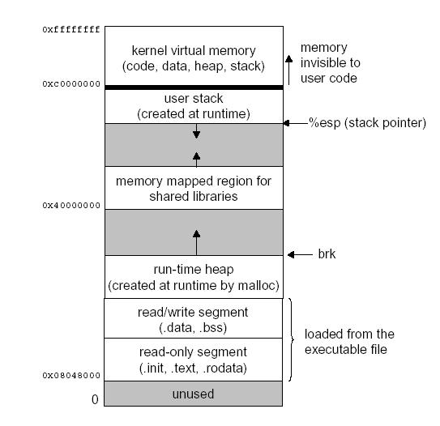

# Software Programming

## The Stack And The Heap

### The Stack

The stack is a region of RAM that gets created on every thread that your application is running on. It works in a **LIFO** (Last In, First Out) manner, meaning that as soon as you allocate ("push") memory on to the stack, that chunk of memory will be the first to be deallocated ("popped"). Every time a function declares a new variable, it is "pushed" onto the stack, and after that variable falls out of scope (such as when the function closes), that variable will be deallocated from the stack automatically. Once a stack variable is freed, that region of memory becomes available for other stack variables.

Due to the pushing and popping nature of the stack, memory management is very logical and is able to be handled completely by the CPU; this makes it very quick, especially since each byte in the stack tends to be reused very frequently which means it tends to be **mapped to the processor’s cache**.

However, there are some cons to this form of strict management. The size of the stack is a fixed value, and allocating more onto the stack than it can hold will result in a **stack overflow**. The size of the stack is decided when the thread is created, and each variable has a maximum size that it can occupy based on its data type; this prevents certain variables such as integers from ever growing beyond a certain value, and forces more complex data types such as arrays to specify their size prior to runtime since the stack won’t let them be resized. Variables allocated on the stack are always **local** in nature because they are always next in line to be popped (unless more variables are pushed prior to the popping of earlier variables).

Overall, the stack really exceeds in managing memory in the most efficient way possible – but what if you need data structures that can be dynamic, such as a dynamically sized array, or what if you need global variables? This is where the heap comes into play.

### The Heap

The heap is a memory store also in RAM that allows for **dynamic memory allocation**, and does not work on a stack-like basis; it’s more just a hub of storage for you to define your variables. Once you allocate a memory location on the heap to store a variable, that variable can be **accessed at any point in time** not only throughout just the thread, but throughout the application’s entire life. This is how you can define global variables. Once an application ends, all of the allocated memory locations are reclaimed by the CPU. The heap size is set on application startup, but unlike the stack there are no size restrictions on the heap (aside from the physical limitations of your machine), which means it can get ever larger as you allocate more memory to it. This is what allows you to create variables that can be dynamically resized, since the heap itself is dynamic in size.

You interact with the heap via **references** (pointers), which are variables whose values are the address of another variable, such as a memory location. By creating a pointer, you 'point' at a memory location on the heap, which is what signifies the initial location of your variable and tells the program where to access the value. Due to the dynamic nature of the heap, it is **completely unmanaged by the CPU** aside from initial allocation and heap resizing; in non-garbage collected languages such as C and C++, this requires you as the developer to manage memory and to manually free memory locations when they are no longer needed. Failing to do so can create memory leaks and cause memory to become fragmented, which will cause reads from the heap to take longer and makes it difficult to continuously allocate more memory onto the heap.

Compared to the stack, the heap is **slower to access** because variables are scattered across memory instead of always sitting at the top of the stack. Improper memory management of the heap can also slow down reading from the heap; however, this shouldn’t detract from its importance – you absolutely need it to create any type of variable dynamically, or global variables.

### Final Thoughts

The importance of the stack and the heap really comes into play with **non-garbage collected languages** where you need to manage memory yourself – and while modern languages do abstract away the need for this, they’re all still doing it under the scene. Different languages use the stack and the heap differently; C and C++ allocate to the stack automatically, and you as the developer manually have to allocate and deallocate from the heap, where more modern languages such as Go and Java allocate to both the stack and the heap automatically, and have a garbage collector that handles heap deallocation on its own. Languages like Ruby and Python allocate everything on the heap and don’t use a stack at all.



## Compiled And Interpreted Languages

We depend on tools such as compilation and interpretation in order to get our written code into a form that the computer can execute. Code can either be executed natively through the operating system after it is converted to machine code (via **compilation**) or can be evaluated line by line through another program which handles executing the code instead of the operating system itself (via **interpretation**).

A compiled language is one where the program, once compiled, is expressed in the instructions of the target machine; this machine code is undecipherable by humans. An interpreted language is one where the instructions are not directly executed by the target machine, but instead read and executed by some other program (which normally is written in the language of the native machine). Both compilation and interpretation offer benefits and pitfalls, which is mainly what we’re going to talk about.

A lot of programming languages have both compiled and interpretated implementations, and thus we can’t really classify an entire language as being compiled or interpreted – only a specific **implementation**.

### Compiled Languages

The major advantage of compiled languages over interpreted languages is their **execution speed**. Because compiled languages are converted directly into machine code, they run significantly faster and more efficiently than interpreted languages, especially considering the complexity of statements in some of the more modern scripting languages which are interpreted.

Lower-level languages tend to be compiled because efficiency is usually more of a concern than cross-platform support. Additionally, because compiled languages are converted directly into machine code, it gives the developer much more control over hardware aspects such as memory management and CPU usage. Examples of pure compiled languages include C, C++, Rust and Go.

Some of the pitfalls of compiled languages:

- The extra step of manually compiling the program on every changes.
- Platform dependent: the compiled machine code is specific to the machine that is executing it.

### Interpreted Languages

In contrast to compiled languages, interpreted languages do not require machine code in order to execute the program; instead, interpreters will run through a program line by line and execute each command. In the early days of interpretation, this posed a disadvantage compared to compiled languages because it took significantly more time to execute the program, but with the advent of new technologies such as **just-in-time compilation**, this gap is narrowing. Examples of some common interpreted languages include PHP, Perl, Ruby, and Python.

### Bytecode Languages

Bytecode languages are a type of programming language that fall under the categories of both compiled and interpreted languages because they employ both compilation and interpretation to execute code. The JVM (Java Virtual Machine) and the .Net framework are the most common examples of platforms running bytecode languages.

In a bytecode language, the first step is to compile the current program from its human-readable language into bytecode. Bytecode is a form of **instruction set** that is designed to be efficiently executed by an interpreter and is composed of compact numeric codes, constants, and memory references. From this point, the bytecode is passed to a virtual machine which acts as the interpreter, which then proceeds to interpret the code as a standard interpreter would.

In bytecode languages, there is a **delay** when the program is first run in order to compile the code into bytecode, but the execution speed is increased considerably compared to standard interpreted languages because the bytecode is optimized for the interpreter. The largest benefit of bytecode languages is platform independence with a much faster execution speed than interpreted languages. Similar to how interpreted languages make use of just-in-time compilation, the virtual machines that interpret bytecode can also make use of this technique to enhance execution speed.

## Concurrency

Concurrency is a property of systems (program, network, computer, etc.) in which **several computations are executing simultaneously**, and potentially interacting with each other. The computations start, run, and complete in overlapping time periods; they can run at the exact same instant (e.g. **parallelism**), but are not required to.

Concurrency is implemented in programming logic by explicitly giving computations or processes within a system their own separate execution point or **thread** of control. This allows these computations to avoid waiting for all other computations to complete – as is the case in sequential programming.

### Concurrent vs Parallel Computing

In parallel computing, execution occurs at the **exact same instant** typically with the goal of optimizing modular computations. This forces parallel computing to utilize more than one processing core because each thread of control is running simultaneously and takes up the core’s entire clock cycle for the duration of execution. This differs from concurrent computing which focuses on the lifetime of the computations overlapping and not necessarily their moments of execution. For example, the execution steps of a process can be broken up into time slices, and if the entire process doesn’t finish during its time slice then it can be paused while another process begins.


### Why use Concurrent Programming ?

The ultimate benefit of concurrent programming is to utilize the resources of the executing machine to the fullest extent. This typically results in a speed boost in execution time because the program is no longer subject to normal sequential behavior. Multi-core CPUs optimize the total execution time of a process with multiple threads by spreading the load across all cores.

Multithreading allows a program to run on multiple threads while still under the same parent process, thus providing the benefits of parallelization (faster execution, more efficient use of the computer’s resources, etc.) but also carrying with it the problems of parallelization too (discussed more below), which is why some languages make use of a mechanism called the **Global Interpreter Lock (GIL)**.

The GIL is found most commonly in the standard implementations of Python and Ruby (CPython and Ruby MRI, respectively), and prevents more than one thread from executing at a time – even on multi-core processors. This might seem like a massive design flaw, but the GIL exists to prevent any thread-unsafe activities – meaning that all code executing on a thread does not manipulate any shared data structures in a manner that risks the safe execution of the other threads. Typically language implementations with a GIL increase the speed of single-threaded programs and make integrations with C libraries easier (because they are often not thread-safe), but all at the price of losing multithreading capabilities.

However, if concurrency through a language implementation with a GIL is a strong concern, there are usually ways around this hindrance. While multithreading is not an option, applications interpreted through a GIL can still be designed to run on different processes entirely – each one with their own GIL.

### Problems

Because the idea behind concurrency is to execute computations simultaneously, the potential exists for these separate tasks to access and unintentionally distort shared resources among them (e.g. **thread-unsafe behavior**). When shared resources are accessed, a programmatic **arbiter** is typically involved which handles the allocation of those resources – but this type of activity can ultimately create indeterminacy and lead to issues such as **deadlock** (where multiple computations are waiting on each other to finish, and thus never do), and **starvation** (where resources are constantly denied to a certain task).

This makes **coordination** when executing concurrent tasks extremely important because even areas where the developer has little control – such as memory allocation on the stack or the heap – can become indeterminate.

### The Future

Countless models have been built to better understand concurrency and describe various theories, such as the **Actor Model**, **CSP Model**, and **Disruptor Model**. However, just as with most programming concepts, there is no silver bullet for concurrent programming.

## Static vs Dynamic Type Checking

**Static** and **dynamic** type checking refer to two different type systems. A **type system** is a collection of rules that assign a property called **type** to various constructs in a computer program, such as variables, expressions, functions or modules, with the end goal of verifying that data is represented properly throughout a program.

### A Type

Also known as a **data type**, is a classification identifying one of various types of data. A type describes the possible values of a structure (such as a variable), the semantic meaning of that structure, and how the values of that structure can be stored in memory. Types can be broken down into categories:

- **Primitive types**: some common primitive types are integers, booleans, floats, and characters.
- **Composite types**: composed of multiple primitive types (e.g. arrays). They are all considered **data structures**.
- **Abstract types**: types that do not have a specific implementation (can be represented via multiple types), such as a hashes, sets, queues, and stacks.
- **Other types**: such as pointers (a type which holds as its value a reference to a different memory location) and functions.

### Type Checking

**Type checking** is the process of verifying and enforcing the constraints of types. It can occur either at **compile time** (i.e. statically) or at **runtime** (i.e. dynamically). Type checking is all about ensuring that the program is **type-safe**, meaning that the possibility of type errors is kept to a minimum. A type error is an erroneous program behavior in which an operation occurs (or trys to occur) on a particular data type that it’s not meant to occur on (e.g. adding a string and an integer together).

### Static Type Checking

A language is statically-typed if the type of a variable is known at **compile time**. The big benefit of static type checking is that it allows many type errors to be caught early in the development cycle. Static typing usually results in compiled code that executes more quickly because when the compiler knows the exact data types that are in use, it can produce optimized machine code (i.e. faster and/or using less memory).

### Dynamic Type Checking

Dynamic type checking is the process of verifying the type safety of a program at **runtime**. Most type-safe languages include some form of dynamic type checking, even if they also have a static type checker. The reason for this is that many useful features or properties are difficult or impossible to verify statically (e.g **downcasting**, **late binding**, **reflection**). Dynamic type checking typically results in less optimized code than does static type checking; it also includes the possibility of runtime type errors and forces runtime checks to occur for every execution of the program.

### Common Misconceptions

#### Static/Dynamic Type Checking == Strong/Weak Type Systems

A **strongly-typed language** is one in which variables are bound to specific data types, and will result in type errors if types do not match up as expected in the expression – **regardless of when type checking occurs**. Strongly-typed languages have high degrees of **type safety**. We often associate statically-typed languages such as Java and C# as strongly-typed (which they are) because data types are explicitly defined when initializing a variable. Languages such as ruby, python, and javascript which do not require manually defining a type when declaring a variable make use of **type inference** – the ability to programmatically infer the type of a variable based on its value. Type inference is a separate feature of a language that is unrelated to any of its type systems.

A **weakly-typed language** on the other hand is a language in which variables are not bound to a specific data type; they still have a type, but type safety constraints are lower compared to strongly-typed languages. PHP (dynamically typed) and C (statically typed) are two weakly-typed languages.

Static/dynamic type system tells **when** type safety is enforced, and its strong/weak type system tells **how** type safety is enforced.


#### Static/Dynamic Type Checking == Compiled/Interpreted Languages

When we say that a language is statically or dynamically-typed, we are referring to that **language as a whole**. For example, no matter what version of Java you use, it will always be statically-typed. This is different from whether a language is compiled or interpreted, because in that statement we are referring to a **specific language implementation**. In theory, any language can be compiled or interpreted. The most common implementation of Java is to compile to bytecode, and have the JVM interpret that bytecode – but there are other implementations of Java that compile directly to machine code or that just interpret Java code as is.

## Type Introspection and Reflection

### Type Introspection

**Type introspection** is the ability of a program to **examine the type or properties of an object at runtime**. the types of questions you might want to ask are what type is this object, or is it an instance of a certain class. Some languages even allow you to traverse the inheritance hierarchy to see if your object is derived from an inherited base class.

```
// java
if(obj instanceof Person){
   Person p = (Person)obj;
   p.walk();
}
```

### Reflection

If type introspection allows you to inspect an object’s attributes at runtime, then **reflection** is what allows you to manipulate those attributes at runtime. As a concrete definition: reflection is the ability of a computer program to examine and modify the structure and behavior (specifically the values, meta-data, properties and functions) of a program at runtime.

Because of the runtime-specific nature of reflection, it’s more difficult to implement it in a statically-typed language compared to a dynamically-typed language. However, it is by no means impossible, as Java, C#, and other modern statically-typed languages allow for both type introspection and reflection.

It's also easier to implement in interpreted language implementations compared to compiled language implementations. This is because as functions, objects, and other data structures are **created and invoked at runtime**, some sort of runtime system must exist to allocate memory properly. In an interpreted language implementation, this is simple because the interpreter by default usually provides the runtime system, but compiled language implementations must provide an additional compiler and interpreter that watches program execution throughout its runtime to allow reflection to occur.

While it has obvious benefits, code that uses reflection is much more difficult to read than non-reflective code, it may make documentation-searching and debugging more difficult, and it opens the doors for really bad things such as code-injection via **eval** statements.

```
# python without reflection
obj = Foo()
obj.hello()

# python with reflection
class_name = "Foo"
method = "hello"
obj = globals()[class_name]()
getattr(obj, method)()

# python with eval
eval("Foo().hello()")
```

## Core Object Oriented Programming Concepts

In OOP, all real-world entities are represented by **Classes**. **Objects** are instances of classes so each object encapsulates a **state** and **behavior**. State implies the fields, attributes of the object and behavior is what you do with the state of the object, they are the methods.

### Encapsulation

Hide unnecessary details in classes and **deliver a simple and clear interface** to work with. It describes the idea of bundling data and methods that work on that data within one unit. This concept is also often used to **hide the internal representation**, or state, of an object from the outside.

### Inheritance

A mechanism where you can derive a class from another class for **a hierarchy of classes that share a set of attributes and methods**. The class hierarchies help with code readability and the reuse of functionality.

### Abstraction

Objects only reveal internal mechanisms that are relevant for the use of other objects, hiding any unnecessary implementation code.

### Polymorphism

Refers to the ability of a variable, function or object to take on multiple forms. The program will determine which meaning or usage is necessary for each execution. **Method overloading** and **method overriding** can be used to achieve polymorphism.

## Core Functionnal Programming Concepts

### Functions are Pure

- **A function called multiple times with the same arguments will always return the same value**. You cannot rely on state that the function doesn’t control, such as global variables or any sort of randomized activity. As soon as you throw in a `rand()` function call, or access a variable not defined in the function the function loses its purity.
- **No side effects occur throughout the function’s execution**. Modifying a variable defined outside the function, printing out to the console, raising an exception, and reading data from a file are all examples of side effects which prevent a function from being pure.

### First-Class and Higher-Order Functions

- **First-class functions**: the concept isn’t exclusive to functional programming but is a requirement of being functional. For a function to be first-class, you have to be able to **set it to a variable**. This allows you to handle the function as if it were a normal data type, and still be able to execute the function at some other point in runtime.
- **Higher-order functions**: functions that either **accept another function as an argument**, or that **return a function themselves**.

### Variables are Immutable

**You can’t modify a variable after it’s been initialized**. You can create new variables just fine but you can’t modify existing variables. This really helps to maintain state throughout the runtime of a program. Once you create a variable and set its value, you can have full confidence knowing that the value of that variable will never change.

### Referential Transparency

If you can replace the value of a function call with its return value everywhere that it’s called and the state of the program stays the same, then the function is referentially transparent. Seems pretty obvious, but a function that print out to the console isn't referential transparent for instance.

### Lambda Calculus

The two core concepts of lambda calculus that really shaped the structure of how functional programming works:

- In lambda calculus, **all functions can be written anonymously without a name**, because the only portion of a function header that affects its execution is the list of arguments. This is where lambda (or **anonymous**) functions get their name in modern-day programming.
- When invoked, all functions will go through a process called **currying**. When a function with multiple arguments is called, it will execute the function once but it will only set one variable in the parameter list. At the end, a new function is returned with 1 less argument – the one that was just applied – and this new function is immediately invoked. This happens recursively until the function has been fully applied, and then a final result is returned (`f(a, b, c)` is called as `f(a)(b)(c)`).

## Garbage Collection

### What is it ?

### Why do we need it ?

### How and when does it run ?

### Algorithms

#### Reference Counting

#### Mark-Sweep

#### Mark-Compact

#### Copying

#### Generational

## Programming Best Practices

### GoF Design Patterns

[**Creational patterns**](https://en.wikipedia.org/wiki/Creational_pattern) provide the capability to create objects based on a required criterion and in a controlled way:

- **Abstract Factory**: Allows the creation of objects without specifying their concrete type.
- **Builder**: Uses to create complex objects.
- **Factory Method**: Creates objects without specifying the exact class to create.
- **Prototype**: Creates a new object from an existing object.
- **Singleton**: Ensures only one instance of an object is created.

[**Structural patterns**](https://en.wikipedia.org/wiki/Structural_pattern) are about organizing different classes and objects to form larger structures and provide new functionality:

- **Adapter**: Allows for two incompatible classes to work together by wrapping an interface around one of the existing classes.
- **Bridge**: Decouples an abstraction so two classes can vary independently.
- **Composite**: Takes a group of objects into a single object.
- **Decorator**: Allows for an object’s behavior to be extended dynamically at run time.
- **Facade**: Provides a simple interface to a more complex underlying object.
- **Flyweight**: Reduces the cost of complex object models.
- **Proxy**: Provides a placeholder interface to an underlying object to control access, reduce cost, or reduce complexity.

[**Behavioral patterns**](https://en.wikipedia.org/wiki/Behavioral_pattern) are about identifying common communication patterns between objects and realize these patterns:

- **Chain of Responsibility**: Delegates commands to a chain of processing objects.
- **Command**: Creates objects which encapsulate actions and parameters.
- **Interpreter**: Implements a specialized language.
- **Iterator**: Accesses the elements of an object sequentially without exposing its underlying representation.
- **Mediator**: Allows loose coupling between classes by being the only class that has detailed knowledge of their methods.
- **Memento**: Provides the ability to restore an object to its previous state.
- **Observer**: Is a publish/subscribe pattern which allows a number of observer objects to see an event.
- **State**: Allows an object to alter its behavior when its internal state changes.
- **Strategy**: Allows one of a family of algorithms to be selected on-the-fly at run-time.
- **Template Method**: Defines the skeleton of an algorithm as an abstract class, allowing its sub-classes to provide concrete behavior.
- **Visitor**: Separates an algorithm from an object structure by moving the hierarchy of methods into one object.

### Coding Principles

- **Keep It Stupid Simple** (KISS): Keep your code very simple.
- **Don't Repeat Yourself** (DRY): Every repetitive behavior in the code should be extracted for later reuse.
- **You Aren't Gonna Need It** (YAGNI): Do not leave any code that's meant only for future extendability.
- **Single Level of Abstraction Principle** (SLAP): Functions should do just one thing (), and they should do it well (don´t mix different levels of abstraction).

[**SOLID**](https://www.digitalocean.com/community/conceptual_articles/s-o-l-i-d-the-first-five-principles-of-object-oriented-design):

- **Single-responsibility principle** (SRP): Every module, class or function in a computer program should have responsibility over a single part of that program's functionality, which it should encapsulate.
- **Open–closed principle** (OCP): Software entities \(classes, modules, functions, etc.\) should be open for extension, but closed for modification.
- **Liskov substitution principle** (LSP): If S is a subtype of T, then objects of type T may be replaced with objects of type S without altering any of the desirable properties of the program.
- **Interface segregation principle** (ISP): No client should be forced to depend on methods it does not use \(split interfaces that are very large into smaller and more specific ones\).
- **Dependency inversion principle** (DIP): High-level modules should not depend on low-level modules. Both should depend on abstractions. Abstractions should not depend on details. Details \(concrete implementations\) should depend on abstractions.

### [The Twelve-Factor App](https://12factor.net/)

- **Codebase**: One codebase tracked in revision control, many deploys
- **Dependencies**: Explicitly declare and isolate dependencies
- **Config**: Store config in the environment
- **Backing services**: Treat backing services as attached resources
- **Build, release, run**: Strictly separate build and run stages
- **Processes**: Execute the app as one or more stateless processes
- **Port binding**: Export services via port binding
- **Concurrency**: Scale out via the process model
- **Disposability**: Maximize robustness with fast startup and graceful shutdown
- **Dev/prod parity**: Keep development, staging, and production as similar as possible
- **Logs**: Treat logs as event streams
- **Admin processes**: Run admin/management tasks as one-off processes

### [Semantic Versioning](https://semver.org/)

In the world of software management there exists a dreaded place called "dependency hell":

- If the dependency specifications are too tight, you are in danger of version lock (the inability to upgrade a package without having to release new versions of every dependent package).
- If dependencies are specified too loosely, you will inevitably be bitten by version promiscuit.

The solution: given a version number MAJOR.MINOR.PATCH, increment the:

1. **MAJOR** version when you make incompatible API changes,
2. **MINOR** version when you add functionality in a backwards compatible manner, and
3. **PATCH** version when you make backwards compatible bug fixes.

Additional labels for pre-release and build metadata are available as extensions to the **MAJOR.MINOR.PATCH** format.

[Regex](https://regex101.com/r/vkijKf/1/) to check a SemVer string: `^(0|[1-9]\d*)\.(0|[1-9]\d*)\.(0|[1-9]\d*)(?:-((?:0|[1-9]\d*|\d*[a-zA-Z-][0-9a-zA-Z-]*)(?:\.(?:0|[1-9]\d*|\d*[a-zA-Z-][0-9a-zA-Z-]*))*))?(?:\+([0-9a-zA-Z-]+(?:\.[0-9a-zA-Z-]+)*))?$`

## Programming Languages

### Erlang / Elixir

#### Resources

- High level concepts of Erlang: [The Zen of Erlang](https://ferd.ca/the-zen-of-erlang.html)
- Learning tutorial: [Learn You Some Erlang for Great Good!](https://learnyousomeerlang.com/introduction#about-this-tutorial)
- How to write systems using Erlang: [Programming Rules and Conventions](http://www.erlang.se/doc/programming_rules.shtml)
- [Erlang Coding Standards & Guidelines](https://github.com/inaka/erlang_guidelines)
- Quick syntax introduction: [Erlang/Elixir Syntax: A Crash Course](https://elixir-lang.org/crash-course.html)
- Community [Elixir Style Guide](https://github.com/christopheradams/elixir_style_guide)

### Golang

#### [Go Proverbs](https://go-proverbs.github.io/)

- Don't communicate by sharing memory, share memory by communicating.
- Concurrency is not parallelism.
- Channels orchestrate; mutexes serialize.
- The bigger the interface, the weaker the abstraction.
- Make the zero value useful.
- interface{} says nothing.
- Gofmt's style is no one's favorite, yet gofmt is everyone's favorite.
- A little copying is better than a little dependency.
- Syscall must always be guarded with build tags.
- Cgo must always be guarded with build tags.
- Cgo is not Go.
- With the unsafe package there are no guarantees.
- Clear is better than clever.
- Reflection is never clear.
- Errors are values.
- Don't just check errors, handle them gracefully.
- Design the architecture, name the components, document the details.
- Documentation is for users.
- Don't panic.

#### Resources

- Tips for writing clear, idiomatic Go code: [Effective Go](https://golang.org/doc/effective_go.html)
- Common comments made during reviews of Go code: [CodeReviewComments](https://github.com/golang/go/wiki/CodeReviewComments)
- Small supplement to CodeReviewComments: [Idiomatic Go](https://dmitri.shuralyov.com/idiomatic-go)
- Real world advice for writing maintainable Go programs: [Practical Go](https://dave.cheney.net/practical-go/presentations/qcon-china.html)
- Language Design in the Service of Software Engineering: [Go at Google](https://talks.golang.org/2012/splash.article)
- The Dos and Don'ts of writing Go code at Uber: [Uber Go Style Guide](https://github.com/uber-go/guide/blob/master/style.md)
- Programming in an industrial context: [Go for Industrial Programming](https://peter.bourgon.org/go-for-industrial-programming/)
- Best practices from 2016: [Go best practices, six years in](https://peter.bourgon.org/go-best-practices-2016/)
- Common good practices for go packages: [Style guideline for Go packages](https://rakyll.org/style-packages/)
- [Network Programming with Go](https://tumregels.github.io/Network-Programming-with-Go/)
- Collection of Technical Interview Questions solved with Go: [go-interview](https://github.com/shomali11/go-interview/blob/master/README.md)
- [Darker Corners of Go](https://rytisbiel.com/2021/03/06/darker-corners-of-go/)

### Python

#### [The Zen of Python](https://www.python.org/dev/peps/pep-0020/)

- Beautiful is better than ugly.
- Explicit is better than implicit.
- Simple is better than complex.
- Complex is better than complicated.
- Flat is better than nested.
- Sparse is better than dense.
- Readability counts.
- Special cases aren't special enough to break the rules.
- Although practicality beats purity.
- Errors should never pass silently.
- Unless explicitly silenced.
- In the face of ambiguity, refuse the temptation to guess.
- There should be one-- and preferably only one --obvious way to do it.
- Although that way may not be obvious at first unless you're Dutch.
- Now is better than never.
- Although never is often better than _right_ now.
- If the implementation is hard to explain, it's a bad idea.
- If the implementation is easy to explain, it may be a good idea.
- Namespaces are one honking great idea -- let's do more of those!

#### Resources

- [PEP8](https://www.python.org/dev/peps/pep-0008/)
- [Google Python Style Guide](http://google.github.io/styleguide/pyguide.html)
- [What the f\*ck Python!](https://github.com/satwikkansal/wtfpython)
- [Python behind the scenes](https://tenthousandmeters.com/tag/python-behind-the-scenes/)

### JavaScript

#### Resources

- [ECMAScript 6 features](https://github.com/lukehoban/es6features)
- [AirBnb style guide](https://github.com/airbnb/javascript)
- [The modern JavaScript tutorial](https://javascript.info/)
- [Google JavaScript Style Guide](https://google.github.io/styleguide/jsguide.html)

## Templates

### Self Documenting Makefile

Avoid documentation of Make targets in a Readme.md or something similar: the Makefiles get updated, not the documentation. Add documentation for each target of the Makefile and view it as a make target \(eg. make help\).

Requirements: `make` and `awk`

```text
.DEFAULT_GOAL:=help
SHELL:=/bin/bash

.PHONY: help deps clean build watch

help:  ## Display this help
    @awk 'BEGIN {FS = ":.*##"; printf "\nUsage:\n  make \033[36mtarget\033[0m \033[36m\033[0m\n\nTargets:\n"} /^[a-zA-Z_-]+:.*?##/ { printf "  \033[36m%-10s\033[0m %s\n", $$1, $$2 }' $(MAKEFILE_LIST)

deps:  ## Check dependencies
    $(info Checking and getting dependencies)

clean: ## Cleanup the project folders
    $(info Cleaning up things)

build: clean deps ## Build the project
    $(info Building the project)

watch: clean deps ## Watch file changes and build
    $(info Watching and building the project)
```

Output:

```text
$ make

Usage:
  make target

Targets:
  help        Display this help
  deps        Check dependencies
  clean       Cleanup the project folders
  build       Build the project
  watch       Watch file changes and build
```

### Architectural Decision Records

#### ADR Best Practices

Characteristics of a good [ADR](https://github.com/joelparkerhenderson/architecture_decision_record):

- **Point in Time** - Identify when the AD was made
- **Rationality** - Explain the reason for making the particular AD
- **Immutable record** - The decisions made in a previously published ADR should not be altered
- **Specificity** - Each ADR should be about a single AD

Characteristics of good **context**:

- Explain your organization's situation and business priorities
- Include rationale and considerations based on social and skills makeups of your teams

Characteristics of good **consequences**:

- Right approach - "We need to start doing X instead of Y"
- Wrong approach - Do not explain the AD in terms of "Pros" and "Cons" of having made the particular AD

A new ADR may take the place of a previous ADR: when an AD is made that **replaces or invalidates** a previous ADR, a new ADR should be created.

#### [MADR](https://adr.github.io/madr) Template

```
# [Short title of solved problem and solution] [#ADR_NUMBER]

- Status: [proposed | rejected | accepted | deprecated | … | superseded by [ADR-0005](0005-example.md)] <!-- optional -->
- Deciders: [list everyone involved in the decision] <!-- optional -->
- Date: [YYYY-MM-DD when the decision was last updated] <!-- optional -->

Technical Story: [description | ticket/issue URL] <!-- optional -->

## Context and Problem Statement

[Describe the context and problem statement, e.g., in free form using two to three sentences. You may want to articulate the problem in form of a question.]

## Decision Drivers <!-- optional -->

- [driver 1, e.g., a force, facing concern, …]
- [driver 2, e.g., a force, facing concern, …]
- … <!-- numbers of drivers can vary -->

## Considered Options

- [option 1]
- [option 2]
- … <!-- numbers of options can vary -->

## Decision Outcome

Chosen option: "[option 1]", because [justification. e.g., only option, which meets k.o. criterion decision driver | which resolves force force | … | comes out best (see below)].

### Positive Consequences <!-- optional -->

- [e.g., improvement of quality attribute satisfaction, follow-up decisions required, …]
- …

### Negative Consequences <!-- optional -->

- [e.g., compromising quality attribute, follow-up decisions required, …]
- …

## Pros and Cons of the Options <!-- optional -->

### [option 1]

[example | description | pointer to more information | …] <!-- optional -->

- Good, because [argument a]
- Good, because [argument b]
- Bad, because [argument c]
- … <!-- numbers of pros and cons can vary -->

### [option n]

...

## Links <!-- optional -->

- [Link type] [Link to ADR] <!-- example: Refined by [ADR-0005](0005-example.md) -->
- … <!-- numbers of links can vary -->
```

## Resources

- [Programming Concepts](https://thecodeboss.dev/2014/10/programming-concepts-the-stack-and-the-heap/)
