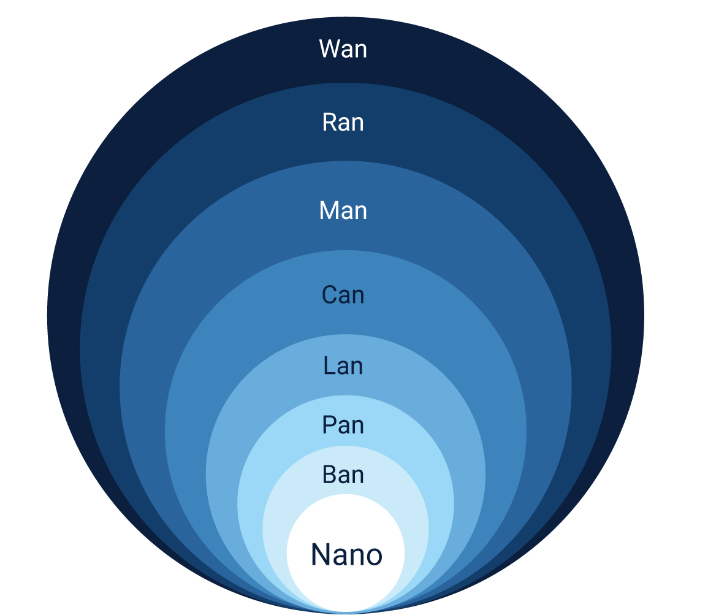

# Computer Networking

## Network Types

Common types of networks include the following:

- **Local Area Network** (LAN): The computers are geographically close together (that is, in the same building).
- **Wide Area Network** (WAN): The computers are farther apart and are connected by telephone lines or radio waves.
- **Metropolitan Area Network** (MAN): A data network designed for a town or city.
- **Home Area Network** (HAN): A network contained within a user’s home that connects a person’s digital devices.
- **Virtual Private Network** (VPN): A network that is constructed by using public wires usually the Internet to connect to a private network, such as a company’s internal network.
- **Storage Area Network** (SAN): A high-speed network of storage devices that also connects those storage devices with servers.

### Local Area Network (LAN)

A LAN connects network devices in such a way that personal computer and workstations can share data, tools and programs. The group of computers and devices are connected together by a switch, or stack of switches, using a **private addressing scheme** as defined by the TCP/IP protocol. Private addresses are unique in relation to other computers on the local network. Routers are found at the boundary of a LAN, connecting them to the larger WAN.

Data transmits at a very fast rate as the number of computers linked are limited. LANs cover smaller geographical area (Size is limited to a few kilometers) and are privately owned. One can use it for an office building, home, hospital, schools, etc. LAN is easy to design and maintain. A Communication medium used for LAN has twisted pair cables and coaxial cables. It covers a short distance, and so the error and noise are minimized.

Early LAN’s had data rates in the 4 to 16 Mbps range. Today, speeds are normally 100 or 1000 Mbps. Propagation delay is very short in a LAN. The smallest LAN may only use two computers, while larger LANs can accommodate thousands of computers. A LAN typically relies mostly on wired connections for increased speed and security, but wireless connections can also be part of a LAN. The fault tolerance of a LAN is more and there is less congestion in this network.

### Metropolitan Area Network (MAN)

A MAN covers a larger area than that of a LAN and smaller area as compared to WAN. It connects two or more computers that are apart but resides in the same or different cities. It covers a large geographical area and may serve as an ISP (**Internet Service Provider**). MAN is designed for customers who need a high-speed connectivity. Speeds of MAN ranges in terms of Mbps. It’s hard to design and maintain a Metropolitan Area Network.

The fault tolerance of a MAN is less and also there is more congestion in the network. It is costly and may or may not be owned by a single organization. The data transfer rate and the propagation delay of a MAN is moderate. Devices used for transmission of data through MAN are: Modem and Wire/Cable. Examples of a MAN are the part of the telephone company network that can provide a high-speed DSL line to the customer or the cable TV network in a city.

### Wide Area Network (WAN)

A WAN is a computer network that extends over a large geographical area, although it might be confined within the bounds of a state or country. A WAN could be a connection of LAN connecting to other LAN’s via telephone lines and radio waves and may be limited to an enterprise (a corporation or an organization) or accessible to the public. The technology is high speed and relatively expensive.

There are two types of WAN: **Switched WAN** and **Point-to-Point WAN**. WAN is difficult to design and maintain. Similar to a MAN, the fault tolerance of a WAN is less and there is more congestion in the network. A Communication medium used for WAN is PSTN or Satellite Link. Due to long distance transmission, the noise and error tend to be more in WAN.

WAN’s data rate is slow about a 10th LAN’s speed, since it involves increased distance and increased number of servers and terminals etc. Speeds of WAN ranges from few kilobits per second (Kbps) to megabits per second (Mbps). Propagation delay is one of the biggest problems faced here. Devices used for transmission of data through WAN are: Optic wires, Microwaves and Satellites. Example of a Switched WAN is the asynchronous transfer mode (ATM) network and Point-to-Point WAN is dial-up line that connects a home computer to the Internet.

## Network Topology

A network topology describes the physical composition of a network. Topologies are either physical or logical. There are four principal topologies used in LANs.

### Bus Topology

All devices are connected to a central cable, called the **bus** or **backbone**. Bus networks are relatively inexpensive and easy to install for small networks. The data is transmitted one end to another in single direction. No bi-directional feature is in bus topology. Even though it's the simplest type of network to implement, there are limitations to it. The first limitation is the length of the main cable or bus. The longer it gets, the higher the chance of signal dropout. This limitation constrains the physical layout of the network. All devices have to be physically located near each other, for example, in the same room. Finally, if there's a break in the bus cable, the whole network fails.

### Ring topology

All devices are connected to one another in the shape of a **closed loop**, so that each device is connected directly to two other devices, one on either side of it. This form of network is more resilient than the bus topology. A break in the cable ring also affects the performance of the network. The transmission is unidirectional, but it can be made bidirectional by having 2 connections between each Network Node, it is called **Dual Ring Topology**.

### Mesh topology

The mesh topology is described as either a **physical mesh** or a **logical mesh**. In a physical mesh, each network device connects to every other network device in the network. It dramatically increases the resilience of a network but has the physical overhead of connecting all devices. Few networks today are built as a full mesh. Most networks use a partial mesh, where some machines interconnect, but others connect through one device. There's a subtle difference between a physical mesh network and a logical one. The perception is that most modern networks are mesh based, since each device can see and communicate with any other device on the network. This description is of a logical mesh network and is primarily made possible through the use of network protocols.

### Star topology

The star topology is the most commonly used network topology. Each network device connects to a centralized hub or switch. Switches and hubs can be linked together to extend and build more extensive networks. This type of typology is, by far, the most robust and scalable.

## Network Standards

### Organizations

While network protocols provide a unified method for communication, network standards govern the hardware and software that uses them. Today, there are hundreds of thousands of hardware suppliers, yet all of their technology seamlessly integrates with your computer or network with minimal effort. Network standards provide a framework that enables the interoperability between devices.

There are a several leading organizations for standardization including:

- The **International Organization for Standardization** ([ISO](https://en.wikipedia.org/wiki/International_Organization_for_Standardization))
- The **American National Standards Institute** ([ANSI](https://en.wikipedia.org/wiki/American_National_Standards_Institute))
- The **Internet Engineering Task Force** ([IETF](https://en.wikipedia.org/wiki/Internet_Engineering_Task_Force))

### IEEE 802

The 802 specification covers all the physical networking standards for both Ethernet and wireless. The following table shows some of the more widely used standards.

| 802    | Overview        | Basics of physical and logical networking concepts                              | Status      |
| ------ | --------------- | ------------------------------------------------------------------------------- | ----------- |
| 802.1  | Bridging        | Higher Layer LAN Protocols (Bridging LAN/MAN, OSI Layer 2)                      | Active      |
| 802.2  | Logical Link    | The logical link control (LLC) specification                                    | Disbanded   |
| 802.3  | Ethernet        | Provides asynchronous networking                                                | Active      |
| 802.5  | Token ring      | The token-passing standard for shielded copper cables and twisted-pair cable    | Disbanded   |
| 802.11 | Wi-Fi           | WLAN media access control (MAC) and physical layer (PHY) specification          | Active      |
| 802.12 | Demand Priority | Ethernet data rate increased to 100 Mbps                                        | Disbanded   |
| 802.15 | WPAN            | Support for wireless personal area networks (bluetooth, uwb, zigbee..)          | Active      |
| 802.16 | WMAN            | Wireless metropolitan area networks Covers mobile and wireless broadband access | Hibernating |

## Network Devices

### Network Interface Card

An expansion board you insert into a computer so the computer can be connected to a network. Most NICs are designed for a particular type of network, protocol, and media, although some can serve multiple networks. The NIC allows computers to communicate over a computer network, either by using cables or wirelessly. The NIC is both a physical layer and data link layer device, as it provides physical access to a networking medium and, for IEEE 802 and similar networks, provides a low-level addressing system through the use of MAC addresses that are uniquely assigned to network interfaces.

### MAC Address

A MAC (**Media Access Control**) address, sometimes referred to as a hardware address or physical address, is an ID code that’s assigned to a network adapter or any device with built-in networking capability. The MAC address has a standard composition of six groups of 2 hexadecimal numbers separated by a colon or dash (48 bits). The first three numbers of the MAC address define the manufacturer's **Organizationally Unique Identifier** (OUI) and the remaining three numbers uniquely identify the device . For example, if the MAC address is AA-6A-BA-2B-68-C1 then the OUI is AA-6A-BA and 2B-68-C1 is the device ID.

### Repeaters

A repeater operates at the physical layer. Its job is to **regenerate the signal** over the same network before the signal becomes too weak or corrupted so as to extend the length to which the signal can be transmitted over the same network. An important point to be noted about repeaters is that they **do not amplify the signal**. When the signal becomes weak, they copy the signal bit by bit and regenerate it at the original strength. It is a 2 port device.

### Bridges

A bridge **divides a network into network segments** and can filter and forward data packets between these segments. Bridges use the network device's MAC address to decide the data package's destination. Typically, a bridge is used to improve network performance by reducing unnecessary network traffic on network segments.

### Hubs

A hub acts as a **multiport repeater** on a network. Hubs are used to connect more than one device and structure the layout of a network. For example, you can cascade hubs to create network branches or as an endpoint to create a star layout with multiple user type devices. Hubs contain multiple ports that act as an input/output Ethernet connection between the hub and a network device. A hub can operate at only one speed, which is the speed of the slowest network device on the network. It doesn't interpret or filter data packets and sends copies of each data packet to all attached devices.

### Switches

A switch **combines the functionality of a bridge and a hub**. It segments networks and can interpret and filter packet data to send it directly to an attached network device. Switches use the network device's MAC address to decide the data package's destination. A switch operates in **full-duplex mode**, which means it can send and receive data to and from network devices at the same time. The switch can perform error checking before forwarding data, that makes it very efficient as it does not forward packets that have errors and forward good packets selectively to correct port only. In other words, switch divides collision domain of hosts, but broadcast domain remains same.

**Managed switches** offers the means to adjust the configuration, behavior, and operation of the switch. The commonly available options are **traffic priority**, **virtuals LANs** (create logical groups of devices, improve security and performance), **Spanning Tree Protocol** (define alternative network routes in case a cable or device fails, improve resilience), **port mirroring** (exports a copy of the network traffic to a single port for a network analyzer), **bandwidth rate-limiting** (fine control of the bandwidth used by specific ports), **MAC address filtering**...

### Routers

Routers in an interconnected network maintain a **routing table** that lists the preferred route between each of the networks. The router acts as the start of **authority** for all the network devices on its network. Routing information is shared between routers by using a routing protocol like the **Border Gateway Protocol** (BGP).

There are several distinct classifications or types of routers:

- **Access routers**: Typically used in a home or small satellite offices, these routers tend to be low-cost devices with a simple routing need.
- **Distribution routers**: These routers compile traffic routing data from multiple routers. Distribution routers come with more significant memory and processing power. This type of router is designed to hold vast quantities of routing information. It's often used to manage and control the quality of service across a WAN.
- **Edge routers**: An edge router operates at the boundary between your network and other networks, for example, your local network and the internet. They act as gateways to filter traffic and route it internally or forward it based on the packet header. An edge router often comes with access control or firewalls to improve the security. It might also handle DHCP and DNS services.
- **Core routers**: Sometimes called enterprise routers, these routers are designed for higher bandwidths. They're used to connect different buildings or geographic locations together. Core routers tend to have fewer features than edge routers because their primary focus is on minimizing packet loss and preventing congestion. They tend to do packet forwarding to edge routers.

### Gateway

A gateway, as the name suggests, is a passage to connect two networks together that may work upon different networking models. They basically work as the messenger agents that take data from one system, interpret it, and transfer it to another system. Gateways are also called protocol converters and can operate at any network layer. Gateways are generally more complex than switch or router.

## Network Protocols

- [School of SRE](https://linkedin.github.io/school-of-sre/linux_networking/intro/)
- [Network Protocols](https://docs.microsoft.com/en-us/learn/modules/network-fundamentals/4-network-protocols)

A network protocol is a set of **conditions and rules** that specify how network devices communicate on a given network. It provides a common framework for establishing and maintaining a communications channel, and how to handle errors or faults should they occur. Network protocols allow communication between different network-enabled devices.

### Definition

- **Network address**: A unique identifier that identifies a network-enabled device. A network-enabled device might have more than one address type. We'll focus on only two: **MAC** and **IP** addresses. **Media Access Control** (MAC) address identifies the network interface at the hardware level. **Internet Protocol** (IP) address identifies the network interface at a software level.
- **Data Packet**: A unit that's used to describe the message two devices on a network send each other. It consists of **raw data**, **headers**, and potentially also a **trailer**. The header contains several information items (sender and destination device addresses, size of the packet, protocol used, and packet number). The trailer deals with error checking.
- **Datagram**: Considered the same as a data packet. It commonly refer to data packets of an unreliable service, where delivery can't be guaranteed.
- **Routing**: In the context of networks, refers to the mechanism used to make sure that data packets follow the correct delivery path between the sending and receiving devices on different networks.

### Communication protocols

Communication protocols focus on establishing and maintaining a connection between devices.

The three foundational protocols of all internet-based networks are Transmission Control Protocol (TCP), Internet Protocol (IP), and User Datagram Protocol (UDP). These protocols are concerned with the logical transmission of data over the network.

- **Transmission Control Protocol (TCP)**: TCP chunks up data into data packets that can be sent securely and quickly while minimizing the chance of data loss. It provides a stable and reliable mechanism for the delivery of data packets across an IP-based network. Even though TCP is an effective **connection-oriented** protocol, it has overhead.
- **Internet Protocol (IP)**: IP is responsible for the **addressing** of a data packet. IP encapsulates the data packet to be delivered and adds an address header. The header contains information on the sender and recipient IP addresses. This protocol isn't concerned about the order in which the packets are sent or received. It also doesn't guarantee that a packet will be delivered, only the address.
- **User Datagram Protocol (UDP)**: UDP is a **connectionless** protocol that offers a low-latency and loss-tolerant implementation. UDP is used with processes that don't need to verify that the recipient device received a datagram.

The rest of the protocols that are commonly used are based on a type of application:

- **Hypertext Transfer Protocol (HTTP)**: The HTTP protocol uses TCP/IP to deliver web page content from a server to your browser. HTTP can also handle the download and upload of files from remote servers.
- **File Transfer Protocol (FTP)**: FTP is used to transfer files between different computers on a network. Typically, FTP is used to upload files to a server from a remote location. While you can use FTP to download files, web-based downloads are typically handled through HTTP.
- **Post Office Protocol 3 (POP3)**: POP3 is one of three email protocols. It's most commonly used by an email client to allow you to receive emails. This protocol uses TCP for the management and delivery of an email.
- **Simple Mail Transfer Protocol (SMTP)**: SMTP is another one of the three email protocols. It's most commonly used to send emails from an email client via an email server. This protocol uses the TCP for management and transmission of the email.
- **Interactive Mail Access Protocol (IMAP)**: IMAP is the more powerful of the three email protocols. With IMAP and an email client, you can manage a single mailbox on an email server in your organization.

### Security protocols

Network security protocols are designed to maintain the security of a network and of the data across a network. These protocols use encryption and cryptographic principles to secure messages. The leading network security protocols are:

- **Secure Socket Layer (SSL)**: SSL is a standard encryption and security protocol. It provides a secure and encrypted connection between your computer and the target server or device that you accessed over the internet.
- **Transport Layer Security (TLS)**: TLS is the successor to SSL and provides a stronger and more robust security encryption protocol. Based on the Internet Engineering Task Force (IETF) standard, it's designed to **stop message forgery and tampering and eavesdropping**. It's typically used to protect web browser communications, email, VoIP, and instant messaging. While TLS is now used, the replacement security protocol is often still called SSL.
- **Hypertext Transfer Protocol Secure (HTTPS)**: HTTPS provides a more secure version of the standard HTTP protocol by using the TLS or SSL encryption standard. This combination of protocols ensures that all data transmitted between the server and the web browser is encrypted and secure from eavesdropping or data packet sniffing. The same principle is applied to the POP, SMTP, and IMAP protocols listed previously to create secure versions known as **POPS, SMTPS, and IMAPS**.
- **Secure Shell (SSH)**: SSH is a cryptographic network security protocol that provides a secure data connection across a network. SSH is designed to support command-line execution of instructions, which includes remote authentication to servers. FTP uses many of the SSH functions to provide a secure file transfer mechanism.
- **Kerberos**: This validation protocol provides a robust authentication for client-server based applications through secret-key cryptography. Kerberos assumes that all endpoints in the network are insecure. It enforces strong encryption for all communications and data at all times.

### Management protocols

The focus of this type of protocol is the sustainability of the network by looking at faults and performance. Network administrators need to monitor their networks and any devices attached to them. Each device in your network exposes some indicators about the state and health of the device. These indicators are requested by the network administrator tool and can be used for monitoring and reporting.

- **Simple Network Management Protocol (SNMP)**: SNMP is an internet protocol that allows for the collection of data from devices on your network and the management of those devices. The device has to support SNMP to gather information. Devices that typically support SNMP include switches, routers, servers, laptops, desktops, and printers.
- **Internet Control Message Protocol (ICMP)**: ICMP is one of the protocols included within the Internet Protocol suite (IPS). It allows network-connected devices to send warning and error messages, along with operation information about the success or failure of a connection request, or if a service is unavailable. Unlike other network transport protocols like UDP and TCP, ICMP isn't used to send or receive data from devices on the network.

### Ports

A port is a logical construct that allows the **routing of incoming messages to specific processes**. There's a particular port for every type of IPS. A port is an **unsigned 16-bit** number in the range **0 to 65535** and is also known as a port number. Ports are assigned by the sending TCP or UDP layer based on the communications protocol used.

There are three ranges of ports: **the well-known ports (0 to 1023), the registered ports (1024 to 49151), and the dynamic/private ports (49152 to 65535)**. Every port links to a specific service or communications protocol. It means that the target network device, say a server, can receive multiple requests on each port and service each of them without conflict.

The **Internet Assigned Numbers Authority (IANA)** manages the allocation of port numbers, the regional assignment of IP addresses, and Domain Name System (DNS) root zones. IANA also manages a central repository for protocol names and the registry used in internet protocols.

The following table lists some of the more common well-known port numbers:

| Port number | Assignment                            |
| ----------- | ------------------------------------- |
| 15          | Netstat (network statistics)          |
| 20          | FTP for data transfer                 |
| 21          | FTP for command control               |
| 22          | SSH for secure authentication         |
| 23          | Telnet (unencrypted text messages)    |
| 25          | SMTP for email routing                |
| 43          | WHOIS                                 |
| 53          | DNS service                           |
| 80          | HTTP for use in the web               |
| 88          | Kerberos                              |
| 110         | POP3                                  |
| 119         | Network News Transfer Protocol (NNTP) |
| 123         | Network Time Protocol (NTP)           |
| 143         | IMAP for management of digital mail   |
| 161         | SNMP                                  |
| 194         | Internet Relay Chat (IRC)             |
| 443         | HTTPS (HTTP over TLS/SSL)             |

### Protocol Stacks

#### Open Systems Interconnection (OSI) model

#### Internet Protocol Suite (IPS or TCP/IP) model

## IP Address Standards

- [TCP/IP Basics](https://docs.microsoft.com/en-us/learn/modules/network-fundamentals/5-ip-tcp-basics)

### ARP

The **Address Resolution Protocol** (ARP) is a communications protocol within the Internet Protocol suite. It's a request-response protocol used to resolve the **Media Access Control** (MAC) address for a given IP address. ARP supports many data link layer technologies, such as Internet Protocol version 4 (**IPv4**), DECnet, and PUP. When an Internet Protocol version 6 (**IPv6**) address is resolved, the **Neighbor Discovery Protocol** (NDP) is used instead of ARP. Without ARP, there would be no means to resolve an IP address to a physical device address.

There's also the **Reverse Address Resolution Protocol** (RARP), which retrieves an IP address based on the given MAC address.

### TCP/IP

The **Transmission Control Protocol/Internet Protocol** is a collection of different communication protocols that support and define how network-enabled devices interconnect with each other over an IP-based network. At its heart are two key protocols: **TCP** and **IP**. TCP/IP makes the internet possible, as well as private and public networks like intranets and extranets.

TCP/IP defines the way data is shared between network-enabled devices by defining the end-to-end communication process. It manages how the message is broken down into **packets** of data, which are sometimes known as **datagrams**. TCP/IP also determines how the packet is **addressed and transmitted, routed, and received**. TCP/IP can determine the most efficient route across a network.

The TCP/IP model is designed to be **stateless**. This design means the network stack treats each request as new because it isn't related to the previous request. One part of the TCP/IP model isn't stateless. The transport layer operates in a **stateful** mode because it maintains a connection until all the packets in the message are received.

The TCP/IP model is made up of four distinct layers. Each layer uses a different type of protocol.

- **Application layer**: The application layer is responsible for determining which communication protocols are used. This layer includes HyperText Transfer Protocol (HTTP), DNS, File Transfer Protocol (FTP), Internet Message Access Protocol (IMAP), Lightweight Directory Access Protocol (LDAP), Post Office Protocol (POP), Simple Mail Transfer Protocol (SMTP), Simple Network Management Protocol (SNMP), Secure Shell (SSH), Telnet, and TLS/SSL.
- **Transport layer**: This layer splits the application data into manageable ordered chunks by using the right port for the application protocol that's used. The protocols associated with this layer are TCP and the User Datagram Protocol (UDP).
- **Internet layer**: Also known as the network layer, this layer ensures the data packet gets to its destination. The protocols associated with this layer are IP, IPv4, IPv6, Internet Control Message Protocol (ICMP), and Internet Protocol Security (IPsec).
- **Network access layer**: This layer is responsible for defining how the data is sent across the network. The protocols associated with this layer are ARP, MAC, Ethernet, digital subscriber line (DSL), and Integrated Services Digital Network (ISDN).

### Internet Protocol Standards

#### IPv4

Internet Protocol version 4 was released in 1983 and is the standard for all packet-switch-based networks in use today. IPv4 uses a **32-bit address space** that gives an upper limit of 4,293,967,296 (**4.3 billion**) unique logical IP addresses. A large number of these available IP addresses are reserved for a specific purpose, for example, private networks, local hosts, internet relays, documentation, and subnets.

The structure of an IPv4 address is four decimal numbers in the range of 0 to 255, each separated with a dot. It's also known as the dotted-decimal format (ex: 192.168.0.1). There are two parts to an IP address: the **network** and the **host**. The network part of an IP address covers the first set of decimal numbers (`192.168.0`.1). This number is unique to the network and specifies the **class** of the network. The host part of the IP address covers the next set of decimal numbers (192.168.0.`1`). This number represents the device and has to be unique within the network to avoid address conflicts.

#### IPv4 address classes

The Internet Protocol's local address space is split into **five logical classes** or ranges of IP addresses, each represented by a letter of the alphabet:

| Class | Start address | End address     | Number of networks | IP addresses per network | Total IP addresses available | Subnet mask   |
| ----- | ------------- | --------------- | ------------------ | ------------------------ | ---------------------------- | ------------- |
| A     | 0.0.0.0       | 127.255.255.255 | 128                | 16,777,216               | 2,147,483,648                | 255.0.0.0     |
| B     | 128.0.0.0     | 191.255.255.255 | 16,384             | 65,536                   | 1,073,741,824                | 255.255.0.0   |
| C     | 192.0.0.0     | 223.255.255.255 | 2,097,152          | 256                      | 536,870,912                  | 255.255.255.0 |
| D     | 224.0.0.0     | 239.255.255.255 | -                  | -                        | 268,435,456                  | -             |
| E     | 240.0.0.0     | 255.255.255.255 | -                  | -                        | 268,435,456                  | -             |

For classes A, B, and C, the start and end IP addresses are **reserved** and shouldn't be used. Class D is reserved for multicast traffic only. Class E is reserved and can't be used on public networks, like the internet.

- Special-use addresses
- Private IP addressing

#### Subnets

#### IPv6

- IPv4 address space exhaustion

### DNS

The **Domain Name System** is a **decentralized lookup service** that translates a human-readable domain name or URL into the IP address of the server that's hosting the site or service. The worldwide distributed nature of DNS is a vital component of the internet. DNS has been in use since its inception in 1985.

A DNS server serves two purposes. The first is to **maintain a cache** of recently searched-for domain names, which improves performance and reduces network traffic. The second is to act as the **start of authority** (SOA) for all the domains under it. When a DNS server is looking to resolve a domain name that isn't held in its cache, it starts with the highest level, the **dot**, and then works down the subdomains until it finds the DNS server acting as the SOA. Once found, it stores the IP address of the domain in its local cache.

The DNS also holds specific records that relate to the domain. These records include the **SOA**, IP addressing (**A and AAAA**), SMTP email (**MX**), name servers (**NS**), and domain name alias (**CNAME**) records.

## Resources

- [Networking in a Day](https://cseweb.ucsd.edu/classes/sp16/cse291-e/applications/ln/lecture2.html)
- [Network Fundamentals Study Guide](https://www.webopedia.com/reference/network-fundamentals-study-guide/)
- [Fundamentals of computer networking](https://docs.microsoft.com/en-us/learn/modules/network-fundamentals/)
- [Computer Network Tutorials](https://www.geeksforgeeks.org/computer-network-tutorials)
- [The Internet](https://www.khanacademy.org/computing/computers-and-internet/xcae6f4a7ff015e7d:the-internet)
