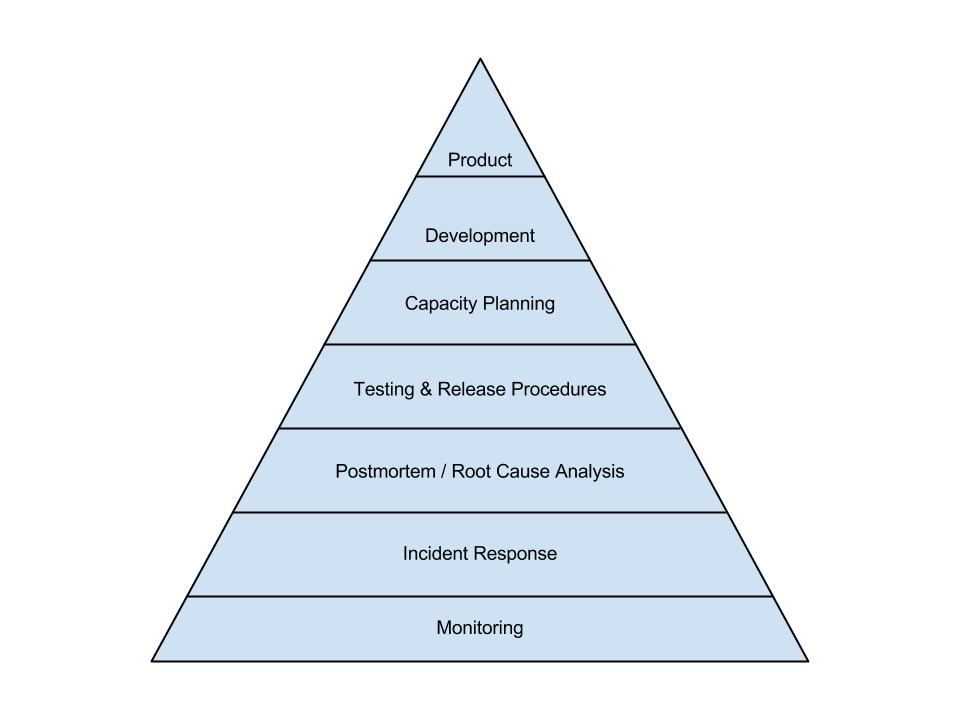
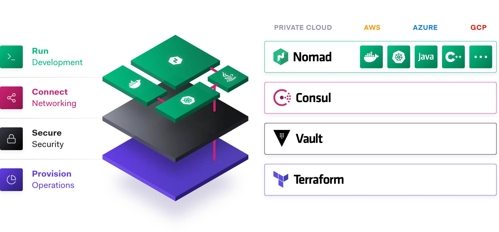
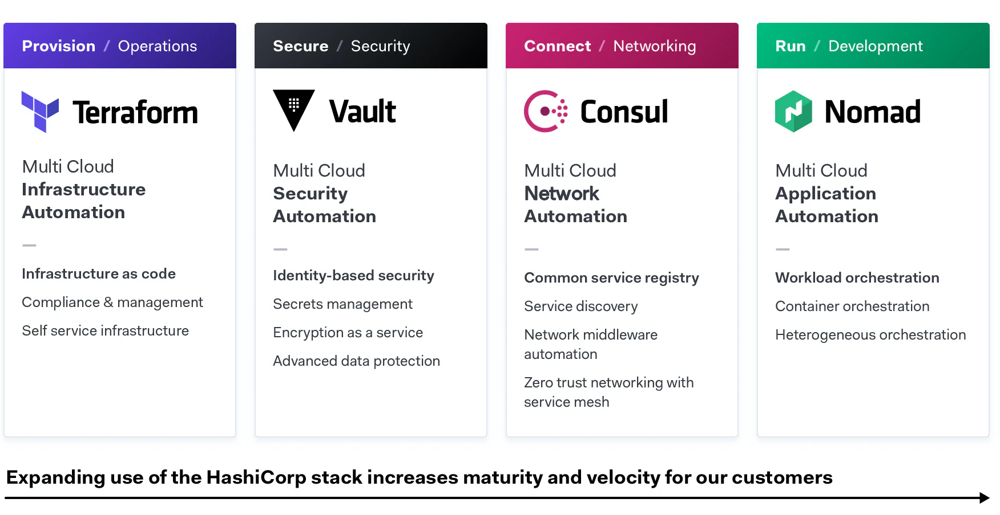

# Infrastructure & Operations

## Linux Basics

### Linux Architecture


- The Linux kernel is **monolithic** in nature.
- **System calls** are used to interact with the Linux kernel space.
- Kernel code can only be executed in **kernel mode**. Non-kernel code is executed in **user mode**.
- Device drivers are used to communicate with the hardware devices.

### File System Organization


- **bin**: User binaries \(ps, grep, ping..\).
- **sbin**: System binaries \(programs used for system administration: iptables, fdisk, ifconfig..\).
- **etc**: Configuration files \(/etc/resolv.conf, /etc/logrotate.conf\) and startup/shutdown shell scripts for programs.
- **dev**: Device files \(/dev/tty, /dev/stdin..\).
- **proc**: Process information \(pseudo filesystem: /proc/{pid}\) and system resources \(/proc/uptime\).
- **var**: Variable files \(files expected to grow: /var/log, /var/lib, /var/lock\).
- **tmp**: Temporary files \(created by system and users, deleted on system reboot\).
- **usr**: User Programs \(binaries, libs, documentation, source code for second level programs: less, cron, useradd..\).
- **home**: Home Directories \(user related files and directories\).
- **boot**: Boot loader files \(kernel initrd, vmlinux, grub files..\).
- **lib**: System libraries \(ld\* and lib\*.so.\* for binaries under /bin and /sbin\).
- **opt**: Optional add-on Apps \(for individual vendors\).
- **mnt**: Mount directory \(for mounted devices and filesystems\).
- **media**: Removable devices.
- **srv**: Service data \(for server specific services data\).

### Command Line Basics

- Navigating the filesystem: pwd, cd, ls
- Manipulating files: touch, mkdir, rm, cp, mv
- Viewing files: cat, head, tail, more, less
- Text processing: grep, sed, sort
- I/O redirection: &gt;, &gt;&gt;, i&gt;, i&gt;&j \(i and j are file descriptors\), &lt;, &lt;&gt;, \|

### Server Administration

- User/Group management: id, whoami, /etc/passwd, /etc/shadow, /etc/group
- Commands for user management: useradd, passwd, usermod, userdel
- Commands for group management: groupadd, groupmod, groupdel, gpasswd
- File permission: chmod, chown, chgrp
- SSH: ssh-keygen, ssh-copy-id, ssh {user}@{hostname/ip} command, scp {source} {dest}
- procs and i/o management: ps, top, free, vmstat, df \(disk free\), du \(disk usage\)
- systemd: systemctl \[start\|stop\|restart\|status\|reload\] name.service

| Permission              | rwx | Binary | Decimal |
| :---------------------- | :-- | :----- | :------ |
| Read, write and execute | rwx | 111    | 7       |
| Read and write          | rw- | 110    | 6       |
| Read and execute        | r-x | 101    | 5       |
| Read only               | r-- | 100    | 4       |
| Write and execute       | -wx | 011    | 3       |
| Write only              | -w- | 010    | 2       |
| Execute only            | --x | 001    | 1       |
| None                    | --- | 000    | 0       |

### Bash

#### Resources

- [Google Shell Style Guide](https://google.github.io/styleguide/shellguide.html)
- [Safe ways to do things in bash](https://github.com/anordal/shellharden/blob/master/how_to_do_things_safely_in_bash.md)
- [Minimal safe Bash script template](https://betterdev.blog/minimal-safe-bash-script-template/)

## Site Reliability Engineering

See the [Site Reliability Engineering](https://docs.tlaurens.xyz/books/01-site-reliability-engineering) book review.



## Instrastructure as Code

### Ansible Best Practices

- `Become` only where necessary
- Name all the `playbooks` and `tasks`.
- Use modules before `run commands` (`command`, `shell`, `raw` and `script` module).
- Set a default for every variable defined.
- Explicitly assign the `state` parameter, even with it default value.
- Prefer scalar variables over dictionaries.
- Prefix variables with meaningful names.
- Tag all the things.
- Keep the number of tags low (use a closed set: `config`, `service`, `package`, `debug`).
- Use native YAML notation instead of folded style.
- Define debug `verbosity`.

### Terraform

## Observability


### Syslog

- https://stackify.com/syslog-101/
- https://www.auvik.com/franklyit/blog/what-is-syslog/
- https://www.dnsstuff.com/what-is-syslog
- https://www.sumologic.com/syslog/

### Logging

//TODO: elastic stack architecture diagram

### Monitoring

//TODO: prom stack architecture diagram

### Tracing

//TODO: Opentracing / Jaeger architecture diagram

## Service Mesh

Operationnal challenges from moving from monolithic architecture to (micro) services oriented architecture:

- **Service Discovery**
- **Configuration Distribution**
- **Access Segmentation**

### Consul

#### Key features

- **Service Discovery**: Clients can register a service and other clients can use Consul to discover providers of a given service.
- **Health Checking**: Clients can provide health checks, either associated with a given service or with the local node. This information can be used by an operator to monitor cluster health, and it is used by the service discovery components to route traffic away from unhealthy hosts.
- **KV Store**: Hierarchical key/value store available for application for any number of purposes, including dynamic configuration, feature flagging, coordination, leader election, and more. The simple HTTP API makes it easy to use.
- **Secure Service Communication**: Consul can generate and distribute TLS certificates for services to establish mutual TLS connections. `Intentions` can be used to define which services are allowed to communicate. Service segmentation can be easily managed with intentions that can be changed in real time instead of using complex network topologies and static firewall rules.
- **Multi Datacenter**: Consul supports multiple datacenters out of the box. This means users of Consul do not have to worry about building additional layers of abstraction to grow to multiple regions.

#### Security

#### Architecture

### Istio

### Envoy

## Container Orchestration

### Hashicorp Stack





### Kubernetes

- [NSA Kubernetes Hardening Guidance](https://media.defense.gov/2021/Aug/03/2002820425/-1/-1/0/CTR_KUBERNETES%20HARDENING%20GUIDANCE.PDF)

## Release Engineering

- CI/CD - gitlab
- Artifactory

## Docker Best Practices

### Images

- **Use the smalest base image possible**: Use a scratch, distroless or alpine base image where possible, minimize the content of the image to reduce the attack surface.
- **Build immutable images**: All executable code should be added at image build time and not at container runtime.
- **Do not use a UID below 10000** In case of priviledge escalation, docker container UID may overlap with a more priviledged system user's UID.
- **Use a static UID and GID**: To manipulate file permissions for files owned by your container. Use `10000:10001` such that `chown 10000:10001 files/` always works.
- **Do not use latest, pin your image tags**: Pin image tags using a specific image version using `major.minor`, not major.minor.patch to get the latest security updates. Consider using [docker-lock](https://github.com/safe-waters/docker-lock).
- **Use** [**tiny**](https://github.com/krallin/tini) **as your ENTRYPOINT**: To ensure that the default signal handlers work for the software you run in your Docker image and protect from software that accidentally creates zombie processes.
- **Only store arguments in CMD**: The `ENTRYPOINT` should be the command name \(`ENTRYPOINT ["/sbin/tini", "--", "myapp"]`\) and `CMD` should only be arguments for the command \(`CMD ["--foo", "1", "--bar=2"]`\) so `docker run yourimage --help` works.
- **Use daemonless builds** or at least, don't build docker images in production clusters.

### Containers

- **Run as non-root user**: Decrease the risk that container -&gt; host priviledge escalation could occur \(**PoLP**: Principle of Least Priviledge\).
- **Do not run with --priviledged flag**: This will grant a bigger set of linux capabilities to the container. The default set is already bad enough.
- **Drop capabilities that aren't needed for each containers**.
- **Run immutable containers**: Run containers with `--read-only` flag if possible.
- **Do not mount sensitive directories from the host**: `/`. `/etc`. `/bin` etc.
- **Do not mount the docker socket**: `/var/run/docker.sock`send instructions to the docker daemon that runs as root on the host.
- **Scan containers for vulnerabilities**.
- **Use runtime protection tool**: To ensure that only expected executables are running inside containers.

### Hosts

- **Use hosts exclusively for running containers**.
- **Use a Thin OS**: RancherOS, Fedora CoreOS or VMware Photon OS are specifically designed for container hosts.
- **Keep the hosts up to date with the latest security releases**.
- **Secrets**: Encrypt at rest and in transit, use a temporary filesystem, use a secret management system for storage and rotation.
- **Enable SELinux if possible**: To constrain what a process is allowed to do in terms of system calls.
- **Use Seccomp or AppArmor profile**: System-wide enforcement of policies that control the actions and resources that each program on a system can perform (Mandatory Access Control). The default docker profiles are a good starting point.

### Resources

- [Docker security](https://docs.docker.com/engine/security/)
- [Dockerfile best practices ](https://github.com/hexops/dockerfile)
- [Container Security](https://www.oreilly.com/library/view/container-security/9781492056690/)

## Chaos Engineering

- [https://principlesofchaos.org/](https://principlesofchaos.org/)

## Resources

- [Counting & Timing](https://code.flickr.net/2008/10/27/counting-timing/)
- [Brendan Gregg Overview](http://www.brendangregg.com/overview.html)
- [eBPF - Rethinking the Linux Kernel](https://www.infoq.com/presentations/facebook-google-bpf-linux-kernel/)

## Templates

### Post Mortem Report

```
# Title [#INCIDENT_NUMBER]

- One line summary
- Start date
- End date
- Project / Ecosystem / Perimeter / Environment
- Infrastructure

## Summary

Brief description of the incident. Include general informations, like for instance:

- Context, reasons, time and duration of the incident
- Type of incident: complete downtime, loss of data, partial interruption of normal operation etc.
- People impacted by the incident: end users, business owners, developpers etc.

## Root Cause

Detailed desciption of what caused the incident.

## Remediation

Description of all the actions taken to resolve the incident. Include every actions taken, even the incorrect of ineffective ones.

## Prevention

List all the measures that should be taken to prevent/avoid this type of incident to happen again in the future. Ex: logging, monitoring, code improvements, development workflow etc.

## Timeline

Precise timeline of the different issues that happened during the incident, including:

- Starting date of the incident
- Date when actions were taken to mitigate the incident
- Resolution date of the incident
```
